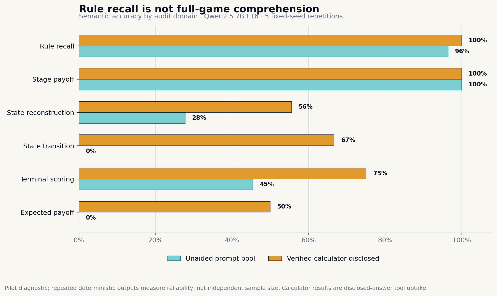
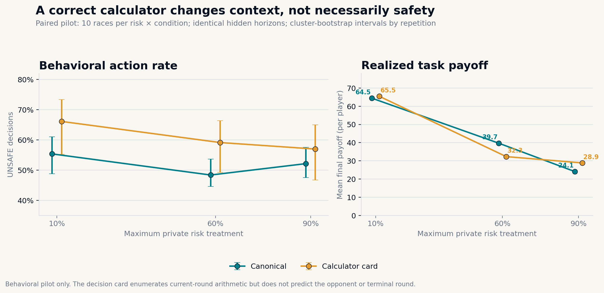
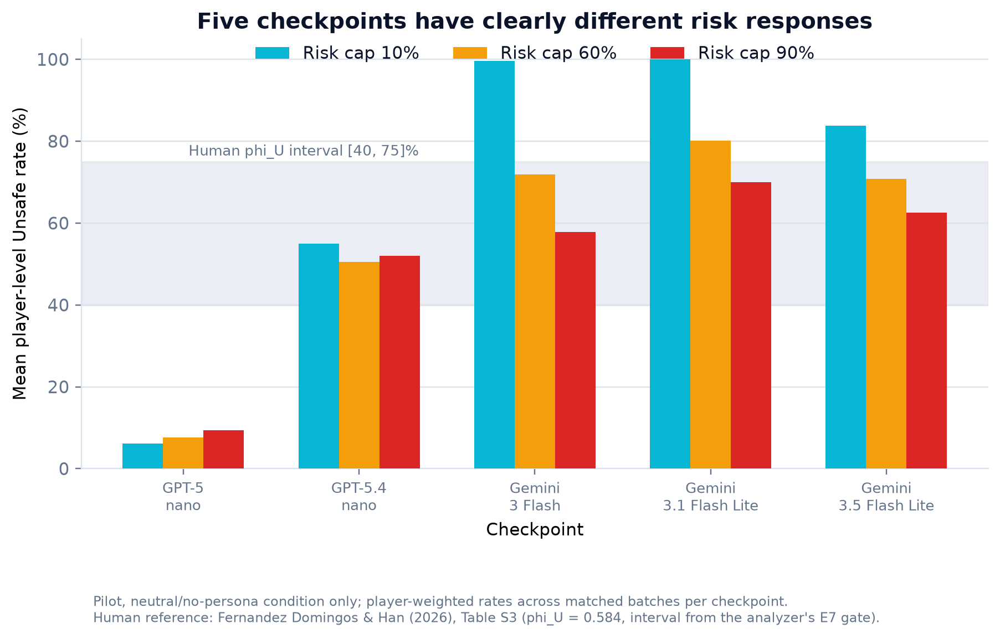
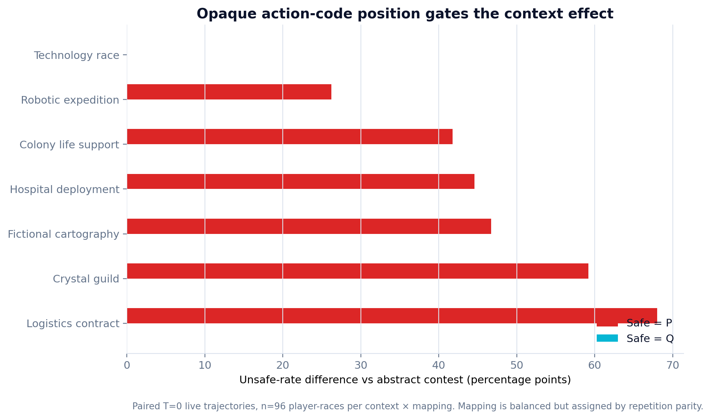
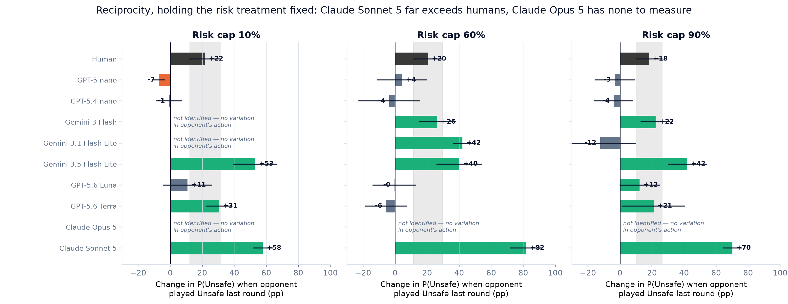
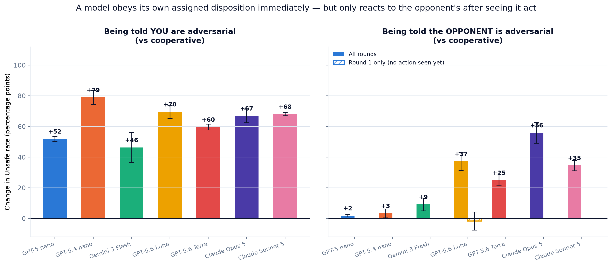
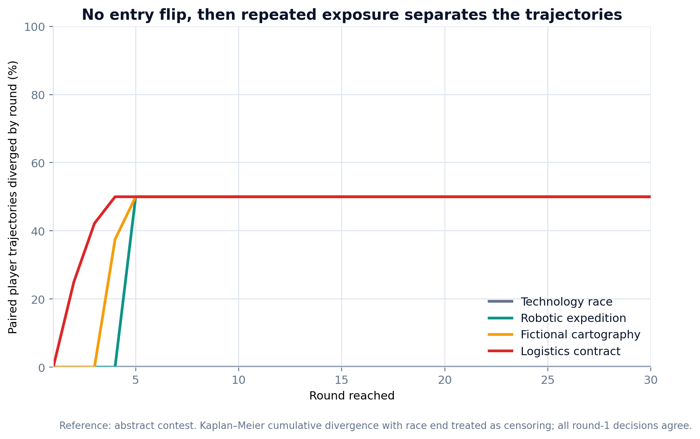
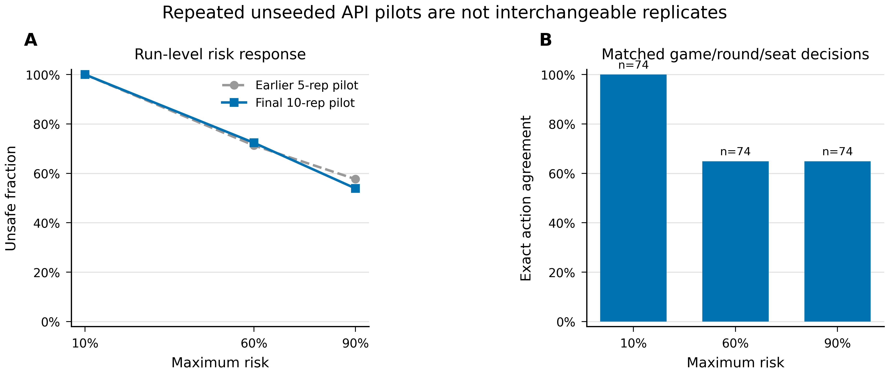
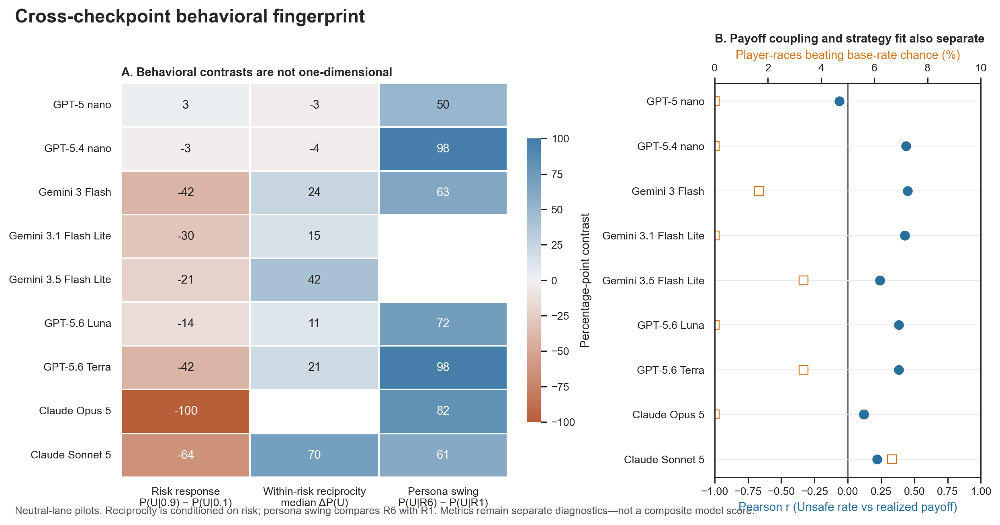

# Paper figure decision book

> **Purpose:** one canonical, reviewer-audited menu of figures for the AI Race paper. Tick the boxes in the [selection sheet](#selection-sheet), then update `paper/main.tex` as one coherent manuscript revision. This file supersedes the older `results/artifacts/figure_gallery/SELECTED_FOR_PAPER.md`.

## Executive recommendation

The strongest paper is a **validity-first behavioral story**, not a gallery of every completed experiment:

1. Can the agent apply the game rules and terminal scoring?
2. Does verified payoff arithmetic change enacted behavior?
3. Do nine checkpoints from three model families respond differently to risk?
4. Can semantically irrelevant response-code mapping dominate behavior?
5. Does the source paper's reciprocity result appear in any checkpoint?
6. Optional mechanistic contribution: does an SAE feature survive causal controls?

For a page-limited main paper, use **M1–M5**. Add **M6** only if activation-level XAI remains a declared contribution. Put the richer robustness and extension figures in the appendix. Do not silently replace the existing five-checkpoint plot: M3 requires coordinated updates to the abstract, model roster, Results text, caption, and snapshot provenance.

### Audit basis

- Whole-repository inventory: **430 visual files**.
- Priority evidence trees checked: **227 PNGs**, including **50 exact-duplicate hash groups**.
- Two independent passes: canonical-file/provenance inventory and strict reviewer selection.
- Canonical precedence: `results/open_source/`, `results/cross_model_pilot_synthesis/`, `results/impact_upgrade/`, then `paper/figures/`.
- `results/artifacts/figure_gallery/` is primarily a browsing/legacy layer. Its `NEW_*` surface figures are retained below only where no better canonical generated copy exists.
- All empirical results remain **exploratory/diagnostic**, not confirmatory estimates.

## Recommended main-paper set

### M1 — Game-understanding admission audit — KEEP



- **Canonical PDF:** [`paper/figures/game_understanding_accuracy.pdf`](../paper/figures/game_understanding_accuracy.pdf)
- **Status:** already in `paper/main.tex`; keep as the construct-validity anchor.
- **Insight:** public-rule recall and one-stage payoff lookup are strong, while accumulated-state update, terminal scoring, and expected-payoff reasoning fail frequently.
- **Permitted claim:** the tested checkpoint did not reliably satisfy the frozen comprehension contract.
- **Required caveat:** calculator rows measure uptake of disclosed verified arithmetic, not unaided comprehension; fixed-seed repetitions are repeatability checks, not independent Bernoulli samples.
- **Best location:** first Results subsection.

### M2 — Calculator-to-behavior ablation — KEEP



- **Canonical PDF:** [`paper/figures/calculator_behavior_ablation.pdf`](../paper/figures/calculator_behavior_ablation.pdf)
- **Status:** already in `paper/main.tex`.
- **Insight:** supplying verified current-round arithmetic changes enacted behavior, but does not monotonically reduce Unsafe play or improve realized payoff.
- **Permitted claim:** tool access and behavior are empirically separable in this paired pilot.
- **Required caveat:** exploratory paired summary; uncertainty must resample independent race/repetition blocks.
- **Best location:** immediately after M1.

### M3 — Nine-checkpoint neutral risk response — REPLACE OLD FIGURE



- **Canonical PDF:** [`results/cross_model_pilot_synthesis/figures/cross_model_risk_response_neutral.pdf`](cross_model_pilot_synthesis/figures/cross_model_risk_response_neutral.pdf)
- **Source:** [`build_cross_model_pilot_synthesis.py`](cross_model_pilot_synthesis/build_cross_model_pilot_synthesis.py)
- **Replaces:** `results/impact_upgrade/figures/cross_model_risk_response.pdf`, currently limited to five checkpoints.
- **Insight:** nine checkpoints across three model families occupy sharply different risk-response regimes; Claude Opus 5 is nearly a deterministic threshold policy.
- **Permitted claim:** checkpoint-level behavioral heterogeneity under the tested neutral-lane protocols.
- **Required caveat:** no pooled model-family effect; provider/backend and protocol signatures differ; Opus regularity makes some downstream contrasts non-identifiable.
- **Best location:** cross-checkpoint baseline replication.

### M4 — Opaque response-mapping gate — KEEP



- **Canonical PDF:** [`results/impact_upgrade/figures/context_mapping_gate.pdf`](impact_upgrade/figures/context_mapping_gate.pdf)
- **Status:** already in `paper/main.tex`.
- **Insight:** six context contrasts appear only in one P/Q semantic mapping; all contrasts are zero in the other mapping.
- **Permitted claim:** behavior is highly sensitive to an ostensibly irrelevant response-code convention.
- **Required caveat:** mapping followed repetition parity and is confounded; this is a gate diagnostic, not an identified causal mapping effect. Pair it in text with the failed admission battery.
- **Best location:** context-robustness results.

### M5 — Reciprocity conditional on risk — ADD



- **Canonical PDF:** [`results/cross_model_pilot_synthesis/figures/within_risk_reciprocity.pdf`](cross_model_pilot_synthesis/figures/within_risk_reciprocity.pdf)
- **Source:** [`analyze_within_risk_reciprocity.py`](cross_model_pilot_synthesis/analyze_within_risk_reciprocity.py)
- **Insight:** Claude Sonnet 5 shows a large, stable conditional response to the opponent's preceding action (+58 to +82 percentage points across risk cells), exceeding the human descriptive contrast (+18 to +22 points); Opus reciprocity is not identifiable because its risk policy is nearly deterministic.
- **Permitted claim:** within-risk association consistent with strong behavioral reciprocity in one checkpoint.
- **Required caveat:** not a randomized causal opponent-action effect; decisions within races are dependent; do not interpret pooled SHAP attribution as reciprocity.
- **Best location:** replace the currently pending opponent-response subsection.

### M6 — SAE target-minus-control intervention — OPTIONAL MAIN


- **Canonical PDF:** [`results/open_source/activation_sae/causal_selfplay/fast-sae-pilot-L12-v1/analysis/figures/fixed_state_target_minus_controls.pdf`](open_source/activation_sae/causal_selfplay/fast-sae-pilot-L12-v1/analysis/figures/fixed_state_target_minus_controls.pdf)
- **Status:** already in `paper/main.tex`; move to appendix if XAI is not a central contribution.
- **Insight:** action-decodable SAE features do not beat matched-random or unrelated-feature causal controls.
- **Permitted claim:** a credible negative mechanistic result—association did not establish feature-specific control.
- **Required caveat:** small exploratory pilot; reconstruction itself perturbs decisions; no neuron-level semantic claim.

## Strong alternative main figures

Use these only by swapping out a core figure; adding all of them will dilute the paper.

### A1 — Randomized social-persona axis



- **PDF/source:** [`social_persona_axis.pdf`](cross_model_pilot_synthesis/figures/social_persona_axis.pdf), [`analyze_social_persona_axis.py`](cross_model_pilot_synthesis/analyze_social_persona_axis.py)
- **Why:** the agent follows its own assigned disposition immediately, while opponent framing matters only after behavior is observed; newer GPT-5.6 checkpoints react more strongly.
- **Use instead of:** M5 if the paper foregrounds randomized framing rather than observational reciprocity.
- **Caveat:** round-1 null helps rule out immediate label deference, but later contrasts remain total live-trajectory effects—not mediation estimates.

### A2 — Surface-variant sensitivity forest


- **Source script:** [`results/scripts/analyze_surface_sensitivity.py`](scripts/analyze_surface_sensitivity.py)
- **Why:** 18 nominally equivalent surface variants span a very wide Unsafe-rate range; this is a direct prompt-validity result and strong demo figure.
- **Use instead of:** a secondary context figure if prompt sensitivity is elevated to a primary contribution.
- **Caveat:** gallery is currently the only generated canonical copy; label pilot, disclose bundled token/order/format changes, and avoid generalizing beyond the tested checkpoint/protocol.

### A3 — Comprehension admission by context/mapping


- **PDF/source:** [`comprehension_admission.pdf`](open_source/context_skin_pilot/analysis_live_pilot_t0/figures/comprehension_admission.pdf), [`analyze_context_skin.py`](scripts/analyze_context_skin.py)
- **Why:** makes the context experiment's validity boundary visible: recall can be perfect while state update and terminal scoring fail.
- **Use instead of:** M1 only if the context experiment becomes the paper's primary protocol.
- **Caveat:** several terminal probes have wording/draw-semantics ambiguities; the admission verdict remains valid because unambiguous state/terminal items also fail, but revise the probe contract before confirmation.

### A4 — Human/LLM predictive architecture


- **PDF/source:** [`feature_importance_shap_heatmap.pdf`](cross_model_pilot_synthesis/figures/feature_importance_shap_heatmap.pdf), [`analyze_feature_importance.py`](cross_model_pilot_synthesis/analyze_feature_importance.py)
- **Why:** different checkpoints are best predicted by different features, and most do not resemble the human profile.
- **Caveat:** descriptive prediction, not causal architecture; models have unequal AUC/balanced accuracy and floor/ceiling behavior. Opus's apparent opponent importance is a collinearity artifact. Reviewer preference: appendix, not headline.

### A5 — Late trajectory divergence



- **PDF/source:** [`trajectory_divergence_curve.pdf`](impact_upgrade/figures/trajectory_divergence_curve.pdf), [`analyze_impact_upgrade.py`](scripts/analyze_impact_upgrade.py)
- **Why:** all paired contexts agree at entry, while differences emerge after repeated exposure and endogenous feedback.
- **Caveat:** divergence timing is descriptive; later gaps mix prompt response with changing state and opponent behavior.

### A6 — Repeat-run stability



- **Canonical PDF:** [`results/derived/two_player_paper_analysis/figures/fig13_repeat_run_stability.pdf`](derived/two_player_paper_analysis/figures/fig13_repeat_run_stability.pdf)
- **Source:** `results/scripts/analyze_two_player_paper_figures.py`
- **Why:** separates stable aggregate treatment patterns from decision-level non-determinism.
- **Caveat:** repeatability under one decoding/backend contract is not cross-model robustness.

### A7 — Cross-checkpoint behavioral fingerprint



- **PDF/data/source:** [`behavioral_fingerprint.pdf`](cross_model_pilot_synthesis/figures/behavioral_fingerprint.pdf), [`behavioral_fingerprint.csv`](cross_model_pilot_synthesis/data/behavioral_fingerprint.csv), [`build_behavioral_fingerprint.py`](scripts/build_behavioral_fingerprint.py)
- **Why:** demonstrates that checkpoint behavior is not a one-dimensional Safe/Unsafe trait. Risk sensitivity, conditional reciprocity, persona swing, payoff coupling, and chance-corrected strategy fit separate sharply.
- **New insight:** GPT-5.4 nano is nearly risk-flat but has a 98pp persona swing; Claude Opus 5 has a −100pp risk response but no identifiable reciprocity; Claude Sonnet 5 combines a −64pp risk response with approximately +70pp median within-risk reciprocity. No checkpoint has more than 6.7% of trajectories whose canonical-strategy fit beats its base-rate-matched chance null.
- **Caveat:** five distinct descriptive estimands are deliberately not collapsed into a composite score. Blank cells mean the relevant persona lane or identifiable contrast is unavailable, not zero.
- **Recommendation:** appendix or demo; use in main only if cross-checkpoint multidimensionality becomes a named contribution.

## Appendix figure menu

| ID | Figure | Primary insight | Mandatory boundary |
|---|---|---|---|
| S1 | [`context_direct_vs_live.pdf`](impact_upgrade/figures/context_direct_vs_live.pdf) | Direct fixed-state and endogenous live contrasts need not coincide. | Different units and estimands; connector is not mediation. Already in main; recommended move to appendix if M5 is added. |
| S2 | [`behavior_payoff_tradeoff.pdf`](impact_upgrade/figures/behavior_payoff_tradeoff.pdf) | More Unsafe behavior need not produce higher realized payoff. | Six ecological cells; descriptive correlation, shared checkpoint/confounds. |
| S3 | [`context_effect_temperature_stability.pdf`](open_source/context_skin_pilot/analysis_temperature_robustness/figures/context_effect_temperature_stability.pdf) | Context-effect ordering is broadly stable across T=0 and T=.7. | Bounded sensitivity analysis; archives/protocol signatures must be disclosed. Already in main; appendix preferred. |
| S4 | [`temperature_trajectory_agreement.pdf`](open_source/context_skin_pilot/analysis_temperature_robustness/figures/temperature_trajectory_agreement.pdf) | Similar aggregate effects coexist with incomplete trajectory agreement. | Do not call temperature-zero repetitions independent samples. |
| S5 | [`temperature_mapping_interaction_heatmap.pdf`](open_source/context_skin_pilot/analysis_temperature_robustness/figures/temperature_mapping_interaction_heatmap.pdf) | Mapping interaction persists/changes across decoding temperatures. | Diagnostic and parity-confounded. |
| S6 | [`persona_role_gradient_extended.pdf`](cross_model_pilot_synthesis/figures/persona_role_gradient_extended.pdf) | Unframed defaults are often near the risk-seeking end; framing effects are asymmetric. | Extreme framing is not a natural model trait; checkpoint-specific pilot. |
| S7 | [`within_role_risk_sensitivity.pdf`](cross_model_pilot_synthesis/figures/within_role_risk_sensitivity.pdf) | Risk still matters within persona roles. | Avoid comparing slopes across non-identical provider protocols as a family effect. |
| S8 | [`canonical_strategy_classification.pdf`](cross_model_pilot_synthesis/figures/canonical_strategy_classification.pdf) | AS/AU/CS/CAS fits rarely beat base-rate-matched chance. | Short horizons create ties; nearest label is not a latent strategy. |
| S9 | [`human_vs_llm_distribution.pdf`](cross_model_pilot_synthesis/figures/human_vs_llm_distribution.pdf) | LLM behavior occupies different distributional regions from humans. | Human and LLM protocols/samples are not exchangeable. |
| S10 | [`llm_human_cluster_projection.pdf`](cross_model_pilot_synthesis/figures/llm_human_cluster_projection.pdf) | Some checkpoints cover narrow slices of human behavioral diversity. | Human clustering is weak/modest (silhouette roughly .24–.32); exploratory only. Prefer this over S9 if only one. |
| S11 | [`round_trajectory.pdf`](cross_model_pilot_synthesis/figures/round_trajectory.pdf) | Checkpoints have distinct round-by-round signatures. | Later-round survivor composition changes as races terminate. |
| S12 | [`payoff_welfare_unsafe_vs_payoff.pdf`](cross_model_pilot_synthesis/figures/payoff_welfare_unsafe_vs_payoff.pdf) | Whether Unsafe “pays” is checkpoint-specific after realized setbacks. | Descriptive association; human payoff proxy is not directly comparable. |
| S13 | [`egt_stationary_strategy_composition.pdf`](open_source/egt_reproduction/egt_stationary_strategy_composition.pdf) | Reconstructed evolutionary phase composition. | Faithful reconstruction, not exact reproduction; not the same process as LLM self-play. |
| S14 | [`egt_chain_diagnostics.pdf`](open_source/egt_reproduction/egt_chain_diagnostics.pdf) | Independent-chain numerical QA for EGT reconstruction. | Implementation validation only. |
| S15 | [`egt_theory_vs_llm_unsafe.pdf`](open_source/egt_reproduction/egt_theory_vs_llm_unsafe.pdf) | Theory and prompted self-play produce different behavioral objects. | Descriptive juxtaposition, never pooled. Already in main; appendix preferred. |
| S16 | [`primary_position_response.pdf`](open_source/position_endowment_greennode_e3cf825/analysis/primary_position_response.pdf) | Fixed-state response changes with relative race position. | Direct prompt effect in one state bank; tested models failed admission. |
| S17 | [`primary_direct_contrasts.pdf`](open_source/position_endowment_greennode_e3cf825/analysis/primary_direct_contrasts.pdf) | Direct contrasts quantify leader/middle/last response differences. | Same admission and external-validity limits as S16. |
| S18 | [`identity_disclosure_matrix.pdf`](open_source/heterogeneous_dyad_greennode_ba2906a/analysis/figures/identity_disclosure_matrix.pdf) | Disclosed opponent identity changes early choices in heterogeneous dyads. | Descriptive; both open models fail comprehension admission. |
| S19 | [`risk_response_same_vs_cross.pdf`](open_source/heterogeneous_dyad_greennode_ba2906a/analysis/figures/risk_response_same_vs_cross.pdf) | Same-model and cross-model dyads can occupy different risk regimes. | No generic “model identity” effect; pairing/protocol-specific. |
| S20 | [`association_selected_features.pdf`](open_source/activation_sae/causal_selfplay/fast-sae-pilot-L12-v1/analysis/figures/association_selected_features.pdf) | Selected SAE features retain held-out action information. | Must be paired with M6; decodability is not causality. |
| S21 | [`fixed_state_dose_response.pdf`](open_source/activation_sae/causal_selfplay/fast-sae-pilot-L12-v1/analysis/figures/fixed_state_dose_response.pdf) | Steering dose-response audit. | Interpret only relative to reconstruction/random/unrelated controls. |
| S22 | [`live_direct_comparable_flips.pdf`](open_source/activation_sae/causal_selfplay/fast-sae-pilot-L12-v1/analysis/figures/live_direct_comparable_flips.pdf) | Pre-divergence live action flips are rare. | After first divergence, trajectories cease to be directly comparable. |
| S23 | [`live_endogenous_payoff_effects.pdf`](open_source/activation_sae/causal_selfplay/fast-sae-pilot-L12-v1/analysis/figures/live_endogenous_payoff_effects.pdf) | Target and control interventions yield similar-scale payoff changes. | Endogenous trajectory effect, not direct neural causation. |
| S24 | [`fig01b_protocol_robustness_baselines.pdf`](derived/two_player_paper_analysis/figures/fig01b_protocol_robustness_baselines.pdf) | Baseline results across protocol variants. | Keep protocol signatures explicit; no indiscriminate pooling. |
| S25 | [`surface_variant_first_round_flip_forest.png`](artifacts/figure_gallery/NEW_02_surface/surface_variant_first_round_flip_forest.png) | Surface variants can flip entry decisions. | Pilot; bundled surface perturbations. |
| S26 | [`surface_family_boxplot.png`](artifacts/figure_gallery/NEW_02_surface/surface_family_boxplot.png) | Sensitivity differs by perturbation family. | Family labels summarize heterogeneous prompts; not a causal factorial decomposition. |

### N-player extension — appendix only unless Methods are added

| ID | Figure | Reason to include | Boundary |
|---|---|---|---|
| N1 | [`nplayer_position_effect_sign_flip.pdf`](cross_model_pilot_synthesis/figures/nplayer_position_effect_sign_flip.pdf) | Position effect reverses under risk-seeking persona framing. | N-player design must be fully described; not transferable to 2-player. |
| N2 | [`nplayer_peer_composition_effect.pdf`](cross_model_pilot_synthesis/figures/nplayer_peer_composition_effect.pdf) | Peer composition changes Unsafe response. | Group composition and position may interact; pilot estimand. |
| N3 | [`2p_position_effect_by_persona.pdf`](cross_model_pilot_synthesis/figures/2p_position_effect_by_persona.pdf) | Tests whether the N-player sign flip transfers to dyads. | Partial, checkpoint-specific replication. |

## Demo/web figures, not paper evidence

These are useful for a talk or interactive walkthrough but too dense, didactic, or meta-analytic for the manuscript:

- [`executive_visual_atlas.png`](impact_upgrade/visual_atlas/executive_visual_atlas.png)
- [`extended_evidence_atlas.png`](impact_upgrade/visual_atlas/extended_evidence_atlas.png)
- [`model_risk_heatmap.png`](impact_upgrade/visual_atlas/model_risk_heatmap.png)
- [`fixed_vs_live_explainer.png`](impact_upgrade/visual_atlas/fixed_vs_live_explainer.png)
- [`evidence_ladder.png`](impact_upgrade/figures/evidence_ladder.png)

## Reject / do not cite as evidence

- Exact copies under `results/artifacts/figure_gallery/ADMITTED_*` and `SELECTED_FOR_PAPER*`; cite the canonical source above.
- Anything under `results/_build/failed_run_scratch/`, smoke-only plots, QA screenshots, compiled paper/deck pages, and format-conversion TIFFs unless a publisher explicitly requests them.
- `xai_auto_vector_encoder` coefficient/importance plots as neuron-level XAI: these are surface-vector surrogates, not mechanistic neuron evidence.
- Standalone SAE action probes without target-minus-random/unrelated/reconstruction controls.
- N=3 plots based on two races per cell as main evidence.
- Legacy `x7`/`x10a` gallery copies whose old canonical paths no longer exist, unless provenance is re-established.
- A simple six-cell Unsafe–payoff correlation as a headline result.

## Selection sheet

Recommended default is checked. Change boxes to record your preferred story.

### Main paper

- [x] **M1** Game-understanding admission audit
- [x] **M2** Calculator behavioral ablation
- [x] **M3** Replace five-checkpoint curve with nine-checkpoint neutral risk response
- [x] **M4** Opaque response-mapping gate
- [x] **M5** Within-risk reciprocity
- [ ] **M6** SAE target-minus-control negative result
- [ ] **A1** Randomized social-persona axis
- [ ] **A2** Surface-variant sensitivity forest
- [ ] **A3** Context-specific comprehension admission
- [ ] **A4** Human/LLM predictive architecture
- [ ] **A5** Late trajectory divergence
- [ ] **A6** Repeat-run stability
- [ ] **A7** Cross-checkpoint behavioral fingerprint

### Appendix

- [x] **S1, S3–S5** Fixed/live and temperature robustness
- [x] **S6–S8** Persona, residual risk, and strategy-null checks
- [x] **S10–S15** Human projection, trajectories, payoff, and EGT QA
- [x] **S20–S23** SAE association/control chain
- [ ] **S2, S9, S16–S19, S24–S26** Optional diagnostics
- [ ] **N1–N3** N-player extension (requires matching Methods)

## Proposed paper flow after selection

```text
Validity gate (M1)
  → arithmetic intervention (M2)
  → checkpoint heterogeneity (M3)
  → nuisance mapping failure (M4)
  → substantive reciprocity test (M5)
  → optional mechanistic falsification (M6)
```

This ordering makes the epistemic boundary explicit before presenting substantive behavior. It also prevents the most attractive plots—SHAP, clustering, personas, and dashboards—from outrunning the evidence that supports them.
