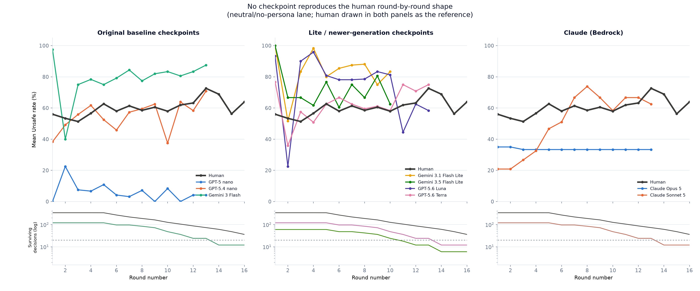
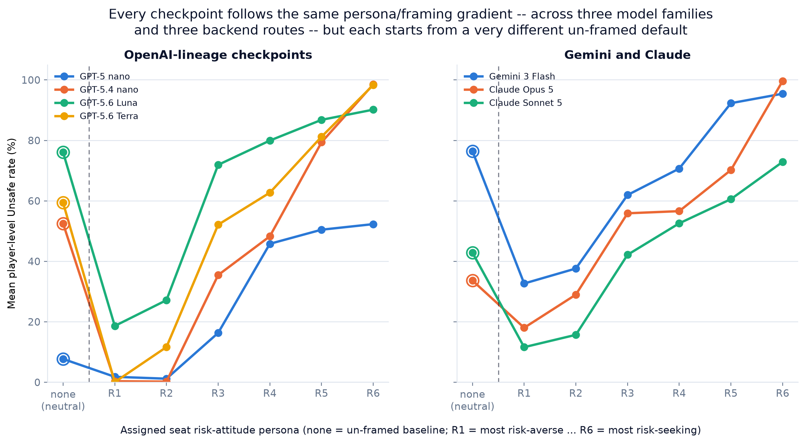
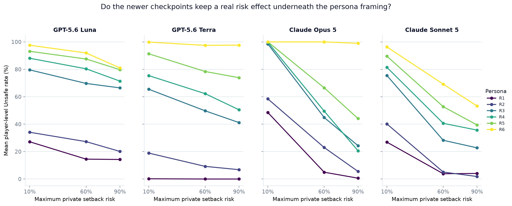
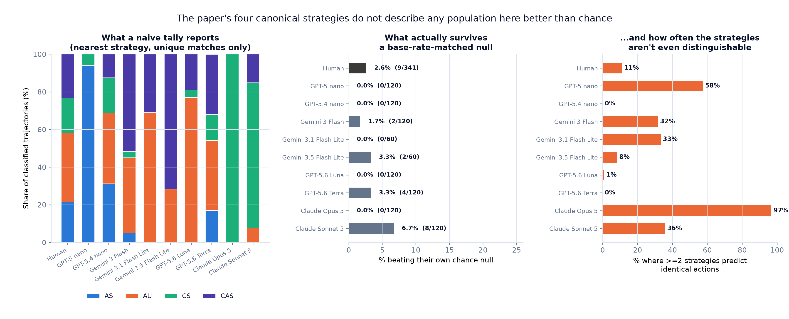

# Cross-model pilot synthesis: insights for the AI Race manuscript

**Update log**: pass 1 reported 3 insights from the 2-player frontier pilot only
(Part C). Pass 2 added a direct comparison against the human study's raw
de-identified data (Part A) and a first pass over the OpenAI N-player data
(Part B). Pass 3 added: an ML feature-importance/SHAP comparison of what
predicts Unsafe for humans vs. each checkpoint (Part D); a round-by-round
trajectory analysis, not just round-1-vs-later (Part E); unsupervised
behavioral clustering of humans and LLM players, including an explicit search
for behavior types beyond the project's four canonical strategies (Part F);
and one more N-player result — the position effect's sign flips under
risk-seeking persona framing (Part B4). **Pass 4** checks whether
that last finding also holds in the 2-player game (Part H — it partially does),
adds a payoff/welfare angle nobody had asked yet (Part G — does Unsafe actually
pay off?), and closes out three smaller threads explicitly requested: a formal
statistical test of cross-model heterogeneity, a theory-gap-vs-human-likeness
correlation, and a cross-reference against the project's existing Qwen
interpretability pipeline (Part I). **Pass 5** adds a new model generation
(GPT-5.6 Luna/Terra) to the persona-dominance finding, plus an operational
lesson about a backend-specific failure mode that made the same checkpoints'
data unusable from one route and clean from another (Part J).

**Pass 6 (this update)** is a re-analysis, not just an extension. Twelve new
run directories arrived — GPT-5.6 Luna and Terra each gained a `baseline`
lane, an `R0_neutral` lane, and the four adversarial/cooperative persona cells
(`S_AA` / `S_AC` / `S_CA` / `S_CC`), all `completed` with 0 parse failures.
Two consequences:

1. **The persona-pooled caveat is retired, and retiring it changed answers.**
   Every Luna/Terra number in Parts D–G was previously computed by pooling the
   full persona sweep, because no neutral lane existed. All of them have been
   refit on the real neutral lane, and several conclusions from Pass 5 were
   *wrong* as a result — most importantly the claim that GPT-5.6 spans three
   human archetypes and has its own round-by-round signature. Both were
   artifacts of pooling. Corrections are flagged inline (Part E, Part F2, Part J).
2. **A previously unanalysed experimental axis is now covered.** The
   adversarial/cooperative persona cells cross *own* framing with the
   *opponent's* framing in a clean 2×2, which no earlier pass examined even
   though the cells already existed for three of the five checkpoints. This is
   the new **Part K**, and it produces the strongest new result in this pass.

Pass 6 also adds an un-framed "none" anchor to the persona gradient (Part J1),
which turns out to matter a lot: the framing swing had only ever been measured
between two extremes, and anchoring it reveals the default is not in the middle.

**Pass 7 (this update)** adds a third model family: **Claude Opus 5 and Claude
Sonnet 5**, via AWS Bedrock (`results/frontier/bedrock/`). Both arrived with
the complete design — neutral lane, full 6×6 persona risk_matrix,
Rminus/Rplus, and all four adversarial/cooperative cells — 44 run directories
each, all `completed`, **0 parse failures across 49,104 decisions**. Every
analysis in this file now covers **nine checkpoints across three model
families and three backend routes**, all on comparable neutral-lane data.

Two things came out of it that no previous pass could have found:

1. **Claude Opus 5 is the first checkpoint whose neutral-lane policy is
   essentially deterministic** — 100.0% Unsafe at risk 0.1, 1.1% at 0.6, 0.0%
   at 0.9. A classifier predicts it perfectly (AUC 1.00, balanced accuracy
   1.00), which is not a modelling success but a description of a step
   function. It also breaks an analysis: with no variation left in the
   opponent's behaviour, reciprocity is *not identifiable* for this checkpoint
   at any risk level.
2. **That forced a methodological correction that changes how Part D should be
   read.** Opus 5's SHAP table shows 43% weight on the opponent's previous
   action, which looks like strong reciprocity and is entirely an artifact of
   collinearity. The new **Part M** measures reciprocity the way the source
   paper does — conditional on the risk treatment — and the picture changes for
   several checkpoints. Claude Sonnet 5 turns out to have by far the strongest
   genuine reciprocity of any population measured here, humans included.

**Status remains pilot / diagnostic throughout — nothing here is confirmatory,
and nothing is pooled across models, across the 2-player/N-player designs, or
across human/LLM populations.**

A genuine data-quality correction from this pass, flagged upfront: `Insight C1`
and the 2-player figures previously included `results/frontier/api_5games_allrisk`
in Gemini-3-Flash's neutral lane. That directory shares `game_id`/`game_seed`
with 15 of the 30 baseline races, and an initial spot-check (3 games) wrongly
concluded it was a byte-identical duplicate log. A full check across all 15
shared games shows the opposite: only the risk-0.1 games match exactly (trivial,
since that cell is ~100% Unsafe either way); risk-0.6/0.9 games under the same
`game_id` have genuinely different round-by-round actions — an independently
sampled re-run, not a duplicated log. It is still excluded (pooling it would
violate the CRN-independence the analyzer's clustering relies on, and the
project's own `analyze_two_player_paper_figures.py` already flags it as a
"superseded overlapping pilot"), but the justification is now accurate, and all
figures/tables have been regenerated. The correction changed Gemini-3-Flash's N
from 150→~120-150 depending on the table; every number that mattered moved by
1-2 points at most.

Figures: [`figures/`](figures/). Tables: [`data/`](data/). Generation scripts:
[`analyze_human_vs_llm.py`](analyze_human_vs_llm.py),
[`build_nplayer_synthesis.py`](build_nplayer_synthesis.py),
[`build_nplayer_position_persona.py`](build_nplayer_position_persona.py),
[`build_cross_model_pilot_synthesis.py`](build_cross_model_pilot_synthesis.py),
[`analyze_feature_importance.py`](analyze_feature_importance.py),
[`analyze_behavioral_clustering.py`](analyze_behavioral_clustering.py),
[`build_2p_position_persona.py`](build_2p_position_persona.py),
[`analyze_payoff_welfare.py`](analyze_payoff_welfare.py),
[`analyze_heterogeneity_test.py`](analyze_heterogeneity_test.py),
[`build_persona_gradient_extended.py`](build_persona_gradient_extended.py),
[`analyze_social_persona_axis.py`](analyze_social_persona_axis.py),
[`analyze_canonical_strategies.py`](analyze_canonical_strategies.py),
[`analyze_within_risk_reciprocity.py`](analyze_within_risk_reciprocity.py),
[`build_round_trajectory.py`](build_round_trajectory.py),
[`build_human_vs_llm_distribution_v3.py`](build_human_vs_llm_distribution_v3.py),
[`build_llm_human_cluster_projection_v2.py`](build_llm_human_cluster_projection_v2.py).

`build_gen56_full_extension.py` was **removed** in Pass 6. Every one of its four
parts (SHAP, trajectory, clustering, payoff) existed only to work around the
missing Luna/Terra neutral lane by pooling persona conditions; all four are now
computed for all seven checkpoints by the primary scripts above, on comparable
neutral-lane data. Keeping a script that regenerates the superseded
persona-pooled numbers would be a live footgun, so it and its four stale JSON
outputs are deleted rather than left in place (recoverable at commit `85a4d6b`).

## Most interesting findings, ranked

0. **[Part M, new] Reciprocity — the human study's headline effect — is present in an LLM at greater magnitude than in humans, but only once measured conditional on risk.** Holding the risk treatment fixed, **Claude Sonnet 5 shifts P(Unsafe) by +58 to +82pp** depending on whether the opponent last played Unsafe, against the human +18 to +22pp, and it is the only checkpoint that is both large and stable across all three risk levels. The pooled SHAP ranking in Part D cannot show this: it credits Claude Opus 5 with a 43% opponent share that is pure collinearity (Opus 5's policy is deterministic in risk, so "opponent played Unsafe" *is* "risk is 0.1"), and conditioning on risk reveals Opus 5 has **no identifiable reciprocity at all**. Three independent methods — Part M's direct estimate, Part K's framing manipulation, and Part L's strategy classification — converge on Claude Sonnet 5 as the most reciprocal checkpoint.
1. **[Part D/M, new] Claude Opus 5 runs a near-deterministic risk threshold, and it breaks analyses rather than merely scoring differently.** In the neutral lane it plays Unsafe on **100.0% of risk-0.1 decisions, 1.1% at risk 0.6, and 0.0% at risk 0.9**. A Random Forest predicts it perfectly (AUC 1.00, balanced accuracy 1.00) — which is a description of a step function, not a modelling result. The consequence matters more than the curiosity: with no residual variation in the opponent's behaviour, reciprocity is *not identifiable*, and in Part L **96.7% of its player-races have two or more canonical strategies predicting identical actions**. It is the clearest case in this report of a checkpoint whose own regularity destroys the contrasts an analysis depends on.
2. **[Part K, new] A model obeys its own assigned disposition instantly, but only reacts to the opponent's after watching it play — and the newer generation reacts far more.** In a clean 2×2 crossing own framing with opponent framing (adversarial vs cooperative), being told *you* are adversarial moves Unsafe play by +46 to +79pp for every checkpoint. Being told the *opponent* is adversarial moves it by only +2 to +9pp for the three older checkpoints but **+37pp (Luna) and +25pp (Terra)** for GPT-5.6. Restricting to round 1 — where nobody has acted yet, so the label is the only information — that opponent effect is **zero for all five** (−1.7 to +0.0pp, none significant). So the effect is not deference to a label; it is reciprocity to observed behaviour, and it is the newer generation that has substantially more of it.
3. **[Part J1, new] The un-framed default is not in the middle of the persona range — it sits near the risk-seeking end.** With every checkpoint now anchored by its own neutral/no-persona lane, four of five default to 52–76% Unsafe, close to what the *most risk-seeking* framing produces and far above the most risk-averse. Framing is therefore strongly asymmetric: for GPT-5.6 Luna the risk-averse framing moves behaviour 4.1× further than the risk-seeking framing does (−57.4pp vs +14.1pp), because there is little headroom left above the default. GPT-5 nano is the lone exception, defaulting to 7.7%. A framing study that only reports the R1→R6 swing hides this entirely.
4. **[Part L, new] The paper's own four canonical strategies (AS/AU/CS/CAS) describe *no* population here better than chance — including humans.** A naive nearest-strategy tally looks decisive (GPT-5 nano "94% AS", Gemini 3.5 Flash Lite "72% CAS"). But testing each trajectory against 400 Bernoulli sequences drawn at that player's *own* Unsafe rate, at most 3.3% of any population beats its own null, and for humans and GPT-5.4 nano the observed fit is *worse* than base-rate-matched noise. Separately, for 58% of GPT-5 nano's player-races two or more of the four strategies predict identical actions, so they are not even competing hypotheses. Strategy-share tables on this data need a chance baseline printed beside them.
5. **[Part D] Humans and LLM checkpoints run on visibly different "decision architectures."** An RF+SHAP model fit separately on each population's own decisions shows opponent-reciprocity dominates for humans (48% of predictive weight) and for one Gemini checkpoint (34%), but GPT-5 nano is instead dominated by relative race position (44%, opponent barely registers at 4%), the Gemini-lite checkpoints by the risk-treatment parameter itself (35–40%), GPT-5.6 Luna by round number (41%), and GPT-5.6 Terra by its own previous action (30%). Seven checkpoints, five different dominant features — and none of them matches the human profile.
6. **[Part F2] LLM checkpoints occupy very different, and very different-sized, slices of human behavioral diversity.** Projected into a 4-archetype clustering fit on 341 human participants, GPT-5 nano is a 99% point-mass in one archetype; the Gemini checkpoints and both GPT-5.6 checkpoints collapse into the same two archetypes; GPT-5.4 nano is the only checkpoint that spans (almost) the full human behavioral space, including the one archetype (a genuine "persister") that nothing else reaches. **Corrected in Pass 6:** GPT-5.6 previously appeared to reach three archetypes, but that was an artifact of pooling persona conditions — on the neutral lane its "cautious starter" share collapses from 31.6% to 3.3% (Luna).
7. **[Part G] Whether Unsafe play "pays off" is itself checkpoint-specific, not a universal fact about the mechanism.** Once the actual setback draw is included, GPT-5 nano's naive positive Unsafe-payoff correlation vanishes (r=0.34→−0.06) — its setback risk fully erases the apparent benefit — while GPT-5.4 nano's stays clearly positive (r=0.44) even after the same correction, and the Gemini and GPT-5.6 checkpoints all show *true* payoff correlating with Unsafe rate more strongly than the setback-free proxy does.
8. **[Part B4/H] The position effect's sign flips under risk-seeking persona framing in N-player, and partially in 2-player.** In N-player, both GPT models show a clean reversal (human-matching negative → reversed positive) from persona R3 onward. In 2-player, GPT-5.4 nano shows the same reversal to positive; GPT-5 nano instead fades from a strongly negative baseline toward zero without crossing into positive — the reversal itself is not simply "always there once you add persona," it depends on which model and how many opponents are in the room.
9. **[Part F] A rigorous, bias-corrected search for a "new" strategy** finds the naive signal is mostly a known short-sequence statistical artifact, but a small, genuine fringe survives correction in both humans (~8%) and one GPT-5 nano persona cell — a candidate fifth reference strategy for future confirmatory work, not yet a headline claim.
10. **[Part I] Cross-model heterogeneity is now a formal statistical fact, not just a visual impression**: a likelihood-ratio test comparing model-specific vs. common risk-response slopes is overwhelming (χ²=2201.2, df=18, p≈0 across seven checkpoints; χ²=524.1, df=14, p≈7×10⁻¹⁰³ for slope heterogeneity beyond level differences alone).
11. **[Part E] Every checkpoint has a distinct, non-human round-by-round "signature"**: GPT-5 nano spikes at round 2 then decays; the Gemini checkpoints crash from ceiling at round 2 (only in the higher-risk arms) then rebound; only GPT-5.4 nano's shape (a gradual net rise) points the same direction as the human trajectory. **Corrected in Pass 6:** GPT-5.6 does *not* have a third signature as Pass 5 claimed — on the neutral lane both Luna and Terra show the Gemini-style ceiling-crash-rebound (Luna 93.3%→22.4%, Terra 76.7%→35.6%). The "dip-and-plateau" reported earlier was persona-mixing.
12. **[Part J]** The persona-dominance finding replicates in a newer model generation at large scale (76 cells, 4,320 players, 0 parse failures, via a different backend entirely), but both GPT-5.6 checkpoints retain a real monotone within-persona risk effect at every framing level, shrinking persona's dominance over risk from roughly 25× to roughly 4–6×.
13. Parts A-C (human distributional comparison, persona/framing dominance, cross-model heterogeneity scorecard, N-player peer-composition/group-size effects) — unchanged from earlier passes, still stand and still matter; summarized below for completeness.

---

## Part D — What predicts an Unsafe choice: humans vs. each LLM checkpoint

A Random Forest classifier (400 trees, depth 6, min-leaf 10) was fit separately
on each population's own round-≥2 decisions, using the same five mechanical
features on both sides: own previous action, opponent's previous action,
progress gap, the risk treatment, and round number. SHAP (TreeExplainer) gives
each feature's share of mean |SHAP value| per population — this describes what
the classifier leans on to reproduce each population's choices, not a causal
claim, and predictive power itself varies hugely (see caveats below).

| Population | Own prev. | Opponent's prev. | Progress gap | Risk treatment | Round | Test AUC | Balanced acc. |
|---|---|---|---|---|---|---|---|
| Human (n=2,904) | 6% | **48%** | 14% | 12% | 20% | 0.62 | 0.54 |
| GPT-5 nano (n=996) | 2% | 4% | **44%** | 16% | 33% | 0.82 | **0.50** |
| GPT-5.4 nano (n=996) | 18% | 7% | 33% | 22% | 20% | 0.56 | 0.53 |
| Gemini 3 Flash (n=996) | 5% | 15% | 23% | **35%** | 23% | 0.95 | 0.81 |
| Gemini 3.1 Flash Lite (n=498) | 16% | 7% | 13% | **40%** | 24% | 0.94 | 0.81 |
| Gemini 3.5 Flash Lite (n=498) | 14% | **34%** | 27% | 17% | 9% | 0.80 | 0.70 |
| GPT-5.6 Luna (n=996) | 14% | 5% | 29% | 11% | **41%** | 0.92 | 0.78 |
| GPT-5.6 Terra (n=996) | **30%** | 5% | 18% | **34%** | 12% | 0.92 | 0.85 |
| Claude Opus 5 (n=996) | 26% | 43%† | 0% | 30% | 0% | **1.00** | **1.00** |
| Claude Sonnet 5 (n=996) | 22% | **51%** | 4% | 14% | 10% | 0.96 | 0.92 |

*(Pass 6: the two GPT-5.6 rows are neutral-lane fits, directly comparable to
the rows above them; Pass 5 reported them persona-pooled and those numbers are
superseded. Pass 7 adds the two Claude rows.)*

**† Read the Claude Opus 5 row with Part M open.** Its perfect AUC/balanced
accuracy is not a modelling triumph — it is what a deterministic policy looks
like. Opus 5 plays Unsafe on 100% of risk-0.1 decisions and ~0% of risk-0.6/0.9
decisions, so `max_private_risk` alone separates its choices completely, and
`opponent_prev_unsafe` is a perfect proxy for it (both seats behave identically,
so the opponent played Unsafe exactly when risk was 0.1). The 43% opponent share
is therefore a collinearity artifact, not reciprocity: conditioning on risk
level, Opus 5 has **no identifiable opponent effect at all**. Claude Sonnet 5's
51% is the opposite case — it survives conditioning and is the largest genuine
reciprocity effect in this report. Part M separates the two.

Five qualitatively different "decision architectures" across seven checkpoints,
not a spread around one pattern:

- **Humans and Gemini 3.5 Flash Lite are opponent-reciprocity-dominated** — the
  same qualitative structure as the paper's own Table 1 (opponent's previous
  action is the single strongest predictor). This RF+SHAP result is a fully
  independent method from the logistic refit in Part A, and it reproduces the
  same qualitative ranking (own-action weakest, opponent-action strongest) for
  humans — a useful cross-method validation.
- **GPT-5 nano is almost purely position-driven** (44% progress gap, 4% opponent)
  — the near-opposite emphasis from humans.
- **The two Gemini-lite checkpoints are risk-treatment-driven** (35-40%) more
  than history-driven — consistent with Part C1's finding that these
  checkpoints have the strongest, most monotone risk dose-response.
- **GPT-5.4 nano has no single dominant feature** (18/7/33/22/20 split) and its
  balanced accuracy (0.53) is barely above chance — its choices are the least
  predictable from mechanical state of any population tested, human included.
- **GPT-5.6 Luna is round-number-dominated** (41%) — the only population where
  elapsed time in the race outweighs every state variable, consistent with the
  sharp round-1→2 transition visible in Part E.
- **GPT-5.6 Terra splits between its own inertia and the risk treatment**
  (30% / 34%) — the highest own-action weight of any population, human included.

**No LLM checkpoint places opponent-reciprocity first.** Gemini 3.5 Flash Lite
comes closest (34%) and is the only one within reach of the human 48%; the two
GPT-5.6 checkpoints sit at 5%. Read alongside Part K this is less contradictory
than it first appears: the neutral lane holds both seats un-framed, so there is
little exogenous variation in opponent behaviour for the classifier to pick up.
Part K creates that variation deliberately and finds GPT-5.6 *does* respond
strongly to opponent behaviour. A low SHAP share here is therefore evidence
about this design's sensitivity, not proof that reciprocity is absent — a
caveat that applies to every checkpoint in the table.

**A caveat that changes how "test accuracy" should be read**: GPT-5 nano's raw
test accuracy (92%) is illusory — it equals the majority-class baseline exactly
(predicting "Safe" always would score the same), and its balanced accuracy is
exactly 0.5 (the classifier essentially never predicts the minority class at
the default threshold), even though AUC (0.82) shows real ranking signal exists
in the predicted probabilities. Humans, similarly, only reach 0.54 balanced
accuracy (barely above chance) despite a real, precisely-estimated opponent-
reciprocity effect — these mechanical features alone do not make individual
human choices very predictable, which is itself informative (matches the
source paper's own framing of this as a noisy, individual-difference-laden
task). Only the Gemini checkpoints and human are estimated with directly
comparable class balance; extreme floor/ceiling behavior (GPT-5 nano near 0%,
Gemini near 100% at low risk) mechanically caps balanced accuracy for the
minority class regardless of true signal strength.

### D2. Demographics add real predictive power for humans (no LLM analogue exists)

A second human-only fit adds `sex`, `age`, `nationality_group`, and
`risk_gamble_choice` (the pre-task Eckel-Grossman risk-preference elicitation)
to the same five mechanical features. Test accuracy rises from 58.6% (core-only,
barely above the 58.8% majority baseline) to **63.2%** — a real gain. SHAP shares
in the expanded model: opponent's previous action still dominates (44%), but
`nationality_south_africa` (8.9%) and `age` (6.8%) each carry more weight than
`risk_gamble_choice` (3.5%, the one measure explicitly designed to predict risk
tolerance) — consistent with the source paper's own finding that the elicited
risk-preference score is not a strong predictor, and suggesting demographic/
cultural covariates matter more for this task than a one-shot risk-preference
elicitation. LLMs have no analogue to any of these covariates, so this is a
human-only finding, included because it directly answers "what drives human
behavior beyond game state."

---

## Part E — Round-by-round trajectories: every checkpoint has its own non-human signature

Earlier passes only compared round 1 vs. "later rounds" as a block. Looking at
the full shape (mean Unsafe rate at every round number, with N shrinking as
races stochastically end — reported transparently at each point, since only
surviving races contribute a later-round row):

- **Human** (341→2 participants, round 1→27): a small dip from round 1 (56.0%)
  to round 3 (51.3%), a rise to a round-5 peak (62.6%), then a noisy plateau in
  the high-50s/low-60s through ~round 14. A trend regression restricted to
  rounds with N≥20 gives a small but real rising slope (coef=0.030, p=0.039,
  cluster-robust by pair) — strongest in the risk=0.9 arm (p=0.041). This shape
  holds essentially unchanged when restricted to only long-horizon games
  (`num_rounds`≥9, 163 of 341 participants), so it is not a survivorship
  artifact of short races dropping out.
- **GPT-5 nano**: near-0% in round 1, a one-round **spike to 22.5%** in round 2,
  then decays back to single digits (4-11%) and stays there. Non-monotone,
  "spike-and-decay" — the opposite of the human round1→2 move (which is
  essentially flat).
- **GPT-5.4 nano**: rises fairly steadily from 38.3% (round 1) to 61.7% (round
  4), then continues rising to 62.5% by round 9. **This is the checkpoint whose
  direction most resembles the human shape** (a net rise into the middle
  rounds), but at roughly 3x the magnitude and without the human's early dip.
- **All three Gemini checkpoints**: round-1 ceiling (97-100%), a sharp
  **crash at round 2** (to 40-67%, checkpoint-dependent), then a rebound to a
  75-92% plateau. Splitting by risk shows this crash is concentrated in the
  higher-risk arms and nearly absent at risk 0.1 (e.g. Gemini 3 Flash round-2
  Unsafe rate: 100% at risk 0.1, 12.5% at risk 0.6, 7.5% at risk 0.9) — a
  real-stakes phenomenon, not a universal artifact, and it survives the
  long-horizon-only robustness check unchanged.
- **Both GPT-5.6 checkpoints join the Gemini family**, and this is a
  **Pass-6 correction to a Pass-5 claim**. Pass 5 reported GPT-5.6 as a "third
  distinct signature" — a shallow round-1→2 dip then a plateau — but that was
  computed by pooling every persona condition, which averages a risk-averse
  seat starting near 0% against a risk-seeking seat starting near 100% and
  necessarily flattens the curve. On the neutral lane the shape is
  unmistakably the Gemini one: **Luna 93.3% → 22.4% at round 2** (a 71pp
  crash, the steepest in the whole table) **then rebounds to a 78-83%
  plateau**; **Terra 76.7% → 35.6%** then rebounds to 50-67%. Two distinct
  signatures across seven checkpoints, not three.
- **The two Claude checkpoints are a third signature after all — a rising one.**
  Both start *low* (Opus 5 at 35.0%, Sonnet 5 at 20.8% in round 1, the two
  lowest round-1 rates of any LLM except GPT-5 nano) and drift upward rather
  than crashing: Sonnet 5 climbs 20.8% → 74% by round 8. That direction — a
  net rise into the middle rounds from a low start — is the human shape, and
  the only other checkpoint pointing the same way is GPT-5.4 nano. Opus 5's
  curve is flatter because its neutral-lane behaviour is dominated by the risk
  threshold rather than by round position (Part D gives it 0% round-number
  weight).

No checkpoint reproduces the human shape (mild dip, modest rise, noisy
plateau) closely; GPT-5.4 nano is directionally closest. The sharp,
checkpoint-specific round-2 discontinuities (GPT-5 nano up, Gemini/GPT-5.6
down) have no human analogue in this data at all. A within-race setback-realization
analysis was attempted and abandoned as out of scope: `current_private_risk_after`
is a deterministic rescaling of a player's own cumulative Unsafe fraction (not
an independently-drawn signal to condition on), and the actual binary setback
event is drawn once, race-end, only for the winner — there is no clean
within-race "risk just got realized" event to test against for either
population.

---

## Part F — Behavioral clustering: human archetypes, and a search for new strategies

### F1. Four human archetypes, fit on 341 participants

Five features per participant (overall Unsafe rate, reciprocity, position
sensitivity, own-action autocorrelation, first-round choice), standardized and
clustered (KMeans, k=4). Two independent runs of this clustering (one in a
mining pass, one rebuilt directly for this file) land on the same qualitative
archetypes despite different exact cluster boundaries/sizes — a reassuring
robustness check for the reported patterns:

- **A "cautious starter" archetype** (this run: n=133; reciprocity near0, always
  starts Safe, unsafe rate ~45%).
- **An "aggressive starter / reciprocator" archetype** (n=170; always starts
  Unsafe, moderate positive reciprocity, unsafe rate ~68%, the largest group).
- **A "reciprocal catch-up" archetype** (n=19-55 depending on the run; by far
  the strongest reciprocity and position-sensitivity of any cluster — closest
  to the paper's CAS reference strategy).
- **A small residual/"persister" archetype** (n=19-57; the only cluster with
  *positive* own-action autocorrelation, i.e. genuinely repeats its last move
  more than chance, distinct from the other three).

Silhouette scores are weak-to-moderate (0.24-0.32 across k=3-5) — this is a
real but noisy partition of short-horizon behavioral data, not a clean
separation.

### F2. Projecting LLM checkpoints into the human archetype space

Each 2-player neutral-lane player-race is standardized with the *human*
mean/SD (not its own) and assigned to the nearest human cluster centroid —
asking "which human type does this look like," not fitting a fresh clustering
on pooled data. The leftmost "Human (reference)" bar is not a projection: it
plots the actual archetype mix the KMeans fit was trained on (by construction
100% correctly assigned to itself), included so the seven checkpoint bars to
its right have something concrete, visual to be compared against rather than
only a percentage in the legend. As of Pass 6 every LLM bar is that
checkpoint's own neutral/no-persona lane, so all seven are like-for-like.

| Population | Cautious starter | Aggressive/reciprocator | Reciprocal catch-up | Persister |
|---|---|---|---|---|
| **Human (reference)** | **39.0%** | **49.9%** | **5.6%** | **5.6%** |
| GPT-5 nano | 99.2% | 0% | 0% | 0.8% |
| GPT-5.4 nano | 51.7% | 33.3% | 3.3% | 11.7% |
| Gemini 3 Flash | 1.7% | 78.3% | 20.0% | 0% |
| Gemini 3.1 Flash Lite | 0% | 83.3% | 16.7% | 0% |
| Gemini 3.5 Flash Lite | 0% | 76.7% | 23.3% | 0% |
| GPT-5.6 Luna | 3.3% | 72.5% | 24.2% | 0% |
| GPT-5.6 Terra | 14.2% | 59.2% | 26.7% | 0% |
| Claude Opus 5 | 66.7% | 33.3% | 0% | 0% |
| Claude Sonnet 5 | 77.5% | 20.8% | 1.7% | 0% |

**Pass 7: Claude re-populates the "cautious starter" archetype.** Both Claude
checkpoints land predominantly in the archetype that, before them, only GPT-5
nano (99.2%) and GPT-5.4 nano (51.7%) reached — and that all three Gemini and
both GPT-5.6 checkpoints miss almost entirely. Claude is the first family to
sit in that archetype *without* being a near-total point mass: Opus 5 splits
67/33 and Sonnet 5 78/21 across two archetypes, versus GPT-5 nano's 99/0. Note
this is an archetype label, not a safety claim — "cautious starter" is defined
by first-round choice and overall rate, and Opus 5's own default (33.7% Unsafe)
is far from the safest in the table.

**Pass-6 correction, and a cautionary tale about pooled conditions.** The
GPT-5.6 rows previously read 31.6%/65.3%/2.8%/0.4% (Luna) and
38.6%/59.3%/2.0%/0% (Terra), computed by pooling the full persona sweep because
no neutral lane existed yet. Pass 5 noted that this "breadth of coverage is
partly mechanical rather than a sign of organic diversity" and flagged it as
needing a neutral condition to confirm. The neutral lane now exists, and it
confirms the caveat emphatically: Luna's "cautious starter" share **collapses
from 31.6% to 3.3%**, and its "reciprocal catch-up" share **rises from 2.8% to
24.2%**. The apparent spread across three archetypes was almost entirely an
artifact of averaging deliberately risk-averse seats against deliberately
risk-seeking ones. On like-for-like data, both GPT-5.6 checkpoints land in the
*same* two-archetype pattern as the three Gemini checkpoints
(aggressive/reciprocator + reciprocal catch-up, essentially no persister).

This is worth stating plainly because it is the kind of error that survives
review easily: every individual number in the Pass-5 table was correctly
computed, the conclusion drawn from them was wrong, and only a change of
experimental condition — not a re-check of the arithmetic — could reveal it.

GPT-5 nano is a near-total point-mass in a single human archetype. All three
Gemini checkpoints collapse into the *same two* archetypes as each other and
never reach the other two at all. **GPT-5.4 nano is the only checkpoint that
reaches every archetype**, including the "persister" that nothing else touches
— independently corroborating Part D's finding that GPT-5.4 nano has the most
diffuse, least single-feature-dominated decision structure of any checkpoint
tested.

### F3. Is there a "new" behavior type? A bias-corrected search for alternation

A naive read of `own-action autocorrelation` suggests a huge "alternator"
population: 60%+ of human participants and LLM player-races fall below a
working threshold (-0.15). **This is substantially a known statistical
artifact** (the Miller-Sanjurjo "hot-hand" bias, which mechanically produces
negative apparent autocorrelation in short binary sequences even under pure
randomness). Correcting with a per-entity permutation-null test (shuffling each
entity's own realized sequence, comparing the real statistic to its own null
distribution) drops the human "genuine alternator" share to a much smaller
**~8% (25/303 testable participants)**, and the full 2-player LLM persona sweep
to **~9.5% (126/1329)** — both close to the 5% expected by chance alone, i.e.
mostly not real.

Two genuine exceptions survive correction, and they are *different* kinds of
finding:

1. **Three Gemini risk-persona cells** (asymmetric pairings like `R2_R3`,
   `R3_R1`) show real, elevated alternation-like signal (20-47% of testable
   player-races) — but Hamming-distance comparison shows these are much closer
   to the project's existing **CS/CAS reciprocation references** (10-14%
   mismatch) than to a literal flip-your-own-last-move reference (16-32%
   mismatch). This is mechanically explained: two mutually copy-opponent
   players, started out of phase, produce joint period-2 oscillation — not a
   new primitive strategy, just two known strategies interacting.
2. **A small, genuinely distinct population** — the human permutation-confirmed
   subgroup (n=25) and especially GPT-5 nano's `S_AC_adv_coop` (adversarial-vs-
   cooperative persona) significant subset (n=7 of that cell's 60 players) —
   matches a literal alternator reference far better than any of the four
   canonical strategies (8-26% mismatch vs. 35-53% for the best-fitting
   canonical reference). This is real but fragile (n=7-25), present in both a
   human subgroup and one specific LLM persona condition, and is flagged here
   as a **candidate fifth reference strategy** for future confirmatory work —
   not a result to build a headline claim on yet.

**Bottom line**: no dominant new behavior emerges, and the exercise of properly
correcting for a known short-sequence bias before claiming one is itself a
methodological point worth keeping — but a small, real, cross-population
"literal alternator" fringe does survive rigorous correction, distinct from the
project's four existing reference strategies.

---

## Part G — Does playing more Unsafe actually pay off?

Every prior section analyzes *behavior*; nobody had yet connected it to its
*consequence*. The human public dataset has no payoff column, so this
reconstructs one from the documented mechanism (`ai_race/configs/game/*.json`:
safeSafe=1.0, safeUnsafe=0.6, unsafeSafe=2.4, unsafeUnsafe=2.0, race prize=100,
tie=50 — which this project's own documentation states is a paper-faithful
copy of the human study's mechanism) and from each participant's own final-round
progress comparison (not the unreliable `won_race` field — see Part A) to
assign the prize precisely, including ties. **This human figure is a proxy: the
file has no per-round setback/risk-draw field, so it is stage payoff + prize
only, omitting the setback penalty entirely — an upper bound, not a real
realised payoff.** LLM data has the real `final_payoff` (including the actual
setback draw) already recorded, so both the same proxy and the true payoff are
reported for LLMs, making the setback's effect on the relationship visible
directly.

| Population | Correlation (Unsafe rate vs. proxy payoff) | Correlation (vs. true payoff) | Setback rate |
|---|---|---|---|
| Human | r=0.449, p<0.001 (proxy only — no true payoff available) | — | unknown |
| GPT-5 nano | r=0.343, p<0.001 | **r=-0.064, p=0.49 (null)** | 4.2% |
| GPT-5.4 nano | r=0.754, p<0.001 | **r=0.438, p<0.001** | 21.7% |
| Gemini 3 Flash | r=0.246, p=0.007 | **r=0.449, p<0.001** | 34.2% |
| Gemini 3.1 Flash Lite | r=0.250, p=0.054 | **r=0.428, p<0.001** | 38.3% |
| Gemini 3.5 Flash Lite | r=0.203, p=0.12 | r=0.240, p=0.065 | 31.7% |
| GPT-5.6 Luna | r=0.234, p=0.010 | **r=0.382, p<0.001** | 40.0% |
| GPT-5.6 Terra | r=0.240, p=0.008 | **r=0.384, p<0.001** | 30.0% |
| Claude Opus 5 | r=0.688, p<0.001 | **r=0.120, p=0.19 (null)** | **3.3%** |
| Claude Sonnet 5 | r=0.252, p=0.006 | r=0.220, p=0.016 | 13.3% |

*(Pass 6: the GPT-5.6 rows are neutral-lane, n=120 each. Pass 5's
persona-pooled figures were much weaker — Luna r=0.112, Terra r=0.081 — and
that section correctly guessed the attenuation was a pooling artifact; it was.)*

Three genuinely different stories, not a uniform "risk-taking pays" or "risk-
taking is punished":

- **GPT-5 nano's apparent payoff advantage from Unsafe play is entirely an
  artifact of ignoring the setback.** The naive (proxy) correlation is positive
  and significant (r=0.34); once the real setback draw is included, it
  collapses to a null (r=-0.06, p=0.49) — even at a comparatively low 4.2%
  setback rate, this checkpoint's Unsafe play buys little enough extra progress
  that the occasional catastrophic loss fully erases the benefit.
- **GPT-5.4 nano's payoff advantage survives the setback.** Despite the
  highest setback rate of the two GPT checkpoints (21.7%), the true-payoff
  correlation stays clearly positive (r=0.44) — for this checkpoint, more
  Unsafe play is a genuinely winning strategy in realised-payoff terms, not
  just in naive stage-payoff terms.
- **The three Gemini checkpoints and both GPT-5.6 checkpoints show *true*
  payoff correlating with Unsafe rate more strongly than the setback-free proxy
  does** (Gemini 3 Flash: proxy r=0.25 → true r=0.45; Luna 0.23→0.38; Terra
  0.24→0.38) — the opposite of the intuitive "setback should
  weaken the relationship" expectation, and now the majority pattern (5 of 7
  checkpoints). The likely explanation (offered
  descriptively, not confirmed causally) is that these checkpoints' higher-
  Unsafe players are disproportionately the eventual race winners, and winning
  is what makes the ±100/50/0 prize — the largest single component of realised
  payoff — visible in the data at all; losers get zero prize regardless of
  their setback exposure, compressing the low-Unsafe end of the true-payoff
  distribution relative to the proxy. Notably GPT-5.6 Luna carries the highest
  setback rate in the whole table (40.0%) and *still* shows a strengthened
  true-payoff relationship.

**This means "does Unsafe pay off" is itself a checkpoint-specific empirical
fact in this pilot, not a property of the game mechanism alone** — the same
mechanism produces a null relationship for one checkpoint and a strong positive
one for another.

---

## Part H — Does the 2-player position effect also flip sign under persona?

Part B4 found a clean sign reversal in the N-player position effect under
risk-seeking persona framing. Checking whether this is an N-player-specific
phenomenon or a more general one, using the already-audited 2-player OpenAI
persona sweep (`unsafe ~ C(max_private_risk) + progress_gap_before`,
cluster-robust by `rep`, one fit per own seat's persona role, pooled over the
opponent's role):

| Own persona | GPT-5 nano coef (p) | GPT-5.4 nano coef (p) |
|---|---|---|
| none (no framing) | -1.10 (0.08, noisy — n=498) | +0.01 (0.73) |
| R0 (neutral framing) | floor, not estimable | +0.11 (0.09) |
| R1-R2 (risk-averse) | floor, not estimable | floor, not estimable |
| R3 | **-0.25 (0.001)** | **+0.26 (<0.0001)** |
| R4 | -0.01 (0.75, null) | **+0.23 (<0.0001)** |
| R5 | -0.04 (0.24, null) | **+0.16 (0.0004)** |
| R6 | **-0.08 (0.008)** | ceiling, not estimable |

**The finding partially replicates, and the part that doesn't is itself
informative.** GPT-5.4 nano shows essentially the same pattern as N-player:
near-zero at baseline, clearly *positive* (reversed from the human direction)
from R3 through R5. GPT-5 nano behaves differently here than it did in
N-player: rather than crossing over into positive territory, its coefficient
starts strongly negative (human-matching) at baseline/R3 and **fades toward
zero** through R4-R6 without ever becoming reliably positive (R6's small
negative coefficient is significant but tiny). So the reversal itself —
not just its weakening — appears to need three or more competing agents, at
least for GPT-5 nano; for GPT-5.4 nano, a positive (human-reversed) coefficient
shows up in both the 2-player and N-player games. This distinction (checkpoint-
and game-structure-dependent, not a single universal rule) is the honest
finding here, not a clean unification of Part B4 into "always true."

---

## Part I — Three shorter threads: a formal heterogeneity test, an EGT-gap correlation, and a cross-reference against the project's existing interpretability pipeline

### I1. Cross-model heterogeneity, formally tested

Part C1 and the SHAP heatmap in Part D show heterogeneity qualitatively.
Fitting three nested logits on the pooled **7**-checkpoint neutral-lane data
(unsafe ~ risk only; ~ model only; ~ risk × model; n=6,696 decisions) and
comparing them by likelihood-ratio test:

| Comparison | LR statistic | df | p |
|---|---|---|---|
| Model×risk vs. risk-only (does letting risk differ by model help at all) | 3550.2 | 24 | <10⁻³⁰⁰ |
| Model-only vs. intercept-only (do models differ in level) | 2152.4 | 8 | <10⁻³⁰⁰ |
| **Model×risk vs. model-only (does risk-response *shape* differ, beyond level)** | **2317.4** | **18** | **<10⁻³⁰⁰** |

*(Recomputed at each pass as checkpoints gained a neutral lane: 5 checkpoints
gave 1957.2 / 1692.4 / 354.7, seven gave 2201.2 / 1881.1 / 524.1, and nine give
the values above. Every comparison strengthens as checkpoints are added, which
is what should happen if the heterogeneity is real rather than an artifact of a
particular pair. The third row — shape differences beyond level differences —
grew more than fourfold from seven to nine checkpoints, driven by Claude Opus
5's near-step-function risk response being unlike anything already in the pool.)*

The third row is the interesting test: it holds each model's overall level
fixed and asks only whether the *shape* of the risk response additionally
differs by model. It does, overwhelmingly. (Caveat: the full model×risk fit
triggered a `ConvergenceWarning` from a few near-separated cells, typical of
this pilot's floor/ceiling behavior; the LR statistic is large enough relative
to its degrees of freedom that the qualitative conclusion is not sensitive to
that numerical imprecision, but the exact statistic should be read as
approximate. This is a simple full-sample LR screen, not a cluster-robust test
— the cluster-robust per-model estimates elsewhere in this file remain the
primary inferential numbers.)

### I2. Does a smaller theory-gap track "more human-like"? (suggestive only, n=5)

`theory_vs_experiment.csv` (best-fit evolutionary-model parameter) gives each
checkpoint's mean absolute gap from the predicted Unsafe frequency, averaged
over the three risk levels: GPT-5 nano 0.665, GPT-5.4 nano 0.403, Gemini 3
Flash 0.249, Gemini 3.1 Flash Lite 0.258, Gemini 3.5 Flash Lite 0.323 — smaller
is closer to the theoretical prediction. Correlating this against three
independent "human-likeness" measures already computed in this file (E1-E8
scorecard replicated-count from Part C1; SHAP opponent-reciprocity share from
Part D; entropy of the human-cluster-share distribution from Part F2) gives
consistently *negative* Pearson correlations (closer to theory associates with
more human-like on all three: r=-0.72, -0.41, -0.49) but **none reach
significance and the Spearman rank correlations are inconsistent** (rho=-0.11,
-0.62, -0.30) — with only 5 checkpoints, this is far too underpowered to treat
as a real relationship. Reported as a directionally-consistent but
statistically inconclusive pattern worth re-checking if more checkpoints are
added, not a finding.

### I3. Cross-referencing against the project's existing Qwen interpretability pipeline

The project already has a leakage-audited feature-importance pipeline for the
open-weight Qwen checkpoint
(`results/open_source/prompt_sensitivity_pilot/xai_auto_vector_encoder_no_response/`),
built on prompt-surface features via logistic regression rather than this
file's RF+SHAP approach on clean pre-decision game state. Its top two features
by far (`step_increment`, `round_payoff`) are near-deterministic functions of
the action just taken and are target leakage the existing pipeline's own
documentation already flags as a known limitation of the "no-response" variant
— they cannot be read as genuine drivers of the decision. Restricting to the
legitimate pre-decision features used elsewhere in this file: `max_private_risk`
ranks 10th of ~200 features overall (the highest-ranked legitimate game-state
signal), `round` ranks 37th, `own_prev_action` ranks 43rd,
`own_progress_before`/`opponent_progress_before` rank 54th-55th, and
`opponent_prev_action` ranks 130th — barely above zero importance. **Read
cautiously (different methodology, different context/pilot condition, single
checkpoint), this ordering is closer to the risk-treatment-dominated pattern
this file found for the two Gemini-lite checkpoints in Part D than to the
opponent-reciprocity-dominated pattern found for humans** — for this Qwen
pilot, the risk treatment is the strongest legitimate predictor and the
opponent's last move is the weakest, the reverse of the human ordering.

---

## Part J — A newer model generation, and an operational lesson about failure modes

### J0. Two runs of the same checkpoints told very different stories, and the difference was not behavioral

Two new checkpoints, `gpt-5.6-luna` and `gpt-5.6-terra`, were first run through the
direct OpenAI route already used for every other 2-player checkpoint in this
report (`results/frontier/openai_luna/`, `results/frontier/openai_terra/`).
Auditing that data the same way as everything else in this report (manifest
counts vs. actual file contents, then parse-failure rates) found it almost
entirely unusable: OpenAI billing credits were exhausted partway through the
sweep (`RateLimitError: ... credit_balance_exhausted`), leaving 0 of 36 planned
persona cells complete for Luna and only 2 of 36 for Terra. Worse, even those
two "completed" Terra cells were severely contaminated: 14.2% and 41.6% of
individual decisions failed to parse, and because this project excludes an
entire race the moment any one decision in it fails to parse, only 5 of 30
races in one cell and **0 of 30** in the other survived that rule. Every failed
decision's raw response was an empty string, not malformed text — the model
was not answering at all, not answering incorrectly.

The root cause traced to `ai_race/models/openai_direct.py`'s existing mitigation
for a known GPT-5-series failure mode (a model can spend its entire token
budget on hidden reasoning and return empty visible content). That mitigation
retries with `reasoning_effort="minimal"` — but GPT-5.6 only accepts
`none`/`low`/`medium`/`high`/`xhigh`, so the retry itself failed with an
"unsupported value" error that the harness misread as "this model rejects the
parameter entirely," permanently disabling the fallback instead of resubmitting
with a valid value. This was independently diagnosed while auditing the data
(before the root cause was known) purely from the audit numbers and the
empty-string pattern, then confirmed exactly by cross-checking the harness
code and Bedrock Mantle documentation.

The practical resolution was to re-run the same two checkpoints through a
different backend entirely: AWS Bedrock via a "mantle" route
(`results/frontier/bedrock_mantle/`), which is unaffected by both problems (no
OpenAI billing dependency, and a different response path that never exercises
the broken reasoning-effort retry). That re-run is what Part J below analyzes.
**The lesson worth keeping**: a "0% parse failure, manifest counts match"
audit result is necessary but the audit must be re-run per data source — the
same nominal checkpoint name produced unusable data from one backend and
clean data from another, for reasons that had nothing to do with the model's
behavior.

### J1. The persona-dominance finding replicates at scale in a newer generation

`results/frontier/bedrock_mantle/{luna,terra}/persona/risk_matrix/` is a
complete $6\times6$ persona sweep for both checkpoints (72 cells) plus
`Rminus_risk_averse`/`Rplus_risk_seeking` singles (4 more) — 76 of 76 run
directories complete, matching manifest counts, **0 parse failures across
42,408 decisions**. Own-seat persona role, pooled over the opponent's role and
all three risk levels ($n=360$ players/point):

| Role | GPT-5.6 Luna | GPT-5.6 Terra |
|---|---|---|
| R1 (risk-averse) | 18.6% | 0.06% |
| R2 | 27.2% | 11.6% |
| R3 | 71.9% | 52.1% |
| R4 | 80.0% | 62.7% |
| R5 | 86.8% | 81.2% |
| R6 (risk-seeking) | 90.2% | 98.3% |

Both reproduce the same large, monotone gradient found in every checkpoint
tested so far (GPT-5 nano, GPT-5.4 nano, Gemini 3 Flash, and independently in
the N-player game). Terra's shape is the most extreme seen anywhere in this
report — a near-perfect floor-to-ceiling swing (0.06% to 98.3%) — while Luna is
the first checkpoint whose most risk-averse framing does *not* collapse
toward zero (18.6%, compared to under 2% for every other 2-player checkpoint's
R1). The single-persona cells corroborate this ordering without the matrix
structure: Rminus/Rplus give 38.5%/95.3% for Luna and 19.4%/100.0% for Terra
($n=60$ each).

**The un-framed anchor, and why it changes the interpretation.** Pass 6 adds a
"none" point at the left of the figure: each checkpoint's own neutral lane,
i.e. what it does when no disposition is assigned at all. Until now the
framing effect had only ever been measured *between two extremes*, which
silently assumes the default sits somewhere between them. It does not:

| Checkpoint | none (un-framed) | R1 | R6 | R1 − none | R6 − none | asymmetry |
|---|---|---|---|---|---|---|
| GPT-5 nano | 7.7% | 1.8% | 52.3% | −5.9pp | +44.6pp | 0.13× |
| GPT-5.4 nano | 52.5% | 0.4% | 98.5% | −52.2pp | +46.0pp | 1.13× |
| Gemini 3 Flash | 76.4% | 32.7% | 95.4% | −43.7pp | +19.0pp | 2.30× |
| GPT-5.6 Luna | 76.1% | 18.6% | 90.2% | −57.4pp | +14.1pp | **4.07×** |
| GPT-5.6 Terra | 59.4% | 0.1% | 98.3% | −59.3pp | +38.9pp | 1.52× |
| Claude Opus 5 | 33.6% | 18.0% | 99.6% | −15.6pp | +66.0pp | 0.24× |
| Claude Sonnet 5 | 42.9% | 11.6% | 72.9% | −31.3pp | +30.0pp | 1.04× |

*(asymmetry = |downward move| ÷ |upward move|; >1 means risk-averse framing
moves behaviour further than risk-seeking framing does.)*

Five of the seven checkpoints default to **43–76% Unsafe with no persona at
all**. For GPT-5.6 Luna there is barely any headroom left above the default
(+14.1pp to reach R6) while there is a great deal below it (−57.4pp to reach
R1), so its framing effect is over 4× larger downward than upward.

**The two Claude checkpoints break the pattern, and in the safer direction.**
Both default lower than any checkpoint except GPT-5 nano (Opus 5 33.6%, Sonnet
5 42.9%), and for Opus 5 the asymmetry *inverts*: only −15.6pp of room below
the default against +66.0pp above it (0.24×). Claude therefore sits closest to
GPT-5 nano's profile — a comparatively safe un-framed default with most of the
framing effect available upward — while the Gemini and GPT-5.6 checkpoints sit
at the opposite end. Across nine checkpoints the un-framed default is the
single largest source of between-model variation, spanning 7.7% to 76.4%.

Two implications worth carrying into the manuscript. First, **"persona shifts
behaviour by ~80 points" is a misleading summary** of a swing that is mostly
one-directional relative to the default. Second, the safety-relevant reading
is uncomfortable: for most checkpoints tested, the *un-framed* behaviour is
already near the unsafe end, and explicit risk-averse framing is doing most of
the corrective work — rather than risk-seeking framing pushing a
safe-by-default model into danger.

### J2. But the newer generation keeps a real risk effect underneath the persona framing

The original three checkpoints' persona sweep showed an almost flat
within-role risk response — e.g. GPT-5 nano's R4 cell moved only
45.1%/46.2%/46.1% across the 0.1/0.6/0.9 risk levels, and the N-player
replication put persona's range at roughly **25x** the within-role risk
range. GPT-5.6 Luna and Terra do not show that near-total flattening: **every
one of the 12 role$\times$checkpoint cells declines monotonically with risk**
($n=120$ players/point). Terra's R4 cell, for example, moves 75.4%/62.3%/50.5%
across 0.1/0.6/0.9 — a 24.9-point range — and Luna's R1 cell moves
27.2%/14.5%/14.2%, a 13.0-point range. Persona still dominates (its R1-to-R6
range at a fixed risk level is 77-98 points, versus 13-25 points for risk
within a fixed persona), but the **dominance ratio is roughly 4-6x here,
not the ~25x found in the prior GPT generation** — a newer checkpoint
generation that has not simply inherited the same near-total risk-treatment
override.

### J3-J6 (retired in Pass 6): merged into the primary sections

Pass 5 carried GPT-5.6-specific versions of the feature-importance (J3),
round-trajectory (J4), archetype-projection (J5) and payoff/welfare (J6)
analyses, all computed on the persona sweep because no neutral lane existed.
Those four subsections are **removed rather than kept alongside the new
numbers**, because they are not an alternative view of the same quantity —
they are the same quantity measured under a condition that turned out to
distort it, and leaving both in place would invite citing whichever is
convenient.

Where each moved, and what changed:

| Was | Now in | What the neutral lane changed |
|---|---|---|
| J3 SHAP | Part D table | The Pass-5 "opponent-reciprocity is strong here, but probably a persona proxy" reading is gone: on the neutral lane opponent-prev is only 5% for both. Luna is round-number-dominated (41%), Terra own-action/risk-dominated (30%/34%). |
| J4 trajectory | Part E + `round_trajectory.png` | The "third distinct signature (dip-then-plateau)" claim was wrong; both checkpoints show the Gemini-style ceiling-crash-rebound. |
| J5 archetypes | Part F2 table | "Spans three archetypes" was wrong; Luna's cautious-starter share collapses 31.6%→3.3%. |
| J6 payoff | Part G | The attenuated correlation ($r\approx0.08$-$0.11$) was a pooling artifact exactly as J6 speculated; on the neutral lane Luna $r=0.382$ and Terra $r=0.384$ ($p<0.0001$, $n=120$), in line with the Gemini checkpoints rather than near-null. |

The J6 speculation is worth calling out as the one Pass-5 caveat that was both
correct *and* actionable: it proposed that pooling personas attenuates the
Unsafe-payoff relationship and flagged that a per-condition breakdown would be
needed to confirm. That is precisely what happened.

---

## Part K — Beliefs about the opponent: does a model act on who it is *told* it faces?

Every persona result above varies a seat's own **risk attitude** (R1-R6). A
second persona axis has existed in these runs all along and had never been
analysed: each seat is framed as either **adversarial** or **cooperative**, and
the four cells `S_AA` / `S_AC` / `S_CA` / `S_CC` cross own framing with the
*opponent's* framing. Because the mixed cells put one adversarial and one
cooperative seat in the same race, the two factors vary orthogonally — a clean
2×2 factorial in which the opponent's stated disposition is manipulated
independently of one's own.

That crossing lets us ask something the rest of this report cannot. The human
study's strongest dynamic effect is **reciprocity**: humans condition on what
the opponent *did*. Here we can separate that from a different mechanism —
conditioning on what one was *told the opponent is*, which is a belief about
disposition rather than a response to behaviour. **Round 1 makes the
separation exact**: no action has been observed by anyone yet, so any
opponent-role effect in round 1 must come from the label alone.

Estimates are cluster-robust linear-probability coefficients (clustered on the
CRN block, `rep`), in percentage points. A linear model is used deliberately:
several checkpoints play Unsafe *exactly* 0% when both seats are framed
cooperative, which perfectly separates a logit — the logit fits are retained in
`data/social_persona_axis.json` and explicitly flagged `unstable_separation`
where that happens, rather than reported as if the enormous coefficients meant
something.

### K1. Own framing: a large, immediate, universal instruction effect

| Checkpoint | Own = adversarial (vs cooperative) | 95% CI |
|---|---|---|
| GPT-5 nano | +51.9pp | [+50.3, +53.6] |
| GPT-5.4 nano | +78.9pp | [+74.5, +83.4] |
| Gemini 3 Flash* | +46.3pp | [+36.5, +56.1] |
| GPT-5.6 Luna | +69.6pp | [+65.3, +73.9] |
| GPT-5.6 Terra | +59.7pp | [+57.9, +61.5] |
| Claude Opus 5 | +67.0pp | [+62.5, +71.4] |
| Claude Sonnet 5 | +68.1pp | [+67.1, +69.2] |

All seven are large and present from round 1 (+13pp to +100pp there). This is
the same phenomenon as the risk-attitude gradient in Part J: told to be a
certain kind of agent, the model is that kind of agent, immediately.

### K2. Opponent framing: large for GPT-5.6, negligible for everything older — and absent at round 1 for all

| Checkpoint | Opponent = adversarial, all rounds | 95% CI | Round 1 only |
|---|---|---|---|
| GPT-5 nano | +1.9pp | [+1.0, +2.8] | −0.0pp (n.s.) |
| GPT-5.4 nano | +3.4pp | [+0.5, +6.3] | −0.0pp (n.s.) |
| Gemini 3 Flash* | +9.2pp | [+5.1, +13.4] | −0.0pp (n.s.) |
| **GPT-5.6 Luna** | **+37.3pp** | [+31.3, +43.2] | −1.7pp (n.s., p=0.58) |
| **GPT-5.6 Terra** | **+25.0pp** | [+21.4, +28.5] | −0.0pp (exact) |
| **Claude Opus 5** | **+56.0pp** | [+49.1, +62.8] | −0.0pp (exact) |
| **Claude Sonnet 5** | **+34.6pp** | [+31.2, +38.1] | −0.0pp (exact) |

Two things follow, and the second is the interesting one.

**The newer checkpoints are far more sensitive to the opponent.** Facing an
adversarially-framed opponent raises **Claude Opus 5's Unsafe rate by 56
points** — the largest opponent effect in the report — GPT-5.6 Luna's by 37,
Claude Sonnet 5's by 35 and Terra's by 25, against 2-9 points for the three
older checkpoints. The split is generational, not by provider: every 2026-era
checkpoint responds strongly and every earlier one barely does.

**But none of it is deference to the label.** At round 1, where the label is
the *only* information available about the opponent, the effect is
indistinguishable from zero for **all seven checkpoints**, including the three
where it is huge overall. For four of them the round-1 effect is *exactly* zero
with no residual variance at all (own framing alone fixes every round-1 action),
which statsmodels reports with a meaningless p-value; those cells are flagged
`degenerate_zero_variance` in the JSON rather than presented as significant. The effect therefore has to be built up over the
race, out of what the opponent actually does — an adversarially-framed opponent
plays Unsafe far more (that is K1, applied to the other seat), and GPT-5.6
reciprocates it strongly while the older checkpoints barely do.

So this is a reciprocity result, measured through an instrumental variable
rather than by observation: opponent framing is randomly assigned, it strongly
shifts opponent behaviour, and the downstream effect on own behaviour is what
K2 estimates. **The direction matters for the manuscript's human comparison** —
reciprocity is exactly the human study's headline dynamic effect (E1), the one
Part D found no LLM checkpoint leading with, and here the newest generation
shows substantially more of it than its predecessors.

### K3. Why this does not contradict Part D's low opponent-SHAP shares

Part D reports opponent-previous-action at 5% of predictive weight for both
GPT-5.6 checkpoints — seemingly at odds with a 37pp reciprocity effect. Both
are correct, and the tension is informative about the neutral-lane design
rather than about the models.

In the neutral lane, both seats are un-framed and behave alike, so the opponent's
action varies little and is strongly correlated with the model's own recent
behaviour; a classifier has almost no independent opponent variation to lean
on. The `S_*` cells manufacture that variation by construction. **A low
opponent-SHAP share in Part D is therefore evidence that the neutral design has
little power to detect reciprocity — not evidence that reciprocity is absent.**
This applies to every checkpoint in the Part D table, and is a caveat that
should travel with any "LLMs do not reciprocate like humans" claim drawn from
neutral-lane data alone.

### K4. Interaction, and what stays descriptive

The `own × opponent` interaction is negative wherever it is estimable, i.e. the
two effects are sub-additive rather than compounding: GPT-5 nano actually plays
*less* Unsafe when both seats are adversarial (39.8%) than when only it is
(51.8%). Cell means for all four cells and both fits are in
`data/social_persona_cell_means.csv`.

**\*Gemini 3 Flash's mixed cells hold n=18 players against n=60 elsewhere**
(only `S_CC` is full-size), so its bars are reported descriptively and are not
used for any cross-checkpoint ordering claim. Gemini 3.1/3.5 Flash Lite have no
`S_*` cells at all and are absent from this section entirely. Everything here is
2-player pilot data; the N-player game has its own adversarial/cooperative
result (B1) which is a different manipulation — peer *composition* among 3-5
agents — and is not pooled with this.

---

## Part L — The paper's own four strategies: a mostly negative result

Part F clusters behaviour bottom-up. This is the top-down complement: how well
is each population described by the strategy vocabulary the source paper itself
defines? The reduced strategy set is **AS** (always Safe), **AU** (always
Unsafe), **CS** (Safe in round 1, thereafter copy the opponent's previous
action) and **CAS** (Unsafe in round 1, then copy). Classification reuses
`strategy_analysis/classify.py` (nearest strategy by Hamming distance, ties
deliberately retained) rather than reimplementing the matching.

Run naively, this produces a clean-looking table — GPT-5 nano 94% AS, Gemini
3.5 Flash Lite 72% CAS, humans split 22/37/19/23 across all four. **Almost all
of that is an artifact**, and two checks are needed to see why.

### L1. A base-rate-matched null removes nearly everything

Median realised horizon here is 8-9 rounds. Over ~8 binary choices a player
with no strategy at all still matches *some* canonical strategy tolerably well
by luck. Worse, AS and AU are pure base-rate strategies: a checkpoint that plays
Safe 92% of the time will match AS closely **by definition**, and reporting
that as "it follows AS" merely restates its Unsafe rate in different words.

So each trajectory is tested against its own null: 400 Bernoulli sequences of
the same length drawn at that player's *own* realised Unsafe rate, classified
identically. This preserves the marginal rate while destroying any contingent
structure. A trajectory "beats chance" only if it sits closer to a canonical
strategy than base-rate-matched noise typically does.

| Population | Mean best mismatch | Null median | Beats chance |
|---|---|---|---|
| Human | 0.252 | 0.237 | **2.6%** (9/341) |
| GPT-5 nano | 0.073 | 0.070 | 0.0% (0/120) |
| GPT-5.4 nano | 0.322 | 0.286 | 0.0% (0/120) |
| Gemini 3 Flash | 0.184 | 0.178 | 1.7% (2/120) |
| Gemini 3.1 Flash Lite | 0.145 | 0.146 | 0.0% (0/60) |
| Gemini 3.5 Flash Lite | 0.182 | 0.231 | 3.3% (2/60) |
| GPT-5.6 Luna | 0.210 | 0.223 | 0.0% (0/120) |
| GPT-5.6 Terra | 0.265 | 0.262 | 3.3% (4/120) |
| Claude Opus 5 | 0.002 | 0.003 | 0.0% (0/120) |
| **Claude Sonnet 5** | 0.084 | 0.158 | **6.7%** (8/120) |

**Not one population clears 7%, and only Claude Sonnet 5 exceeds humans.** For most, the observed mismatch rate is
statistically indistinguishable from — and for humans and GPT-5.4 nano actually
*worse than* — base-rate-matched noise. GPT-5 nano's headline "94% AS" is
precisely the degenerate case the null is built to catch: its mean mismatch
against AS is a very low 0.073, but its null median is 0.070, because a coin
weighted to its 7.7% Unsafe rate matches AS just as well.

### L2. And the strategies are often not distinguishable in the first place

CS and CAS differ **only in round 1**. AS and CS are identical whenever the
opponent happens to play Safe throughout. So for some realised opponent
histories, two or more of the four candidates predict literally the same action
sequence, and no amount of clean matching can tell them apart. The share of
trajectories where this happens:

**Claude Opus 5 96.7%**, GPT-5 nano 58%, Claude Sonnet 5 35.8%, Gemini 3.1
Flash Lite 33%, Gemini 3 Flash 32%, humans 11%, Gemini 3.5 Flash Lite 8%,
GPT-5.6 Luna 1%, GPT-5.4 nano and Terra 0%. **Opus 5 is degenerate in 97% of
its player-races** — for the same reason Part M cannot estimate its
reciprocity: its own determinism removes the opponent variation that would
distinguish CS from AS. A strategy tally for Opus 5 would be very nearly
meaningless whatever it reported.

The degeneracy is worst exactly where the naive tally looked most decisive: for
more than half of GPT-5 nano's player-races, its opponent was so uniformly Safe
that AS and CS make identical predictions, so "AS" and "CS" are not competing
hypotheses at all.

### L3. What does survive, and what it means

Among the handful that beat their null, the surviving labels are **exclusively
CS and CAS — never AS or AU** (humans: 33% CS / 67% CAS of n=9; Terra 50/50 of
n=4; the two Gemini survivors both CAS; **Claude Sonnet 5 100% CS of n=8**, the
largest surviving group of any population). This is structural, not incidental:
AS and AU cannot beat a base-rate-matched null by construction, so the test can
only ever detect genuinely *contingent* play. That is the right target — the
interesting question is whether behaviour has structure beyond its base rate —
but it means this analysis is silent on whether anyone "is" an AS or AU player,
and it should not be cited as evidence that nobody plays those.

**The honest summary is a negative one, and it applies to humans too.** In this
pilot's short horizons, the paper's four-strategy reduction does not capture
either human or LLM behaviour beyond what each player's overall Unsafe rate
already implies. This does not refute the reduction — it is a coarse-graining
device for evolutionary analysis, not a claim that individuals literally run
one of four programs, and the source paper's own regression-based results
(reciprocity, position effects) are where its empirical claims live. But it does
mean **strategy-share tables computed this way should not be reported for this
data without a chance baseline beside them**, and it independently corroborates
Part F's finding that behaviour here is a noisy continuum rather than a clean
typology.

---

## Part M — Reciprocity measured properly: conditional on risk

Reciprocity is the human study's headline dynamic effect (E1), and Part D's
SHAP table appears to say no LLM leads with it. Pass 7 shows that table is
**not a safe basis for that claim**, because two things contaminate a pooled
feature-importance ranking. Part M replaces it with the estimand the source
paper actually uses: the change in P(Unsafe) when the opponent's previous
action was Unsafe rather than Safe, **holding the risk treatment fixed** —
cluster-robust LPM, estimated separately per checkpoint per risk level.

| Population | Risk 10% | Risk 60% | Risk 90% |
|---|---|---|---|
| **Human** | **+21.7pp** | **+20.5pp** | **+18.3pp** |
| GPT-5 nano | −7.1pp | +4.4pp | −3.3pp |
| GPT-5.4 nano | −0.8pp | −3.6pp | −3.9pp |
| Gemini 3 Flash | not identified | +26.4pp | +22.2pp |
| Gemini 3.1 Flash Lite | not identified | +42.1pp | −12.3pp |
| Gemini 3.5 Flash Lite | +53.0pp | +40.1pp | +41.9pp |
| GPT-5.6 Luna | +10.8pp | −0.4pp | +12.3pp |
| GPT-5.6 Terra | +30.5pp | −5.6pp | +21.1pp |
| **Claude Opus 5** | not identified | not identified | not identified |
| **Claude Sonnet 5** | **+57.9pp** | **+81.8pp** | **+70.2pp** |

### M1. Why the pooled SHAP ranking misleads

**Collinearity.** When a checkpoint's policy is near-deterministic in the risk
treatment, the opponent's previous action *becomes* a proxy for risk, and a
tree model splits credit between them arbitrarily. Claude Opus 5 is the clean
demonstration: it plays Unsafe on 100% of risk-0.1 decisions and ~0% of
risk-0.6/0.9 decisions. Since both seats do this, "opponent played Unsafe" and
"risk is 0.1" are *the same event*. Its 43% opponent-SHAP share therefore
measures nothing about reciprocity — and conditioning on risk reveals there is
no contrast left to estimate at any level.

**Aggregation.** A gap computed over pooled risk levels blends a genuine
within-condition response with the between-condition difference in base rate.

### M2. What the corrected measurement shows

- **Humans are modest but rock-steady**: +18 to +22pp at every risk level, the
  narrowest spread of any population. Stability across conditions is itself a
  signature, and no LLM reproduces it.
- **Claude Sonnet 5 is the most reciprocal population measured here, by a wide
  margin** — +58 to +82pp, roughly 3-4× the human effect, positive and large at
  every risk level. It is the only checkpoint that is simultaneously *large*
  and *consistent*. This is the human study's headline effect, present in an
  LLM at greater magnitude than in humans.
- **Gemini 3.5 Flash Lite is the runner-up** (+40 to +53pp, consistent),
  corroborating its 34% opponent-SHAP share in Part D — for this checkpoint the
  SHAP ranking was right.
- **Claude Opus 5 has no measurable reciprocity at all**, not because it was
  measured and found absent but because its own determinism destroys the
  variation needed to measure it. Reported as *not identified*, never as zero.
- **The GPT checkpoints do not reciprocate.** GPT-5 and GPT-5.4 nano hover
  around zero or negative. GPT-5.6 Luna and Terra flip sign across risk levels
  (+30.5 / −5.6 / +21.1 for Terra), which is what an unstable, non-effect looks
  like — not a smaller version of the human pattern.

### M3. How this squares with Parts D, K and L

Part K found GPT-5.6 responds strongly (+25 to +37pp) to an adversarially
*framed* opponent, and argued that effect must be mediated by observed
behaviour since it is zero at round 1. Part M measures that mediation directly
in the neutral lane and finds Luna/Terra's within-risk reciprocity is small and
sign-unstable. Both can be true: opponent framing produces a much larger
behavioural swing than the neutral lane's natural variation does, so a
checkpoint can respond to a big exogenous shift while showing little response
to ordinary round-to-round variation. **The honest reading is that Part K
measures responsiveness under a strong manipulation and Part M measures it
under natural variation, and they are different quantities.** Where they agree
is Claude Sonnet 5 and Gemini 3.5 Flash Lite, which score high on both.

Part L independently corroborates the ranking: Claude Sonnet 5 has the highest
share of trajectories beating their own chance null (6.7%, above humans' 2.6%
and the highest of any population), and **100% of its survivors are CS** — the
canonical "copy the opponent" strategy. The three analyses use different
methods and converge on the same checkpoint.

---

## Part B — N-player (N=3/4/5) findings

*(B1-B3 unchanged from the previous pass; B4 is new.)*

**B1. A social-framing "deterrence" effect unique to N-player games**: agents
framed adversarial pull back slightly (Cohen's d 0.31-0.37) as more of their
groupmates are also adversarial; cooperative agents are unaffected by peer
composition. Replicates across GPT-5 nano and GPT-5.4 nano.
(`figures/nplayer_peer_composition_effect.png`.)

**B2. Group size flips the sign of GPT-5 nano's own-action persistence**:
alternation (coef=-1.92, p<0.001) at N=3, persistence (coef=+0.65, p<0.001) at
N=4, (+0.60, p=0.043) at N=5. GPT-5.4 nano shows no dynamic effect at any group
size (ceiling artifact, not evidence of none).

**B3. The 2-player persona-dominance finding (C2) replicates independently at
N=3**, at close to identical magnitude (GPT-5 nano Δ=55.3pp at N=3 vs. Δ=50.5pp
at 2-player; GPT-5.4 nano Δ=96.0pp vs. Δ=98.1pp) — but the Qwen pilot's clean
step-function shape does not: GPT-5 nano's N=3 gradient is smooth with no
pinned extremes; GPT-5.4 nano's is a blunter two-tier split.

**B4. New — the N-player position effect's sign flips under risk-seeking persona
framing.**

Fitting `unsafe ~ C(max_private_risk) + gap` (own progress minus the mean of
the other N-1 players' progress — the direct N-player generalization of the
2-player `progress_gap_before`), clustered by `rep` (10 clusters/cell), one fit
per persona level:

| Persona | GPT-5 nano coef (p) | GPT-5.4 nano coef (p) |
|---|---|---|
| none (neutral) | -0.084 (0.67) | +0.069 (0.72) |
| R1 (risk-averse) | -0.323 (0.53) | floor, not estimable |
| R2 | **-1.40 (<0.001)** | floor, not estimable |
| R3 | +0.091 (0.45) | **+0.534 (0.006)** |
| R4 | **+0.228 (0.013)** | **+1.45 (<0.001)** |
| R5 (risk-seeking) | **+0.393 (<0.001)** | ceiling, not estimable |
| R6 | **+0.303 (<0.001)** | ceiling, not estimable |

At no framing / risk-averse framing, the coefficient is negative — the human
study's direction (behind → more Unsafe). From R3 (risk-seeking-leaning) onward,
it flips positive and stays significantly positive through R6, for both models
wherever estimable. This is not a fragile, small-n artifact: every reported
coefficient rests on 675 round-≥2 decisions, 10 CRN clusters, and the direction
is consistent within each side of the flip across both checkpoints. The
mechanistic story is plausible: under risk-averse framing, a player who is
ahead just used the safer play that got them there and continues it; under
risk-seeking framing, a player who is ahead can "afford" to keep gambling
(nothing to protect yet by falling further behind pushes toward caution
instead) — but this is offered as a plausible reading, not a tested causal
mechanism.

---

## Part A — Human ground truth: real distributions, not frozen scalars

*(Unchanged from the previous pass; summarized here for completeness — full
detail in earlier revisions of this file / the project history.)*

**Validation**: refitting the paper's Table 1 specification directly on the raw
data reproduces the reported coefficients almost exactly (opponent's previous
action: 0.606 vs. 0.607 reported; progress gap: -0.295 vs. -0.296; first-round:
0.217 vs. 0.217; own previous action: -0.195 vs. -0.193) on an exactly-matching
sample (N=2,888, 172 clusters, 338 participants) — strong grounds to trust
everything built on this dataset in this file.

**A1. Humans are heterogeneous; every LLM checkpoint is a near-point-mass**
(`figures/human_vs_llm_distribution.png`, smoothed boundary-reflected KDEs
overlaid on a shared axis per risk level, split into two rows by checkpoint
family — original baseline checkpoints on top, Gemini-lite/GPT-5.6 on the
bottom, Human repeated in both as the reference — after an 8-row small-
multiples grid proved too tall for the paper and a first single-panel
8-curve overlay proved too cluttered to read). Each panel's y-axis (smoothed
density, % of population per 10-point bin) is log-scaled, not a second axis:
checkpoint peaks span nearly three orders of magnitude — Human ~18%/bin vs.
Gemini 3 Flash ~934%/bin at the 10% risk cap — and a shared linear scale
would flatten every curve but the single tallest spike into an invisible
line. Categorical colors are the dataviz skill's validated reference-palette
slots, chosen per row so every pair clears the CVD/normal-vision separation
floors (`validate_palette.py --pairs all`) — the original ad hoc palette had
cyan and teal too close together to tell apart. Read this way, the human
curve (shaded, thicker, styled as a neutral reference rather than a
categorical peer) is low and flat across nearly the entire range at every
risk level; every one of the five original LLM checkpoints rises to a sharp,
checkpoint-specific peak. GPT-5.6 Luna/Terra (bottom row, marked with an
asterisk since neither has a neutral lane yet) visibly span more of the
range than the other checkpoints, but this is the mechanical consequence of
pooling extreme risk-averse and risk-seeking framings noted in J5, not
evidence of organic diversity comparable to the human curve.

**A2. The one place LLMs track humans well**: winners play more Unsafe than
losers, in comparable magnitude, in both populations (human gap 16.0pp; LLM
pooled gap ~20pp).

**A3. Dynamic-coefficient precision**: plotting real 95% CIs (not verdict
checkmarks) shows GPT-5.4 nano's opponent-reciprocity CI is wide and straddles
zero where the human CI is precise and clearly positive.
(`figures/human_vs_llm_dynamic_coefficients.png`.)

A data-quality note discovered in this pass and still worth keeping: the public
dataset's `won_race` field is not constant per participant as documented — it
reads 0 on every round except the final one. Handled by taking each
participant's final-round value; reported upstream-facing, not as doubt about
the rest of the file.

---

## Part C — 2-player frontier findings (unchanged from pass 1)

**C1. No checkpoint replicates the human study, and none fails the same way**
(`figures/human_effect_scorecard.png`, `figures/cross_model_risk_response_neutral.png`).
Both figures were **rebuilt in Pass 7 to cover all nine checkpoints**, and the
risk-response chart now plots the **human population as a real bar** computed
from the raw de-identified data (n=98/105/138 participants per risk cap) rather
than only as the reference band it used to show.

Two things stand out once the human bars are drawn:

- **Humans barely respond to the risk cap at all** — 64.2% → 55.8% → 55.8%
  across 10%/60%/90%. The treatment that defines the experiment moves human
  behaviour by ~8pp. Every LLM checkpoint except GPT-5 nano and GPT-5.4 nano
  responds far more strongly, and Claude Opus 5 responds almost perfectly
  (100% → 1.1% → 0.0%). "More responsive to the stated risk" is not
  "more human-like" here; it is the opposite.
- **Claude Sonnet 5 is the only checkpoint that replicates all four estimable
  effects (E5-E8)** — 4/4, against 3/4 for GPT-5.4 nano and Gemini 3.5 Flash
  Lite, 2/4 for most others and 0/4 for GPT-5 nano. Combined with Part M
  (strongest genuine reciprocity) and Part L (highest share beating its own
  chance null), Sonnet 5 is the closest thing to a human-pattern match in this
  report — while still failing E1-E4 for the estimability reason in C3.

**C2. A numeric risk-persona label (R1→R6) moves Unsafe play far more than the
risk treatment itself**, now verified in **all seven checkpoints with a full
sweep across three model families and three backend routes**
(`figures/persona_role_gradient_extended.png`; see Part J1 for the un-framed
anchor that reframes how this swing should be described). Still confounded with
run batch — flagged, not resolved.

**C3. The human study's Model-6 dynamic specification is not estimable for 8 of
9 checkpoints** (rank-deficient or non-converged design matrices from
near-deterministic play) — including both Claude checkpoints, whose
`--fit-logit` runs crash on a singular design matrix exactly as the Gemini ones
do. Where estimable (GPT-5.4 nano only), first-round persistence flips sign
against the human direction. This is why the E1-E4 columns of the scorecard are
almost entirely grey, and it is the reason Part M estimates reciprocity
directly rather than reading it off this specification.

---

## Data audited

121 of 137 `results/frontier` run directories were clean for the 2-player
pilots; 16 excluded (2 `deepseek-v4-flash` failed/running; 14 Gemini-3-flash-
preview `risk_matrix` cells with manifests understating actual turn/race
counts). `api_5games_allrisk` is additionally excluded from Gemini-3-Flash's
neutral lane for the CRN-independence reason explained above (not a duplicate-
log issue as first stated). N-player data (Part B): all 41 real per-model run
directories audited clean, 0 parse failures anywhere across 22,950+ decisions
checked this pass. GPT-5.6 generation (Part J): `results/frontier/openai_luna/`
and `results/frontier/openai_terra/` (direct OpenAI route) are excluded
wholesale — 0 of 36 and 2 of 36 persona cells complete respectively, and the
2 completed Terra cells are themselves 14.2%/41.6% parse-failure-contaminated
(root cause: OpenAI billing exhaustion plus a `reasoning_effort` value-mismatch
bug, see Part J0). `results/frontier/bedrock_mantle/{luna,terra}/` (Bedrock
route) is used instead: all 76 directories audited clean, 0 parse failures
across 42,408 decisions.

**Pass 6 additions.** Twelve further `bedrock_mantle` directories were audited
and all are clean (`status: completed`, 558 turns each, **0 parse failures**):
per checkpoint, `baseline`, `persona/R0_neutral`, and the four
`persona/S_{AA,AC,CA,CC}_*` social-framing cells. The two neutral directories
per checkpoint (n=60 players each, all three risk levels present) are what
makes Luna/Terra directly comparable to the other five checkpoints throughout
Parts D-G; the four `S_*` cells are the basis of the new Part K. The
corresponding `S_*` cells for the older checkpoints were already present and
had simply never been analysed: `gpt-5-nano` and `gpt-5.4-nano` at n=60 per
cell, `google-gemini-3-flash-preview` at n=18 for the three mixed cells and
n=60 for `S_CC` (its small-n cells are used descriptively only). Gemini 3.1 /
3.5 Flash Lite have no `S_*` cells and are excluded from Part K.

**Pass 7 additions.** `results/frontier/bedrock/` contributes **88 further run
directories** — 44 per Claude checkpoint — every one `status: completed` with
**0 parse failures across 49,104 decisions**, and with manifest turn counts
matching file contents in all 88. Each checkpoint carries the full design:
`baseline` and `persona/R0_neutral` (n=60 players each, all three risk levels),
the complete 6×6 `persona/risk_matrix` (36 cells, 2,160 players),
`Rminus_risk_averse`/`Rplus_risk_seeking`, and all four `persona/S_*` social
cells. Two Opus 5 risk_matrix cells (`R1_R3`, `R1_R4`) were listed as
`status=running` in the Pass-5 manifest and have since completed; the manifest
exclusion list is updated accordingly. No Claude directory is excluded from any
analysis.

## How this maps onto the manuscript

Same position as every previous pass: `paper/main.tex`'s three `\pending`
Results subsections were **not edited**. Parts D-F are new empirical material
beyond the original 2-player/N-player RQ list (feature-importance comparison,
trajectory shape, and behavioral clustering were not pre-specified anywhere)
and would need new subsections if the authors choose to include them, not slots
in the existing pending ones. Part K (opponent-disposition beliefs) and the
Part J1 neutral anchor are likewise new material, not pre-specified.

Two Pass-6 results are the most likely to be worth a manuscript slot, for
different reasons. **Part K** speaks directly to the human study's headline
dynamic effect — it is the only analysis here that manipulates the opponent
exogenously, and it finds the newest checkpoints reciprocate observed behaviour
substantially more than their predecessors while none of them defers to a
stated label. **Part J1's neutral anchor** changes how the existing
persona-dominance result should be phrased: the framing swing is strongly
asymmetric around an un-framed default that already sits near the unsafe end,
which is a different claim from "framing moves behaviour ~80 points."

## Limitations

- **Several Pass-5 conclusions about GPT-5.6 were wrong** because they were
  computed on persona-pooled data in the absence of a neutral lane, and are
  corrected in Pass 6 (Part E signature, Part F2 archetype spread, Part G
  payoff correlation, Part D SHAP profile). This is a limitation of the
  *method*, not a one-off slip: pooling across a deliberately-varied
  experimental factor and reporting the average as if it were a baseline
  produces numbers that are individually correct and collectively misleading.
  Any remaining pooled-condition number in this file should be treated with the
  same suspicion. The direct-OpenAI-route data for these checkpoints
  (`openai_luna`/`openai_terra`) remains unusable pending the `reasoning_effort`
  fix and restored billing; it is not re-attempted here.
- Part K's opponent-framing effect is identified through an instrument
  (randomly-assigned opponent disposition shifts opponent behaviour, which then
  shifts own behaviour). The round-1 null cleanly rules out label-deference,
  but the all-rounds estimate is a *total* effect and is not decomposed into
  "how much opponent behaviour changed" × "how strongly the model reciprocates
  a given change." Two checkpoints could reach the same total effect with very
  different reciprocity slopes. A per-round mediation analysis would separate
  these and is not attempted here.
- Part K covers five checkpoints, not seven (Gemini 3.1/3.5 Flash Lite have no
  `S_*` cells), and one of the five (Gemini 3 Flash) has n=18 in three of four
  cells, so it is reported descriptively and excluded from ordering claims.
- Part J1's neutral anchor is pooled over the three risk levels, matching how
  the R1-R6 gradient points are constructed, so the asymmetry ratios describe
  average behaviour and not any single risk condition.
- **Claude Opus 5's near-determinism is a data property, not a bug, but it
  invalidates several standard readouts and those are reported as
  non-estimable rather than as zeros.** Its perfect classifier accuracy (Part
  D), its 43% opponent-SHAP share (Part D), its 96.7% degenerate strategy sets
  (Part L) and its unmeasurable reciprocity (Part M) are four views of the same
  underlying fact. Any future analysis of this checkpoint should check for
  residual variation before estimating a conditional effect.
- Part M estimates a *total* within-risk association, not a causal reciprocity
  parameter: the opponent's previous action is not randomly assigned in the
  neutral lane, so a shared shock (both seats reacting to the same game state)
  can inflate it. Part K's framing manipulation is the randomised complement,
  and the two are different estimands — agreement between them (Claude Sonnet
  5, Gemini 3.5 Flash Lite) is stronger evidence than either alone.
- Part L's null is deliberately base-rate-matched, which makes AS and AU
  undetectable **by construction**: a player whose Unsafe rate is ~0 will always
  match AS, and so will its null. The correct reading is "this test detects only
  contingent structure beyond the base rate," not "nobody plays AS/AU." The
  negative result is also horizon-limited — 8-9 rounds is little evidence per
  player, and a longer-horizon design could plausibly detect strategy use that
  is invisible here. Part L constrains how strategy shares should be *reported*
  for this pilot; it does not settle whether the four-strategy reduction is a
  good model of the underlying game.
- Part D's RF+SHAP models are descriptive association-structure comparisons,
  not causal or mechanistic claims; predictive power itself varies hugely by
  population (AUC 0.56-0.95) and floor/ceiling behavior mechanically caps
  balanced accuracy independent of true signal strength.
- Part E's round-by-round trends are associational and subject to survivorship
  (fewer races reach later rounds); the long-horizon-only robustness check
  mitigates but does not eliminate this concern.
- Part F's clustering has weak-to-moderate silhouette scores (0.24-0.32) — a
  real but noisy partition, not a clean typology; the "new strategy" claim is
  deliberately hedged to a small, fragile (n=7-25) candidate, not a finding.
- Part B4's mechanistic interpretation (affordability vs. protection under
  different framings) is a plausible reading of a robust pattern, not a tested
  causal mechanism.
- Part G's human payoff is a reconstructed proxy that omits the setback penalty
  entirely (no per-round risk-draw field exists in the public dataset) — it is
  an upper bound on true human payoff, not a measurement of it, and the human
  row in that table cannot be directly compared to the LLM "true payoff" column.
- Part H's "partial replication" conclusion rests on 675-2,988 decisions per
  cell for a well-powered core, but several persona cells (R0-R2 for GPT-5 nano,
  R1-R2 and R6 for GPT-5.4 nano) are floor/ceiling and excluded from the
  reported pattern rather than forced into an estimate.
- Part I1's likelihood-ratio test is a simple full-sample screen (not
  cluster-robust) meant to formalize "heterogeneity is real," not to replace
  the cluster-robust per-model estimates used everywhere else in this file.
- Part I2 is explicitly underpowered (n=5) and reported as suggestive only.
- Part I3 compares two different methodologies (prompt-surface logistic
  regression vs. RF+SHAP on clean game state) on a single Qwen pilot condition,
  not the same neutral baseline used for the frontier checkpoints — read as a
  directional cross-reference, not an apples-to-apples replication.
- As throughout: coefficients are conditional associations in an endogenous
  repeated-interaction design, not causal effects, on either side of any
  human/LLM comparison.
