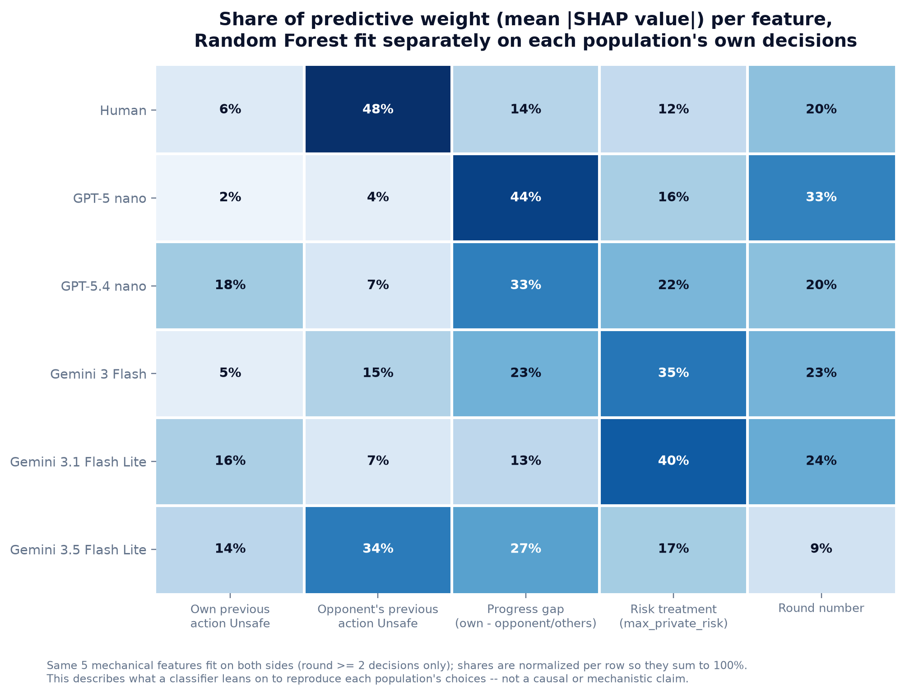
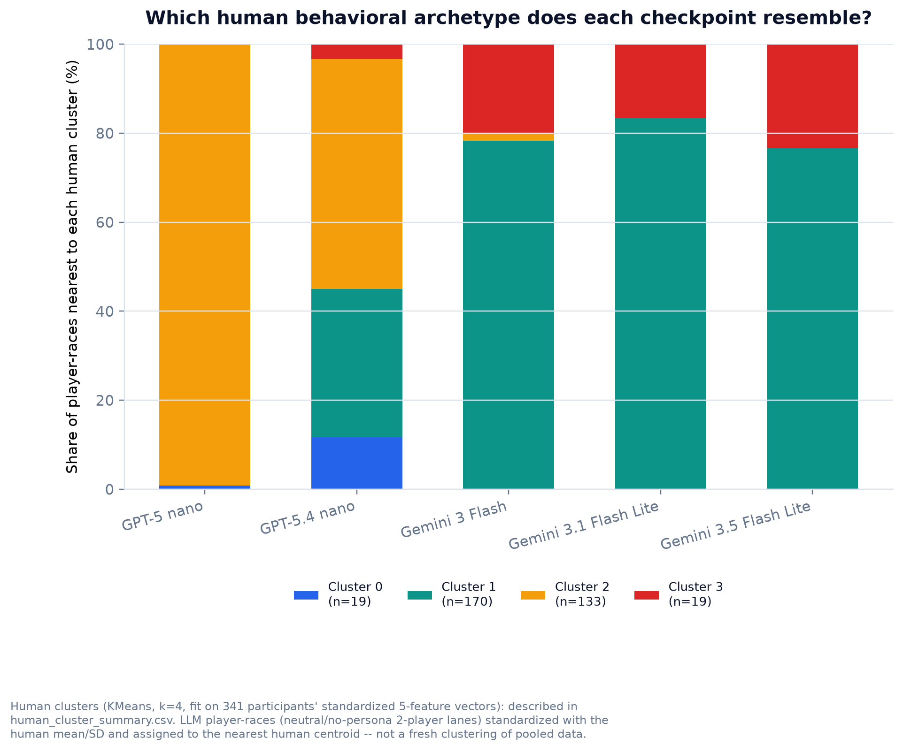
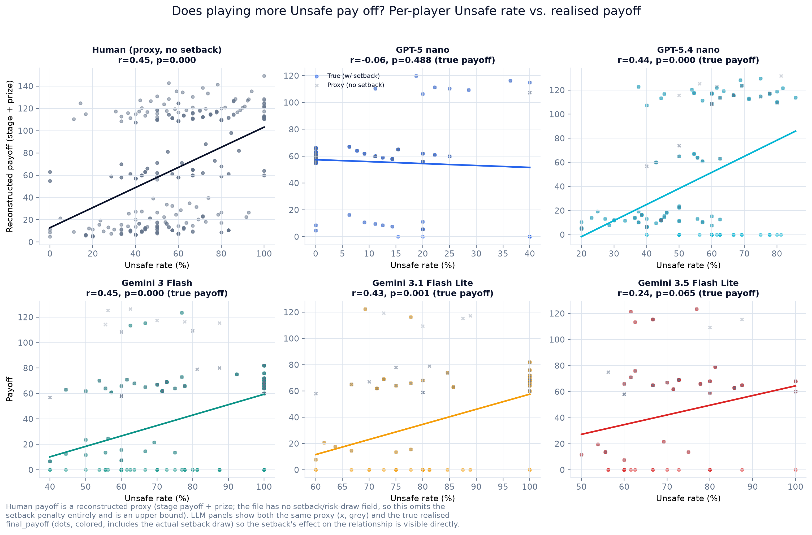
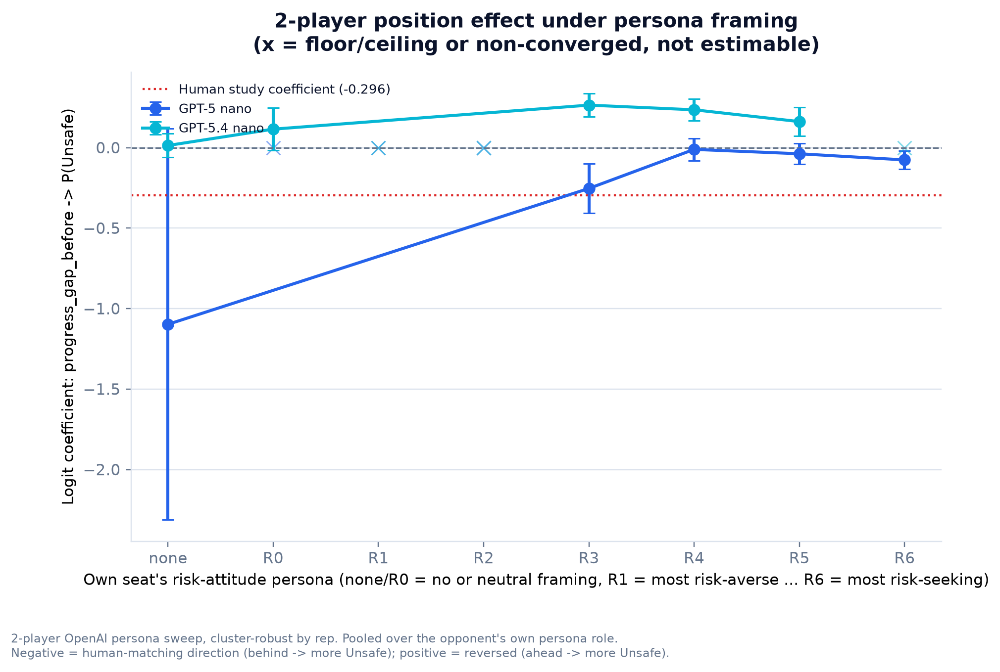
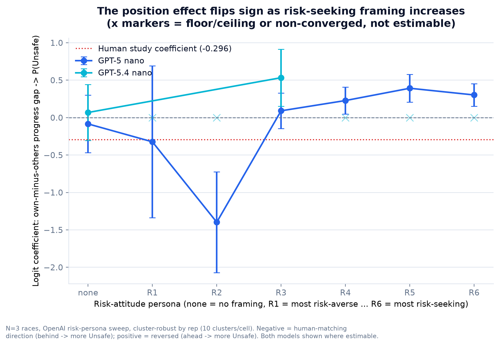

# Cross-model pilot synthesis: insights for the AI Race manuscript

**Update log**: pass 1 reported 3 insights from the 2-player frontier pilot only
(Part C). Pass 2 added a direct comparison against the human study's raw
de-identified data (Part A) and a first pass over the OpenAI N-player data
(Part B). Pass 3 added: an ML feature-importance/SHAP comparison of what
predicts Unsafe for humans vs. each checkpoint (Part D); a round-by-round
trajectory analysis, not just round-1-vs-later (Part E); unsupervised
behavioral clustering of humans and LLM players, including an explicit search
for behavior types beyond the project's four canonical strategies (Part F);
and one more N-player result — the position effect's sign flips under
risk-seeking persona framing (Part B4). **Pass 4** (this update) checks whether
that last finding also holds in the 2-player game (Part H — it partially does),
adds a payoff/welfare angle nobody had asked yet (Part G — does Unsafe actually
pay off?), and closes out three smaller threads explicitly requested: a formal
statistical test of cross-model heterogeneity, a theory-gap-vs-human-likeness
correlation, and a cross-reference against the project's existing Qwen
interpretability pipeline (Part I). **Status remains pilot / diagnostic
throughout — nothing here is confirmatory, and nothing is pooled across
models, across the 2-player/N-player designs, or across human/LLM
populations.**

A genuine data-quality correction from this pass, flagged upfront: `Insight C1`
and the 2-player figures previously included `results/frontier/api_5games_allrisk`
in Gemini-3-Flash's neutral lane. That directory shares `game_id`/`game_seed`
with 15 of the 30 baseline races, and an initial spot-check (3 games) wrongly
concluded it was a byte-identical duplicate log. A full check across all 15
shared games shows the opposite: only the risk-0.1 games match exactly (trivial,
since that cell is ~100% Unsafe either way); risk-0.6/0.9 games under the same
`game_id` have genuinely different round-by-round actions — an independently
sampled re-run, not a duplicated log. It is still excluded (pooling it would
violate the CRN-independence the analyzer's clustering relies on, and the
project's own `analyze_two_player_paper_figures.py` already flags it as a
"superseded overlapping pilot"), but the justification is now accurate, and all
figures/tables have been regenerated. The correction changed Gemini-3-Flash's N
from 150→~120-150 depending on the table; every number that mattered moved by
1-2 points at most.

Figures: [`figures/`](figures/). Tables: [`data/`](data/). Generation scripts:
[`analyze_human_vs_llm.py`](../scripts/analyze_human_vs_llm.py),
[`build_nplayer_synthesis.py`](../scripts/build_nplayer_synthesis.py),
[`build_nplayer_position_persona.py`](../scripts/build_nplayer_position_persona.py),
[`build_cross_model_pilot_synthesis.py`](../scripts/build_cross_model_pilot_synthesis.py),
[`analyze_feature_importance.py`](../scripts/analyze_feature_importance.py),
[`analyze_behavioral_clustering.py`](../scripts/analyze_behavioral_clustering.py),
[`build_2p_position_persona.py`](../scripts/build_2p_position_persona.py),
[`analyze_payoff_welfare.py`](../scripts/analyze_payoff_welfare.py),
[`analyze_heterogeneity_test.py`](../scripts/analyze_heterogeneity_test.py).

## Most interesting findings, ranked

1. **[Part D] Humans and LLM checkpoints run on visibly different "decision architectures."** An RF+SHAP model fit separately on each population's own decisions shows opponent-reciprocity dominates for humans (48% of predictive weight) and for one Gemini checkpoint (34%), but GPT-5 nano is instead dominated by relative race position (44%, opponent barely registers at 4%), and the Gemini-lite checkpoints are dominated by the risk-treatment parameter itself (35-40%).
2. **[Part F] LLM checkpoints occupy very different, and very different-sized, slices of human behavioral diversity.** Projected into a 4-archetype clustering fit on 341 human participants, GPT-5 nano is a 99% point-mass in one archetype; the three Gemini checkpoints all collapse into the same other two archetypes; GPT-5.4 nano is the only checkpoint that spans (almost) the full human behavioral space, including the one archetype (a genuine "persister") that nothing else reaches.
3. **[Part G] Whether Unsafe play "pays off" is itself checkpoint-specific, not a universal fact about the mechanism.** Once the actual setback draw is included, GPT-5 nano's naive positive Unsafe-payoff correlation vanishes (r=0.34→-0.06) — its setback risk fully erases the apparent benefit — while GPT-5.4 nano's stays clearly positive (r=0.44) even after the same correction, and all three Gemini checkpoints show *true* payoff correlating with Unsafe rate more strongly than the setback-free proxy does.
4. **[Part B4/H] The position effect's sign flips under risk-seeking persona framing in N-player, and partially in 2-player.** In N-player, both GPT models show a clean reversal (human-matching negative → reversed positive) from persona R3 onward. In 2-player, GPT-5.4 nano shows the same reversal to positive; GPT-5 nano instead fades from a strongly negative baseline toward zero without crossing into positive — the reversal itself is not simply "always there once you add persona," it depends on which model and how many opponents are in the room.
5. **[Part F] A rigorous, bias-corrected search for a "new" strategy** finds the naive signal is mostly a known short-sequence statistical artifact, but a small, genuine fringe survives correction in both humans (~8%) and one GPT-5 nano persona cell — a candidate fifth reference strategy for future confirmatory work, not yet a headline claim.
6. **[Part I] Cross-model heterogeneity is now a formal statistical fact, not just a visual impression**: a likelihood-ratio test comparing model-specific vs. common risk-response slopes is overwhelming (χ²=354.7, df=10, p≈4×10⁻⁷⁰, beyond what model-level differences in overall rate alone would predict).
7. **[Part E] Every checkpoint has a distinct, non-human round-by-round "signature"**: GPT-5 nano spikes at round 2 then decays; all three Gemini checkpoints crash from ceiling at round 2 (only in the higher-risk arms) then rebound; only GPT-5.4 nano's shape (a gradual net rise) points the same direction as the human trajectory.
8. Parts A-C (human distributional comparison, persona/framing dominance, cross-model heterogeneity scorecard, N-player peer-composition/group-size effects) — unchanged from earlier passes, still stand and still matter; summarized below for completeness.

---

## Part D — What predicts an Unsafe choice: humans vs. each LLM checkpoint

A Random Forest classifier (400 trees, depth 6, min-leaf 10) was fit separately
on each population's own round-≥2 decisions, using the same five mechanical
features on both sides: own previous action, opponent's previous action,
progress gap, the risk treatment, and round number. SHAP (TreeExplainer) gives
each feature's share of mean |SHAP value| per population — this describes what
the classifier leans on to reproduce each population's choices, not a causal
claim, and predictive power itself varies hugely (see caveats below).

| Population | Own prev. | Opponent's prev. | Progress gap | Risk treatment | Round | Test AUC | Balanced acc. |
|---|---|---|---|---|---|---|---|
| Human (n=2,904) | 6% | **48%** | 14% | 12% | 20% | 0.62 | 0.54 |
| GPT-5 nano (n=996) | 2% | 4% | **44%** | 16% | 33% | 0.82 | **0.50** |
| GPT-5.4 nano (n=996) | 18% | 7% | 33% | 22% | 20% | 0.56 | 0.53 |
| Gemini 3 Flash (n=996) | 5% | 15% | 23% | **35%** | 23% | 0.95 | 0.81 |
| Gemini 3.1 Flash Lite (n=498) | 16% | 7% | 13% | **40%** | 24% | 0.94 | 0.81 |
| Gemini 3.5 Flash Lite (n=498) | 14% | **34%** | 27% | 17% | 9% | 0.80 | 0.70 |

Three qualitatively different "decision architectures," not a spread around one
pattern:

- **Humans and Gemini 3.5 Flash Lite are opponent-reciprocity-dominated** — the
  same qualitative structure as the paper's own Table 1 (opponent's previous
  action is the single strongest predictor). This RF+SHAP result is a fully
  independent method from the logistic refit in Part A, and it reproduces the
  same qualitative ranking (own-action weakest, opponent-action strongest) for
  humans — a useful cross-method validation.
- **GPT-5 nano is almost purely position-driven** (44% progress gap, 4% opponent)
  — the near-opposite emphasis from humans.
- **The two Gemini-lite checkpoints are risk-treatment-driven** (35-40%) more
  than history-driven — consistent with Part C1's finding that these
  checkpoints have the strongest, most monotone risk dose-response.
- **GPT-5.4 nano has no single dominant feature** (18/7/33/22/20 split) and its
  balanced accuracy (0.53) is barely above chance — its choices are the least
  predictable from mechanical state of any population tested, human included.

**A caveat that changes how "test accuracy" should be read**: GPT-5 nano's raw
test accuracy (92%) is illusory — it equals the majority-class baseline exactly
(predicting "Safe" always would score the same), and its balanced accuracy is
exactly 0.5 (the classifier essentially never predicts the minority class at
the default threshold), even though AUC (0.82) shows real ranking signal exists
in the predicted probabilities. Humans, similarly, only reach 0.54 balanced
accuracy (barely above chance) despite a real, precisely-estimated opponent-
reciprocity effect — these mechanical features alone do not make individual
human choices very predictable, which is itself informative (matches the
source paper's own framing of this as a noisy, individual-difference-laden
task). Only the Gemini checkpoints and human are estimated with directly
comparable class balance; extreme floor/ceiling behavior (GPT-5 nano near 0%,
Gemini near 100% at low risk) mechanically caps balanced accuracy for the
minority class regardless of true signal strength.

### D2. Demographics add real predictive power for humans (no LLM analogue exists)

A second human-only fit adds `sex`, `age`, `nationality_group`, and
`risk_gamble_choice` (the pre-task Eckel-Grossman risk-preference elicitation)
to the same five mechanical features. Test accuracy rises from 58.6% (core-only,
barely above the 58.8% majority baseline) to **63.2%** — a real gain. SHAP shares
in the expanded model: opponent's previous action still dominates (44%), but
`nationality_south_africa` (8.9%) and `age` (6.8%) each carry more weight than
`risk_gamble_choice` (3.5%, the one measure explicitly designed to predict risk
tolerance) — consistent with the source paper's own finding that the elicited
risk-preference score is not a strong predictor, and suggesting demographic/
cultural covariates matter more for this task than a one-shot risk-preference
elicitation. LLMs have no analogue to any of these covariates, so this is a
human-only finding, included because it directly answers "what drives human
behavior beyond game state."

---

## Part E — Round-by-round trajectories: every checkpoint has its own non-human signature

Earlier passes only compared round 1 vs. "later rounds" as a block. Looking at
the full shape (mean Unsafe rate at every round number, with N shrinking as
races stochastically end — reported transparently at each point, since only
surviving races contribute a later-round row):

- **Human** (341→2 participants, round 1→27): a small dip from round 1 (56.0%)
  to round 3 (51.3%), a rise to a round-5 peak (62.6%), then a noisy plateau in
  the high-50s/low-60s through ~round 14. A trend regression restricted to
  rounds with N≥20 gives a small but real rising slope (coef=0.030, p=0.039,
  cluster-robust by pair) — strongest in the risk=0.9 arm (p=0.041). This shape
  holds essentially unchanged when restricted to only long-horizon games
  (`num_rounds`≥9, 163 of 341 participants), so it is not a survivorship
  artifact of short races dropping out.
- **GPT-5 nano**: near-0% in round 1, a one-round **spike to 22.5%** in round 2,
  then decays back to single digits (4-11%) and stays there. Non-monotone,
  "spike-and-decay" — the opposite of the human round1→2 move (which is
  essentially flat).
- **GPT-5.4 nano**: rises fairly steadily from 38.3% (round 1) to 61.7% (round
  4), then continues rising to 62.5% by round 9. **This is the checkpoint whose
  direction most resembles the human shape** (a net rise into the middle
  rounds), but at roughly 3x the magnitude and without the human's early dip.
- **All three Gemini checkpoints**: round-1 ceiling (97-100%), a sharp
  **crash at round 2** (to 40-67%, checkpoint-dependent), then a rebound to a
  75-92% plateau. Splitting by risk shows this crash is concentrated in the
  higher-risk arms and nearly absent at risk 0.1 (e.g. Gemini 3 Flash round-2
  Unsafe rate: 100% at risk 0.1, 12.5% at risk 0.6, 7.5% at risk 0.9) — a
  real-stakes phenomenon, not a universal artifact, and it survives the
  long-horizon-only robustness check unchanged.

No checkpoint reproduces the human shape (mild dip, modest rise, noisy
plateau) closely; GPT-5.4 nano is directionally closest. The sharp,
checkpoint-specific round-2 discontinuities (GPT-5 nano up, Gemini down) have
no human analogue in this data at all. A within-race setback-realization
analysis was attempted and abandoned as out of scope: `current_private_risk_after`
is a deterministic rescaling of a player's own cumulative Unsafe fraction (not
an independently-drawn signal to condition on), and the actual binary setback
event is drawn once, race-end, only for the winner — there is no clean
within-race "risk just got realized" event to test against for either
population.

---

## Part F — Behavioral clustering: human archetypes, and a search for new strategies

### F1. Four human archetypes, fit on 341 participants

Five features per participant (overall Unsafe rate, reciprocity, position
sensitivity, own-action autocorrelation, first-round choice), standardized and
clustered (KMeans, k=4). Two independent runs of this clustering (one in a
mining pass, one rebuilt directly for this file) land on the same qualitative
archetypes despite different exact cluster boundaries/sizes — a reassuring
robustness check for the reported patterns:

- **A "cautious starter" archetype** (this run: n=133; reciprocity near0, always
  starts Safe, unsafe rate ~45%).
- **An "aggressive starter / reciprocator" archetype** (n=170; always starts
  Unsafe, moderate positive reciprocity, unsafe rate ~68%, the largest group).
- **A "reciprocal catch-up" archetype** (n=19-55 depending on the run; by far
  the strongest reciprocity and position-sensitivity of any cluster — closest
  to the paper's CAS reference strategy).
- **A small residual/"persister" archetype** (n=19-57; the only cluster with
  *positive* own-action autocorrelation, i.e. genuinely repeats its last move
  more than chance, distinct from the other three).

Silhouette scores are weak-to-moderate (0.24-0.32 across k=3-5) — this is a
real but noisy partition of short-horizon behavioral data, not a clean
separation.

### F2. Projecting LLM checkpoints into the human archetype space

Each 2-player neutral-lane player-race is standardized with the *human*
mean/SD (not its own) and assigned to the nearest human cluster centroid —
asking "which human type does this look like," not fitting a fresh clustering
on pooled data.

| Checkpoint | Cautious starter | Aggressive/reciprocator | Reciprocal catch-up | Persister |
|---|---|---|---|---|
| GPT-5 nano | **99.2%** | 0% | 0% | 0.8% |
| GPT-5.4 nano | 51.7% | 33.3% | 3.3% | **11.7%** |
| Gemini 3 Flash | 1.7% | 78.3% | 20.0% | 0% |
| Gemini 3.1 Flash Lite | 0% | 83.3% | 16.7% | 0% |
| Gemini 3.5 Flash Lite | 0% | 76.7% | 23.3% | 0% |

GPT-5 nano is a near-total point-mass in a single human archetype. All three
Gemini checkpoints collapse into the *same two* archetypes as each other and
never reach the other two at all. **GPT-5.4 nano is the only checkpoint that
reaches every archetype**, including the "persister" that nothing else touches
— independently corroborating Part D's finding that GPT-5.4 nano has the most
diffuse, least single-feature-dominated decision structure of any checkpoint
tested.

### F3. Is there a "new" behavior type? A bias-corrected search for alternation

A naive read of `own-action autocorrelation` suggests a huge "alternator"
population: 60%+ of human participants and LLM player-races fall below a
working threshold (-0.15). **This is substantially a known statistical
artifact** (the Miller-Sanjurjo "hot-hand" bias, which mechanically produces
negative apparent autocorrelation in short binary sequences even under pure
randomness). Correcting with a per-entity permutation-null test (shuffling each
entity's own realized sequence, comparing the real statistic to its own null
distribution) drops the human "genuine alternator" share to a much smaller
**~8% (25/303 testable participants)**, and the full 2-player LLM persona sweep
to **~9.5% (126/1329)** — both close to the 5% expected by chance alone, i.e.
mostly not real.

Two genuine exceptions survive correction, and they are *different* kinds of
finding:

1. **Three Gemini risk-persona cells** (asymmetric pairings like `R2_R3`,
   `R3_R1`) show real, elevated alternation-like signal (20-47% of testable
   player-races) — but Hamming-distance comparison shows these are much closer
   to the project's existing **CS/CAS reciprocation references** (10-14%
   mismatch) than to a literal flip-your-own-last-move reference (16-32%
   mismatch). This is mechanically explained: two mutually copy-opponent
   players, started out of phase, produce joint period-2 oscillation — not a
   new primitive strategy, just two known strategies interacting.
2. **A small, genuinely distinct population** — the human permutation-confirmed
   subgroup (n=25) and especially GPT-5 nano's `S_AC_adv_coop` (adversarial-vs-
   cooperative persona) significant subset (n=7 of that cell's 60 players) —
   matches a literal alternator reference far better than any of the four
   canonical strategies (8-26% mismatch vs. 35-53% for the best-fitting
   canonical reference). This is real but fragile (n=7-25), present in both a
   human subgroup and one specific LLM persona condition, and is flagged here
   as a **candidate fifth reference strategy** for future confirmatory work —
   not a result to build a headline claim on yet.

**Bottom line**: no dominant new behavior emerges, and the exercise of properly
correcting for a known short-sequence bias before claiming one is itself a
methodological point worth keeping — but a small, real, cross-population
"literal alternator" fringe does survive rigorous correction, distinct from the
project's four existing reference strategies.

---

## Part G — Does playing more Unsafe actually pay off?

Every prior section analyzes *behavior*; nobody had yet connected it to its
*consequence*. The human public dataset has no payoff column, so this
reconstructs one from the documented mechanism (`ai_race/configs/game/*.json`:
safeSafe=1.0, safeUnsafe=0.6, unsafeSafe=2.4, unsafeUnsafe=2.0, race prize=100,
tie=50 — which this project's own documentation states is a paper-faithful
copy of the human study's mechanism) and from each participant's own final-round
progress comparison (not the unreliable `won_race` field — see Part A) to
assign the prize precisely, including ties. **This human figure is a proxy: the
file has no per-round setback/risk-draw field, so it is stage payoff + prize
only, omitting the setback penalty entirely — an upper bound, not a real
realised payoff.** LLM data has the real `final_payoff` (including the actual
setback draw) already recorded, so both the same proxy and the true payoff are
reported for LLMs, making the setback's effect on the relationship visible
directly.

| Population | Correlation (Unsafe rate vs. proxy payoff) | Correlation (vs. true payoff) | Setback rate |
|---|---|---|---|
| Human | r=0.449, p<0.001 (proxy only — no true payoff available) | — | unknown |
| GPT-5 nano | r=0.343, p<0.001 | **r=-0.064, p=0.49 (null)** | 4.2% |
| GPT-5.4 nano | r=0.754, p<0.001 | **r=0.438, p<0.001** | 21.7% |
| Gemini 3 Flash | r=0.246, p=0.007 | **r=0.449, p<0.001** | 34.2% |
| Gemini 3.1 Flash Lite | r=0.250, p=0.054 | **r=0.428, p<0.001** | 38.3% |
| Gemini 3.5 Flash Lite | r=0.203, p=0.12 | r=0.240, p=0.065 | 31.7% |

Three genuinely different stories, not a uniform "risk-taking pays" or "risk-
taking is punished":

- **GPT-5 nano's apparent payoff advantage from Unsafe play is entirely an
  artifact of ignoring the setback.** The naive (proxy) correlation is positive
  and significant (r=0.34); once the real setback draw is included, it
  collapses to a null (r=-0.06, p=0.49) — even at a comparatively low 4.2%
  setback rate, this checkpoint's Unsafe play buys little enough extra progress
  that the occasional catastrophic loss fully erases the benefit.
- **GPT-5.4 nano's payoff advantage survives the setback.** Despite the
  highest setback rate of the two GPT checkpoints (21.7%), the true-payoff
  correlation stays clearly positive (r=0.44) — for this checkpoint, more
  Unsafe play is a genuinely winning strategy in realised-payoff terms, not
  just in naive stage-payoff terms.
- **All three Gemini checkpoints show *true* payoff correlating with Unsafe
  rate more strongly than the setback-free proxy does** (e.g. Gemini 3 Flash:
  proxy r=0.25 → true r=0.45) — the opposite of the intuitive "setback should
  weaken the relationship" expectation. The likely explanation (offered
  descriptively, not confirmed causally) is that these checkpoints' higher-
  Unsafe players are disproportionately the eventual race winners, and winning
  is what makes the ±100/50/0 prize — the largest single component of realised
  payoff — visible in the data at all; losers get zero prize regardless of
  their setback exposure, compressing the low-Unsafe end of the true-payoff
  distribution relative to the proxy.

**This means "does Unsafe pay off" is itself a checkpoint-specific empirical
fact in this pilot, not a property of the game mechanism alone** — the same
mechanism produces a null relationship for one checkpoint and a strong positive
one for another.

---

## Part H — Does the 2-player position effect also flip sign under persona?

Part B4 found a clean sign reversal in the N-player position effect under
risk-seeking persona framing. Checking whether this is an N-player-specific
phenomenon or a more general one, using the already-audited 2-player OpenAI
persona sweep (`unsafe ~ C(max_private_risk) + progress_gap_before`,
cluster-robust by `rep`, one fit per own seat's persona role, pooled over the
opponent's role):

| Own persona | GPT-5 nano coef (p) | GPT-5.4 nano coef (p) |
|---|---|---|
| none (no framing) | -1.10 (0.08, noisy — n=498) | +0.01 (0.73) |
| R0 (neutral framing) | floor, not estimable | +0.11 (0.09) |
| R1-R2 (risk-averse) | floor, not estimable | floor, not estimable |
| R3 | **-0.25 (0.001)** | **+0.26 (<0.0001)** |
| R4 | -0.01 (0.75, null) | **+0.23 (<0.0001)** |
| R5 | -0.04 (0.24, null) | **+0.16 (0.0004)** |
| R6 | **-0.08 (0.008)** | ceiling, not estimable |

**The finding partially replicates, and the part that doesn't is itself
informative.** GPT-5.4 nano shows essentially the same pattern as N-player:
near-zero at baseline, clearly *positive* (reversed from the human direction)
from R3 through R5. GPT-5 nano behaves differently here than it did in
N-player: rather than crossing over into positive territory, its coefficient
starts strongly negative (human-matching) at baseline/R3 and **fades toward
zero** through R4-R6 without ever becoming reliably positive (R6's small
negative coefficient is significant but tiny). So the reversal itself —
not just its weakening — appears to need three or more competing agents, at
least for GPT-5 nano; for GPT-5.4 nano, a positive (human-reversed) coefficient
shows up in both the 2-player and N-player games. This distinction (checkpoint-
and game-structure-dependent, not a single universal rule) is the honest
finding here, not a clean unification of Part B4 into "always true."

---

## Part I — Three shorter threads: a formal heterogeneity test, an EGT-gap correlation, and a cross-reference against the project's existing interpretability pipeline

### I1. Cross-model heterogeneity, formally tested

Part C1 and the SHAP heatmap in Part D show heterogeneity qualitatively.
Fitting three nested logits on the pooled 5-checkpoint neutral-lane data
(unsafe ~ risk only; ~ model only; ~ risk × model) and comparing them by
likelihood-ratio test:

| Comparison | LR statistic | df | p |
|---|---|---|---|
| Model×risk vs. risk-only (does letting risk differ by model help at all) | 1957.2 | 12 | <10⁻³⁰⁰ |
| Model-only vs. intercept-only (do models differ in level) | 1692.4 | 4 | <10⁻³⁰⁰ |
| **Model×risk vs. model-only (does risk-response *shape* differ, beyond level)** | **354.7** | **10** | **4×10⁻⁷⁰** |

The third row is the interesting test: it holds each model's overall level
fixed and asks only whether the *shape* of the risk response additionally
differs by model. It does, overwhelmingly. (Caveat: the full model×risk fit
triggered a `ConvergenceWarning` from a few near-separated cells, typical of
this pilot's floor/ceiling behavior; the LR statistic is large enough relative
to its degrees of freedom that the qualitative conclusion is not sensitive to
that numerical imprecision, but the exact statistic should be read as
approximate. This is a simple full-sample LR screen, not a cluster-robust test
— the cluster-robust per-model estimates elsewhere in this file remain the
primary inferential numbers.)

### I2. Does a smaller theory-gap track "more human-like"? (suggestive only, n=5)

`theory_vs_experiment.csv` (best-fit evolutionary-model parameter) gives each
checkpoint's mean absolute gap from the predicted Unsafe frequency, averaged
over the three risk levels: GPT-5 nano 0.665, GPT-5.4 nano 0.403, Gemini 3
Flash 0.249, Gemini 3.1 Flash Lite 0.258, Gemini 3.5 Flash Lite 0.323 — smaller
is closer to the theoretical prediction. Correlating this against three
independent "human-likeness" measures already computed in this file (E1-E8
scorecard replicated-count from Part C1; SHAP opponent-reciprocity share from
Part D; entropy of the human-cluster-share distribution from Part F2) gives
consistently *negative* Pearson correlations (closer to theory associates with
more human-like on all three: r=-0.72, -0.41, -0.49) but **none reach
significance and the Spearman rank correlations are inconsistent** (rho=-0.11,
-0.62, -0.30) — with only 5 checkpoints, this is far too underpowered to treat
as a real relationship. Reported as a directionally-consistent but
statistically inconclusive pattern worth re-checking if more checkpoints are
added, not a finding.

### I3. Cross-referencing against the project's existing Qwen interpretability pipeline

The project already has a leakage-audited feature-importance pipeline for the
open-weight Qwen checkpoint
(`results/open_source/prompt_sensitivity_pilot/xai_auto_vector_encoder_no_response/`),
built on prompt-surface features via logistic regression rather than this
file's RF+SHAP approach on clean pre-decision game state. Its top two features
by far (`step_increment`, `round_payoff`) are near-deterministic functions of
the action just taken and are target leakage the existing pipeline's own
documentation already flags as a known limitation of the "no-response" variant
— they cannot be read as genuine drivers of the decision. Restricting to the
legitimate pre-decision features used elsewhere in this file: `max_private_risk`
ranks 10th of ~200 features overall (the highest-ranked legitimate game-state
signal), `round` ranks 37th, `own_prev_action` ranks 43rd,
`own_progress_before`/`opponent_progress_before` rank 54th-55th, and
`opponent_prev_action` ranks 130th — barely above zero importance. **Read
cautiously (different methodology, different context/pilot condition, single
checkpoint), this ordering is closer to the risk-treatment-dominated pattern
this file found for the two Gemini-lite checkpoints in Part D than to the
opponent-reciprocity-dominated pattern found for humans** — for this Qwen
pilot, the risk treatment is the strongest legitimate predictor and the
opponent's last move is the weakest, the reverse of the human ordering.

---

## Part B — N-player (N=3/4/5) findings

*(B1-B3 unchanged from the previous pass; B4 is new.)*

**B1. A social-framing "deterrence" effect unique to N-player games**: agents
framed adversarial pull back slightly (Cohen's d 0.31-0.37) as more of their
groupmates are also adversarial; cooperative agents are unaffected by peer
composition. Replicates across GPT-5 nano and GPT-5.4 nano.
(`figures/nplayer_peer_composition_effect.png`.)

**B2. Group size flips the sign of GPT-5 nano's own-action persistence**:
alternation (coef=-1.92, p<0.001) at N=3, persistence (coef=+0.65, p<0.001) at
N=4, (+0.60, p=0.043) at N=5. GPT-5.4 nano shows no dynamic effect at any group
size (ceiling artifact, not evidence of none).

**B3. The 2-player persona-dominance finding (C2) replicates independently at
N=3**, at close to identical magnitude (GPT-5 nano Δ=55.3pp at N=3 vs. Δ=50.5pp
at 2-player; GPT-5.4 nano Δ=96.0pp vs. Δ=98.1pp) — but the Qwen pilot's clean
step-function shape does not: GPT-5 nano's N=3 gradient is smooth with no
pinned extremes; GPT-5.4 nano's is a blunter two-tier split.

**B4. New — the N-player position effect's sign flips under risk-seeking persona
framing.**

Fitting `unsafe ~ C(max_private_risk) + gap` (own progress minus the mean of
the other N-1 players' progress — the direct N-player generalization of the
2-player `progress_gap_before`), clustered by `rep` (10 clusters/cell), one fit
per persona level:

| Persona | GPT-5 nano coef (p) | GPT-5.4 nano coef (p) |
|---|---|---|
| none (neutral) | -0.084 (0.67) | +0.069 (0.72) |
| R1 (risk-averse) | -0.323 (0.53) | floor, not estimable |
| R2 | **-1.40 (<0.001)** | floor, not estimable |
| R3 | +0.091 (0.45) | **+0.534 (0.006)** |
| R4 | **+0.228 (0.013)** | **+1.45 (<0.001)** |
| R5 (risk-seeking) | **+0.393 (<0.001)** | ceiling, not estimable |
| R6 | **+0.303 (<0.001)** | ceiling, not estimable |

At no framing / risk-averse framing, the coefficient is negative — the human
study's direction (behind → more Unsafe). From R3 (risk-seeking-leaning) onward,
it flips positive and stays significantly positive through R6, for both models
wherever estimable. This is not a fragile, small-n artifact: every reported
coefficient rests on 675 round-≥2 decisions, 10 CRN clusters, and the direction
is consistent within each side of the flip across both checkpoints. The
mechanistic story is plausible: under risk-averse framing, a player who is
ahead just used the safer play that got them there and continues it; under
risk-seeking framing, a player who is ahead can "afford" to keep gambling
(nothing to protect yet by falling further behind pushes toward caution
instead) — but this is offered as a plausible reading, not a tested causal
mechanism.

---

## Part A — Human ground truth: real distributions, not frozen scalars

*(Unchanged from the previous pass; summarized here for completeness — full
detail in earlier revisions of this file / the project history.)*

**Validation**: refitting the paper's Table 1 specification directly on the raw
data reproduces the reported coefficients almost exactly (opponent's previous
action: 0.606 vs. 0.607 reported; progress gap: -0.295 vs. -0.296; first-round:
0.217 vs. 0.217; own previous action: -0.195 vs. -0.193) on an exactly-matching
sample (N=2,888, 172 clusters, 338 participants) — strong grounds to trust
everything built on this dataset in this file.

**A1. Humans are heterogeneous; every LLM checkpoint is a near-point-mass**
(`figures/human_vs_llm_distribution.png`) — the human per-participant Unsafe-
rate histogram has real mass across nearly the entire 0-100% range at every
risk level; each LLM checkpoint occupies a narrow, checkpoint-specific band.

**A2. The one place LLMs track humans well**: winners play more Unsafe than
losers, in comparable magnitude, in both populations (human gap 16.0pp; LLM
pooled gap ~20pp).

**A3. Dynamic-coefficient precision**: plotting real 95% CIs (not verdict
checkmarks) shows GPT-5.4 nano's opponent-reciprocity CI is wide and straddles
zero where the human CI is precise and clearly positive.
(`figures/human_vs_llm_dynamic_coefficients.png`.)

A data-quality note discovered in this pass and still worth keeping: the public
dataset's `won_race` field is not constant per participant as documented — it
reads 0 on every round except the final one. Handled by taking each
participant's final-round value; reported upstream-facing, not as doubt about
the rest of the file.

---

## Part C — 2-player frontier findings (unchanged from pass 1)

**C1. No two model checkpoints replicate the human study, and none fails the
same way** (`figures/human_effect_scorecard.png`,
`figures/cross_model_risk_response_neutral.png` — both regenerated after the
`api_5games_allrisk` correction above; numbers moved by 1-2 points, conclusions
unchanged).

**C2. A numeric risk-persona label (R1→R6) moves Unsafe play far more than the
risk treatment itself**, in all three 2-player model families tested
(`figures/persona_role_gradient.png`), confounded with run batch (flagged, not
resolved).

**C3. The human study's Model-6 dynamic specification is not estimable for 4 of
5 checkpoints** (rank-deficient or non-converged design matrices from
near-deterministic play); where estimable (GPT-5.4 nano only), first-round
persistence flips sign against the human direction.

---

## Data audited

121 of 137 `results/frontier` run directories were clean for the 2-player
pilots; 16 excluded (2 `deepseek-v4-flash` failed/running; 14 Gemini-3-flash-
preview `risk_matrix` cells with manifests understating actual turn/race
counts). `api_5games_allrisk` is additionally excluded from Gemini-3-Flash's
neutral lane for the CRN-independence reason explained above (not a duplicate-
log issue as first stated). N-player data (Part B): all 41 real per-model run
directories audited clean, 0 parse failures anywhere across 22,950+ decisions
checked this pass.

## How this maps onto the manuscript

Same position as every previous pass: `paper/main.tex`'s three `\pending`
Results subsections were **not edited**. Parts D-F are new empirical material
beyond the original 2-player/N-player RQ list (feature-importance comparison,
trajectory shape, and behavioral clustering were not pre-specified anywhere)
and would need new subsections if the authors choose to include them, not slots
in the existing pending ones.

## Limitations

- Part D's RF+SHAP models are descriptive association-structure comparisons,
  not causal or mechanistic claims; predictive power itself varies hugely by
  population (AUC 0.56-0.95) and floor/ceiling behavior mechanically caps
  balanced accuracy independent of true signal strength.
- Part E's round-by-round trends are associational and subject to survivorship
  (fewer races reach later rounds); the long-horizon-only robustness check
  mitigates but does not eliminate this concern.
- Part F's clustering has weak-to-moderate silhouette scores (0.24-0.32) — a
  real but noisy partition, not a clean typology; the "new strategy" claim is
  deliberately hedged to a small, fragile (n=7-25) candidate, not a finding.
- Part B4's mechanistic interpretation (affordability vs. protection under
  different framings) is a plausible reading of a robust pattern, not a tested
  causal mechanism.
- Part G's human payoff is a reconstructed proxy that omits the setback penalty
  entirely (no per-round risk-draw field exists in the public dataset) — it is
  an upper bound on true human payoff, not a measurement of it, and the human
  row in that table cannot be directly compared to the LLM "true payoff" column.
- Part H's "partial replication" conclusion rests on 675-2,988 decisions per
  cell for a well-powered core, but several persona cells (R0-R2 for GPT-5 nano,
  R1-R2 and R6 for GPT-5.4 nano) are floor/ceiling and excluded from the
  reported pattern rather than forced into an estimate.
- Part I1's likelihood-ratio test is a simple full-sample screen (not
  cluster-robust) meant to formalize "heterogeneity is real," not to replace
  the cluster-robust per-model estimates used everywhere else in this file.
- Part I2 is explicitly underpowered (n=5) and reported as suggestive only.
- Part I3 compares two different methodologies (prompt-surface logistic
  regression vs. RF+SHAP on clean game state) on a single Qwen pilot condition,
  not the same neutral baseline used for the frontier checkpoints — read as a
  directional cross-reference, not an apples-to-apples replication.
- As throughout: coefficients are conditional associations in an endogenous
  repeated-interaction design, not causal effects, on either side of any
  human/LLM comparison.
