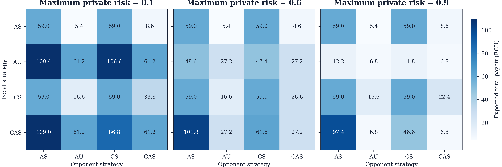
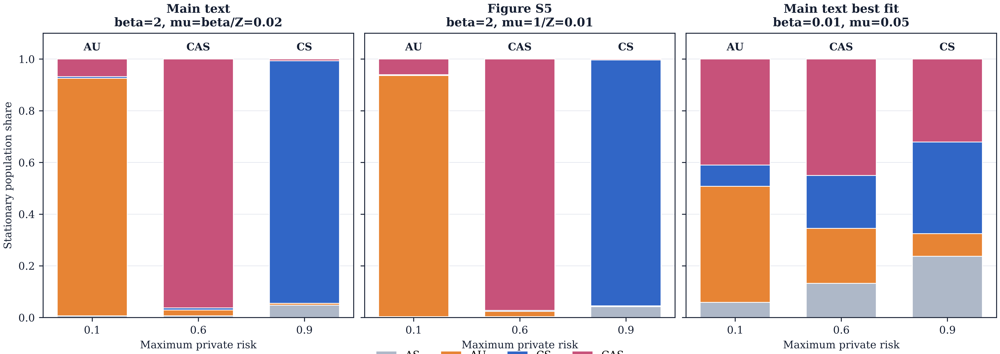
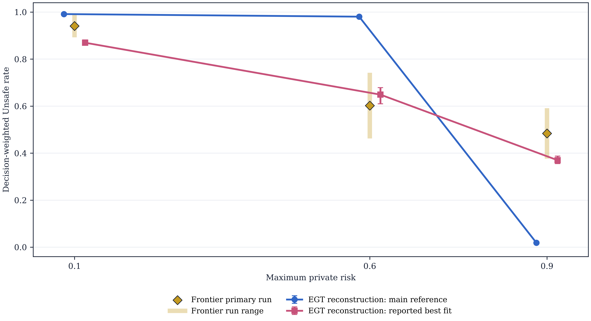
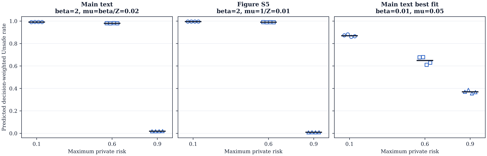
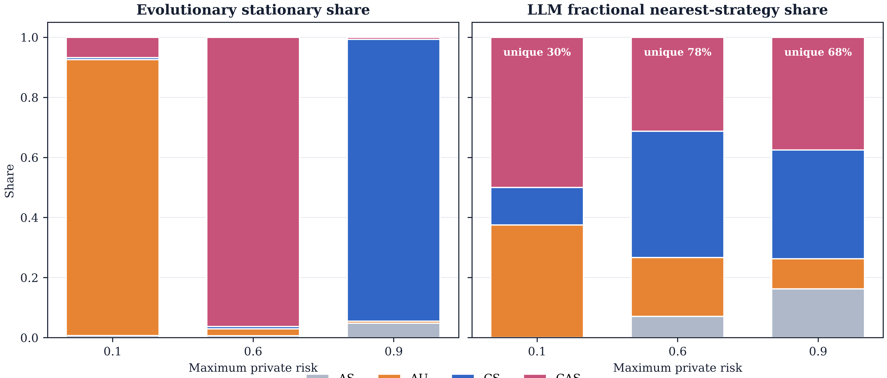

# Reduced evolutionary-game reconstruction

## Admission status

**Evidence class: faithful reconstruction, not exact code reproduction.** The arXiv v1 paper discloses the game, strategy rules, payoff equations, and evolutionary process. It does not yet publish the authors' analysis code, generated payoff matrices, EGTtools version/commit, or Monte Carlo seeds. The paper says code will be deposited on Zenodo upon publication. This run therefore cannot be bitwise identical to the private author run.

This reconstruction improves numerical reproducibility in one bounded way: it sums the geometric horizon until the omitted mass is below `1e-13`, rather than using the paper's `10^4` Monte Carlo races for conditional matchups. The finite-population stationary quantities are still numerical estimates from independent, seeded pairwise-comparison chains.

## Reconstructed specification

- Strategies: AS always Safe; AU always Unsafe; CS starts Safe then copies the opponent's preceding action; CAS starts Unsafe then copies the opponent's preceding action.
- Stage payoff matrix: `[[1, 0.6], [2.4, 2]]`; Safe progress 1; Unsafe progress 1.5.
- Horizon: at least 5 rounds, then stop after each completed round with probability 0.2; expected horizon 9.
- Terminal prize: 100 for the winner or 50 each on a tie.
- Winner/tied-winner effective private risk: `max_risk * Unsafe_fraction`; a setback removes the complete task payoff. A loser keeps stage payoffs, receives no prize, and faces no setback.
- Evolution: well-mixed population `Z=100`, random pair matching without self-interaction, Fermi imitation, and uniform mutation to one of the other three strategies.

## Reproduction audit finding

The paper contains two distinct reference mutation settings. Its main text defines the blue reference as `beta=2, mu=beta/Z=0.02`; Figure S5 instead reports `beta=2, mu=1/Z=0.01`. Neither is silently corrected here. Both are run and exported, together with the reported best-fit point `beta=0.01, mu=0.05`.

The requested EGTtools `docs` branch was inspected at commit `df7f5fb7787658b3fd3ab21343ff50a3e2a5d439`. That commit documents the same finite-population transition rule, but it predates the 2026 paper and is not identified by the paper as its execution revision. Current EGTtools was therefore not treated as a missing author lockfile.

The pinned official-source execution artifact was not available for this run.

## Main findings

At the main-text reference point, the dominant reconstructed strategy changes from **AU** at risk 0.1, to **CAS** at 0.6, to **CS** at 0.9. This reproduces the paper's qualitative ordering. The associated predicted Unsafe rates are 99.2%, 98.0%, and 1.9%.

At the weak-selection, high-mutation best-fit point, the predicted rates are more diffuse: 87.0%, 64.9%, and 37.0%. This matches the paper's interpretation that higher mutation and weaker selection move mass away from near-pure vertices.

The deterministic payoff matrices reveal the mechanism. At risk 0.1, AU receives 109.44 against AS and maintains a strong invasion advantage. At risk 0.6, CAS receives 101.77 against AS because one initial Unsafe move wins the race with low accumulated exposure. At risk 0.9, CS earns 59 against itself while Unsafe winners' payoff is strongly discounted, supporting the shift toward conditional Safe play.

## LLM-agent comparison

The frontier comparison uses `120` player trajectories and `1116` decisions from routes `['anthropic-claude-sonnet-5-default', 'google-gemini-3-flash-preview']`, with requested temperature values `[0.7]`. No independent sensitivity artifact was supplied; the comparison is therefore a single frontier-run description. This comparison is **descriptive only**. The LLM races are repeated self-play prompts; they are not draws from the evolutionary population process, and nearest-strategy labels do not establish a latent strategy.

- Frontier primary run, risk 0.1: focal context claude 89.2%; observed range 89.2% to 98.9%.
- Frontier primary run, risk 0.6: focal context claude 46.2%; observed range 46.2% to 74.2%.
- Frontier primary run, risk 0.9: focal context claude 37.6%; observed range 37.6% to 59.1%.

The key cross-study insight is a boundary, not an equivalence: the reduced EGT model predicts a sharp risk-driven phase change under strong selection, while the single-model pilot is strongly affected by surface context and opaque action-code position. The same payoff mechanics therefore do not guarantee the same behavioural regularity once decisions are produced by a prompt-sensitive language model.

## Figures

## Artifact map

- `egt_expected_payoff_matrices.csv`: exact reconstructed ordered payoffs.
- `egt_pair_unsafe_fractions.csv`: expected focal Unsafe fraction in each matchup.
- `egt_stationary_chains.csv`: every independent Markov-chain estimate.
- `egt_stationary_summary.csv`: chain means and between-chain ranges.
- `llm_strategy_matches_primary_t0.csv` and `llm_strategy_summary_primary_t0.csv`: primary frontier audit (the legacy filename is retained for downstream compatibility).
- `theory_llm_comparison.csv`: commensurable theory and LLM Unsafe-rate descriptors.
- `theory_llm_comparison.csv`: commensurable theory and LLM Unsafe-rate descriptors.
- `egttools_pinned_source_validation.json`: official-source transition and stationary parity audit.
- `reconstruction_manifest.json`: source revisions, parameters, hashes, coverage, and evidence boundary.

## Sources

- Fernández Domingos and Han, *Falling Behind Drives Unsafe Development in an Idealised AI Race Experiment*, arXiv:2607.26034v1: https://arxiv.org/abs/2607.26034
- EGTtools official repository, inspected `docs` commit `df7f5fb7787658b3fd3ab21343ff50a3e2a5d439`: https://github.com/Socrats/EGTTools/tree/docs

## Scope boundary

This artifact reproduces the disclosed qualitative evolutionary pattern. It does not reproduce the human experiment, recover the authors' private model code, infer human-like strategies in the LLM, or establish that context effects would generalise beyond the exact frontier endpoint and prompt protocol represented in the local artifacts.
