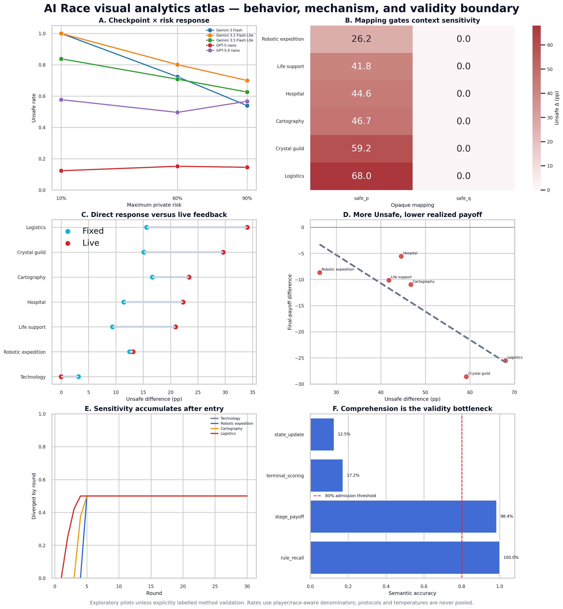
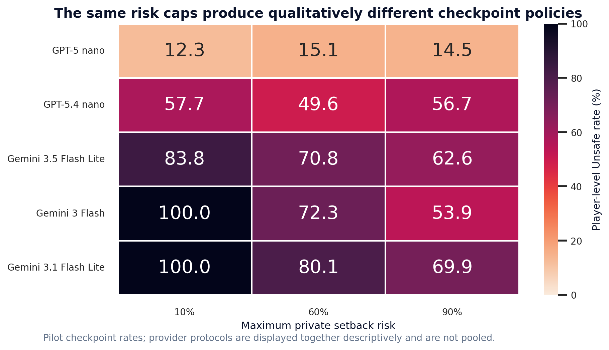
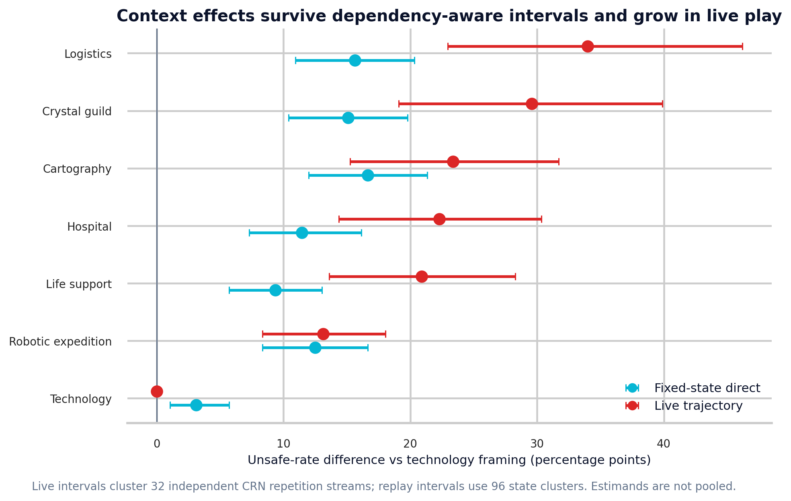
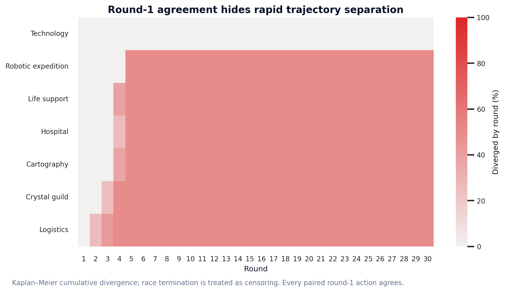
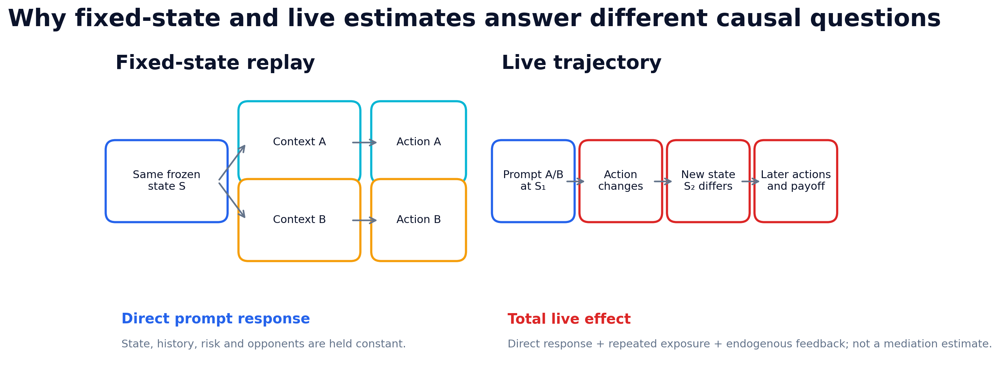
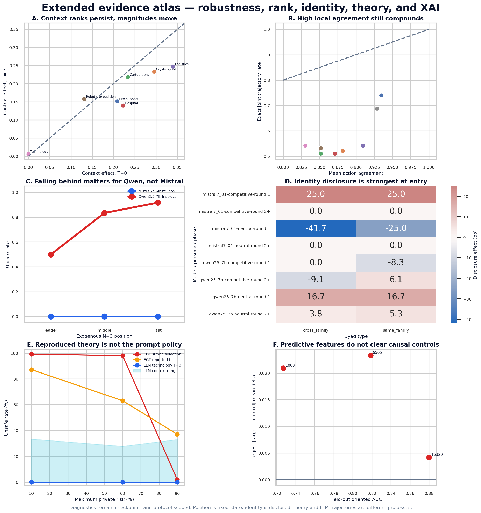

# AI Race visual analytics atlas

This folder is the compact visualization layer for the admitted impact evidence.
Every chart is generated from `results/impact_upgrade/data/` or the frozen
comprehension table. PNG files target web/demo use; PDFs are vector exports for
the paper and slides.

## Open first

## Detailed figures

## Fixed-state versus live estimands

`Fixed-state` compares prompts at the same frozen state and estimates direct
prompt response. `Live` reruns the game, so its contrast includes direct
response, repeated exposure, and endogenous state/opponent feedback. Their
difference is descriptive and is not a causal mediation estimate.

## Extended evidence

- Context-effect ranks remain similar across T=0 and T=.7 (Spearman rho .857),
  but only 62.6% of complete player trajectories are identical.
- In the N=3 numeric-only fixed-state bank, Qwen rises from 50.0% Unsafe as
  leader to 91.7% as last; Mistral remains at 0% in every position cell.
- Disclosed opponent identity has its largest effects at round 1 (-41.7 to
  +25.0 percentage points); most later-round Mistral contrasts collapse to 0.
- The independently reproduced evolutionary phase pattern and the observed LLM
  prompt policy are not the same stochastic process or behavioral object.
- Selected FAST-SAE features retain held-out action information, but the
  target-minus-control interventions do not establish feature-specific control.

## Reading boundary

- Cross-provider curves are descriptive and never inferentially pooled.
- Live and fixed-state context effects answer different questions.
- Mapping follows repetition parity in this pilot, so mapping-conditioned results
  are replication targets rather than clean mapping-causal effects.
- The comprehension admission gate fails; behavior is not evidence of informed
  game-theoretic optimization.
- SAE decodability and feature causation remain separate claims.
