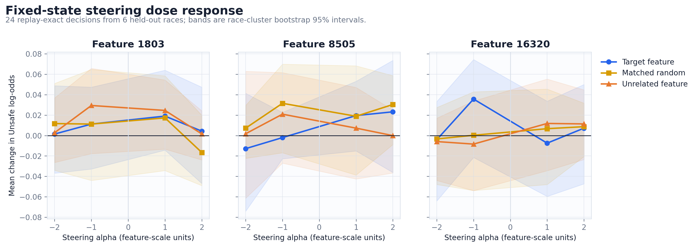
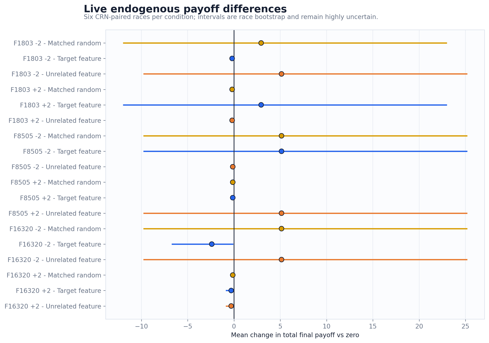

# FAST-SAE actual-self-play causal audit

## Bottom line

The layer-12 FAST-SAE pilot found strong held-out **associations**, but it did **not** establish feature-specific causal control of SAFE/UNSAFE behavior. The three selected features retained large absolute held-out correlations (range 0.692-0.700) and action-discrimination AUCs away from 0.5. However, at the configured strongest fixed-state dose (`|alpha|=2`), only 0 of 12 target-minus-control contrasts had a race-cluster bootstrap interval excluding zero. This is an exploratory diagnostic with only six held-out race clusters, not a confirmatory null test.

Live target steering frequently reproduced control behavior: the mean exact target/control action-sequence match rate across feature/sign/control cells was 68.1%. Consequently, trajectory and payoff changes cannot be attributed specifically to the selected SAE direction. The most extreme target-condition mean payoff difference was feature 8505 at alpha -2: +5.13 total payoff units versus zero across six races, with a bootstrap interval [-9.80, +25.20]. Controls produced changes on the same scale.

## What was actually run

- Model: `Qwen/Qwen2.5-7B-Instruct` at revision `a09a35458c702b33eeacc393d103063234e8bc28`.
- SAE: `Geaming/Qwen2.5-7B-Instruct_SAEs`, `FAST/blocks_12_hook_resid_post_8X_2048_jumprelu`, revision `5a7ecabe1401bf4de11a0e6da1f7c36bbb46a464`.
- Intervention site: layer 12 residual stream, final prompt token before any action-label token.
- Decision policy: full exact-sequence likelihood for `ACTION: SAFE` versus `ACTION: UNSAFE`, including EOS; temperature 0.0.
- Self-play: 18 races, 300 decisions; split by whole race into 12 discovery and 6 held-out evaluation races.
- Fixed-state steering: 24 replay-exact decisions and 984 intervention rows. Maximum baseline replay error was 0.0.
- Live steering: 114 trajectories over 6 common-random-number seeds.

## 1. Discovery and held-out association

Feature selection used discovery-race correlation with the continuous Unsafe-minus-Safe sequence log-odds. AUC is added here only as a descriptive action-discrimination metric; neither correlation nor AUC identifies a causal feature.

| Feature | Eval correlation | Eval Unsafe-action AUC | Activation prevalence |
|---:|---:|---:|---:|
| 8505 | +0.692 | 0.819 | 1.000 |
| 16320 | -0.693 | 0.120 | 1.000 |
| 1803 | -0.700 | 0.273 | 1.000 |


## 2. Fixed-state causal steering

All fixed-state rows use the identical held-out prompts and the baseline replay gate passed exactly. The intended target direction therefore has a clean *direct-effect* interpretation at this token, but specificity requires it to outperform matched-random and unrelated-feature directions.



The dose curves are not consistently monotone or antisymmetric. Target-direction slopes per alpha were F1803=+0.0014, F8505=+0.0094, F16320=-0.0021. This weak sign/dose behavior is inconsistent with a simple one-dimensional causal controller.


Full SAE reconstruction itself changed the action on 12.5% of fixed prompts and had mean absolute log-odds change 0.097. Because reconstruction is not behaviorally neutral, feature-ablation and SAE-space steering results require additional calibration against reconstruction artifacts.


## 3. Live simulation: direct flips versus endogenous feedback

Only action changes observed before the first state divergence are directly comparable to the zero condition. Later decisions inherit altered histories and are trajectory effects.

| Feature | Alpha | Direct comparable flips | Unsafe-rate delta vs zero | Total-payoff delta vs zero |
|---:|---:|---:|---:|---:|
| 1803 | -2 | 2.5% | +2.31 pp | -0.20 |
| 1803 | +2 | 3.8% | -3.47 pp | +2.93 |
| 8505 | -2 | 2.4% | -1.62 pp | +5.13 |
| 8505 | +2 | 2.5% | +1.62 pp | -0.13 |
| 16320 | -2 | 3.9% | +0.46 pp | -2.40 |
| 16320 | +2 | 1.1% | +0.00 pp | -0.30 |




The live payoff chart is not a fixed-state causal estimate. It combines the initial direct perturbation, subsequent endogenous state feedback, and rare setback realization. Each point has only six races.

| Feature | Alpha | Control | Exact target/control action-sequence match | Target-minus-control payoff delta |
|---:|---:|---|---:|---:|
| 1803 | -2 | Matched random | 50.0% | -3.13 |
| 1803 | -2 | Unrelated feature | 66.7% | -5.33 |
| 1803 | +2 | Matched random | 50.0% | +3.13 |
| 1803 | +2 | Unrelated feature | 50.0% | +3.13 |
| 8505 | -2 | Matched random | 100.0% | +0.00 |
| 8505 | -2 | Unrelated feature | 66.7% | +5.27 |
| 8505 | +2 | Matched random | 100.0% | +0.00 |
| 8505 | +2 | Unrelated feature | 66.7% | -5.27 |
| 16320 | -2 | Matched random | 50.0% | -7.53 |
| 16320 | -2 | Unrelated feature | 50.0% | -7.53 |
| 16320 | +2 | Matched random | 66.7% | -0.17 |
| 16320 | +2 | Unrelated feature | 100.0% | +0.00 |

Exact sequence matches are especially diagnostic here: identical action sequences under a target direction and a control direction cannot support a feature-specific behavioral interpretation, even when both differ from zero.

## 4. Claim boundary

Supported:

- The selected activations are associated with the model's Unsafe-vs-Safe score in held-out races.
- Residual-stream interventions can perturb scores and occasionally flip actions at replay-exact states.
- Interventions can alter full self-play trajectories under common random numbers.

Not supported:

- A selected SAE feature uniquely represents an Unsafe intention, safety preference, or game-theoretic strategy.
- Target-feature steering has a larger or more reliable effect than norm-matched random and unrelated-feature controls.
- Live payoff differences are stable, general, or beneficial.
- Feature semantics transfer across layers, checkpoints, contexts, or decoding policies.

## 5. Next confirmatory experiment

1. Increase held-out race clusters before increasing decision rows; uncertainty is currently race-limited.
2. Require behavioral-neutrality gates for SAE reconstruction and zero-dose hooks.
3. Select features on discovery races only, then freeze feature, sign, layer, alpha, and all controls.
4. Use multiple norm-matched random directions per feature and report the target's percentile in that empirical null.
5. Test opaque action labels and multiple context skins to separate action-token coding from strategy representation.
6. Replicate at another layer and checkpoint without re-selecting on the evaluation set.

## Reproducibility

Run from the repository root:

```bash
python results/scripts/analyze_causal_selfplay_fast_sae.py \
  results/open_source/activation_sae/causal_selfplay/fast-sae-pilot-L12-v1
```

Derived CSV tables are in `tables/`, figures are in `figures/` as PNG and vector PDF, and `analysis_manifest.json` records SHA-256 provenance. Raw experiment files were not modified.
The analysis aborts if any of the 41 runner-recorded source checksums fails (36 race shard files plus five stage artifacts).
