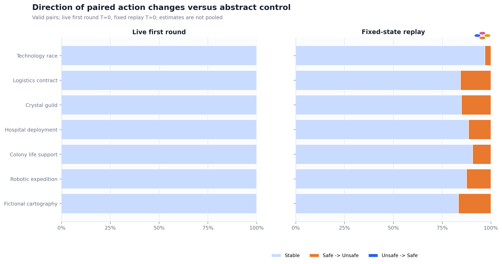
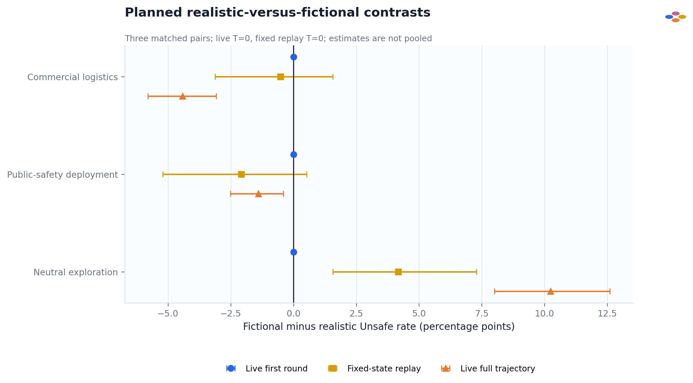
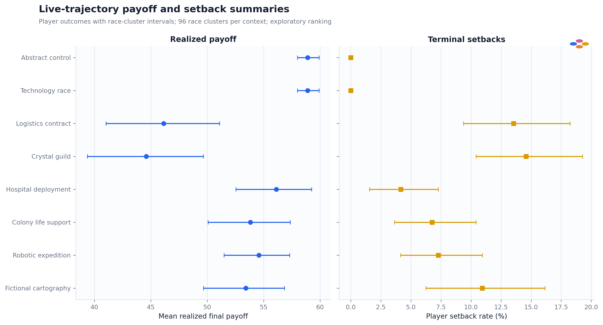

# Context-skin invariance: live simulation and fixed-state replay

> **Evidence status: DIAGNOSTIC ONLY -- COMPREHENSION ADMISSION FAILED.** This combines a pilot live run with a separately labelled pilot fixed-state run; neither is a confirmatory estimate. The same mathematical game and exact model digest were used throughout, but failure of the frozen comprehension gate prevents interpreting action differences as informed utility optimization.

## Technical summary

- **Coverage and provenance passed.** 8 skins, 768 live races, 13680 live decisions, 96 fixed states, and 1536 replay cells were reconciled. There were 0 live and 0 fixed-state final parse failures.
- **No first-round context effect was observed in the pilot live run.** Every paired first-round estimate was exactly 0 pp.
- **Later behavior separated across skins.** The largest fixed-state difference versus the abstract control was Fictional cartography at +16.7 pp (95% bootstrap CI +12.0 to +21.4 pp); the largest live full-trajectory difference was Logistics contract at +34.0 pp (95% bootstrap CI +27.2 to +40.8 pp). Both rankings remain exploratory.
- **The admission failure is substantive, not cosmetic.** State-update semantic accuracy was 12.5%; terminal-scoring accuracy was 17.2%. Behavior below therefore diagnoses prompt-conditioned output, not verified understanding of the game.
- **Opaque mapping dominated semantic action rates.** When P denoted Safe (`safe_p`), the live semantic Unsafe rate was 37.2% across 6,240 decisions; when Q denoted Safe (`safe_q`), it was 0.0% across 7,440. This is why mapping remains explicit in every primary table.
- **Planned semantic contrasts were selective.** Live intervals excluding zero occurred only for: Commercial logistics (-4.4 pp), Public-safety deployment (-1.4 pp), Neutral exploration (+10.2 pp). These intervals remain exploratory and do not estimate a general realism effect.
- **Live and fixed context profiles aligned descriptively.** All 6/7 non-abstract context effects had the same sign, and the across-context Pearson correlation was 0.851. This is not a pooled estimate: decoding temperatures match, but admission failed.
- **Protocol boundary.** Live and fixed-state protocol configurations have matching file hashes. Live and fixed-state replay use the same decoding temperature.

## Design and estimands

Within each protocol, all eight prompts preserve progress increments, payoff matrix, risk treatments, horizon process, prize, tie rule, setback process, state disclosure, parser, model digest, and decoding. Context nouns and introductions change. The model answers with opaque code P or Q; `safe_p` and `safe_q` reverse which code denotes the semantic Safe action while display order remains P then Q.

The pre-feedback estimand is the paired first-round semantic Unsafe-rate difference versus `abstract_contest`, keyed by risk, repetition, seat, and mapping. Fixed-state replay asks the model at the same engine-reachable state under every context and both mappings, so that comparison isolates a direct prompt effect at those sampled states. Full live trajectories include continued context exposure and endogenous feedback; they are total trajectory differences, not direct effects.

## Action rates keep context, risk, and mapping visible

The heatmap reports decision-weighted decoded semantic actions. It deliberately does not average the two action-code mappings: a strong P/Q response tendency can otherwise masquerade as a context effect. The paired effect chart below instead macro-averages each player-race trajectory before clustering, so its values need not equal a subtraction of heatmap cells.


## Direct, pre-feedback, and total-trajectory estimates disagree

First-round rows are the cleanest live pre-feedback comparison. The pilot fixed-state run supplies a separate direct-effect diagnostic at sampled later states. Full trajectories answer a different question because choices change subsequent progress, risk, and history. Fixed-state intervals reflect 96 sampled states.


The flip view prevents a zero average from hiding offsetting directions. A one-sided reference distribution can make all changes point in the same direction, so the exact Safe-to-Unsafe and Unsafe-to-Safe counts remain visible.



## Mapping is a major diagnostic factor

In live play, mapping is assigned by repetition and is therefore confounded with the repetition-specific stochastic horizon; its live difference is descriptive only. Fixed-state replay presents both mappings to every state and can estimate the paired mapping effect. The resulting asymmetry shows why P/Q mapping must remain a reported factor rather than a nuisance silently pooled away.


## Realistic versus fictional pairs

The three contrasts were planned from matched narrative pairs. They are a compact sensitivity check, not a general estimate of realism or fiction: each category contains only three hand-authored stories.



## Payoff and setback outcomes

Realized payoff combines stage payoffs, race outcome, and one sampled setback draw. With 96 live races per skin, payoff/setback rankings remain exploratory and should not be used to claim one context is economically superior.



## Comprehension gate failed

The model recalled simultaneous choice and most stage payoffs, but failed the state-update and terminal-scoring domains. Strict-format validity is reported separately from semantic correctness: formatting errors are not silently converted into reasoning errors, and semantic errors are not excused by correct formatting.


Because every context x mapping cell had to pass the frozen gate and none did, the fixed-state replay manifest classifies the evidence as `diagnostic_comprehension_failed`. Running replay despite that failure is useful for debugging prompt behavior, but it does not rehabilitate the evidence.

## Data-quality and uncertainty boundary

- Exact model: `qwen2.5:7b-instruct-fp16` at digest `59805ce4a4046be2d8f63231a78daacd2e66f5dccf1a64d0d138ebeeb26ff16c`.
- Live/fixed profiles: `pilot` / `pilot`; temperatures: 0.0 / 0.0.
- Live/fixed experiment-config hashes: `1961aadfb3f0c6c76f19eb88b068a279265434228f6e61cce1b2e08d5bc0d1d4` / `1961aadfb3f0c6c76f19eb88b068a279265434228f6e61cce1b2e08d5bc0d1d4`; exact match: `True`.
- Source revisions are verified within live and fixed protocols. They differ across runner types by design and are not asserted to be the same executable file.
- Paired percentile intervals resample race clusters for live outcomes and state clusters for fixed replay. They quantify finite-sample resampling variability, not population uncertainty over prompts, models, or narrative domains.
- Decisions within races are dependent. Full-trajectory rates are descriptive enacted behavior, not independent Bernoulli observations.
- Fixed-state replay holds the disclosed state constant but does not prove causal mediation by any SAE feature. Neural steering needs held-out features, dose response, sign reversal, matched-norm random directions, and unrelated-feature controls.
- Realistic/fictional contrasts are planned but under-covered: three pairs cannot establish a broad semantic-category effect.

## Recommended promotion gates

1. Repair or redesign comprehension prompts and rerun the frozen admission battery without changing thresholds after seeing outcomes.
2. Promote only after every context x mapping cell passes, then run at least the 32-repetition / 32-state pilot profiles with manifests frozen before analysis.
3. Keep mapping randomized or crossed within identical live race seeds; the current parity assignment balances counts but does not identify a live mapping effect.
4. Add at least one more model family and a separately labelled cross-decoding robustness run before discussing model or decoding stability.
5. Treat activation-SAE prediction and steering as separate stages: AUC is association; controlled action shifts are causal intervention evidence.

## Reproducible artifacts

The adjacent CSV files contain all plotted summaries; `analysis_summary.json` records source-manifest hashes, coverage, admission status, and figure inventory. Re-run with:

```bash
python results/scripts/analyze_context_skin.py \
  --live-root <live-run-root> \
  --fixed-root <fixed-state-run-root> \
  --output-dir <new-output-dir>
```
