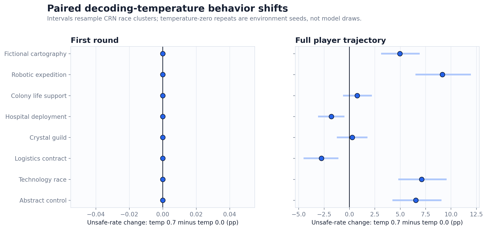
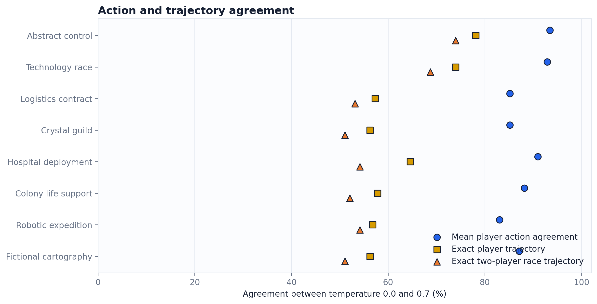

# Context-skin decoding-temperature robustness audit

## Bottom line

Temperature 0.7 changed full-trajectory Unsafe behavior by +3.04 percentage points relative to temperature 0.0 (race-cluster 95% interval [+2.19, +3.97] pp). The overall first-round change was +0.00 pp [+0.00, +0.00]. Mean action agreement was 88.2%, while only 62.6% of complete player trajectories remained identical.

This is a **diagnostic robustness comparison**, not a comprehension-admitted behavioral estimate. The common comprehension audit failed (`admission_passed=false`; 256 probe rows), so neither temperature condition supports a claim that the model understood the game. Temperature-zero repetitions are common-random-number environment seeds, not independent stochastic model draws.

## Compatibility audit

- Exact model digest, mechanism hash, experiment/effective configuration hashes, three game hashes, prompt-template hashes, CRN contract, lane assignment, hostname, H100 class, Ollama version, base seed, and repetition count matched.
- First-round prompts matched exactly for all paired observations; race horizons and stop-draw streams matched for all 768 paired races.
- Whole staged-source SHA-256 match: `false`. The staged-source archive hashes differ, so this is not an exact whole-source replication. Mechanism-specific and template hashes do match; results are reported with this provenance warning rather than discarded.
- Both conditions had 768 races, 1,536 player-races, no parse failures, no retries, and only valid opaque `P`/`Q` responses.

## Paired context results

| Context | First-round delta | Full-trajectory delta | Mean action agreement | Exact joint trajectory | Mean player payoff delta |
|---|---:|---:|---:|---:|---:|
| Abstract control | +0.00 pp | +6.53 pp | 93.5% | 74.0% | -1.74 |
| Technology race | +0.00 pp | +7.11 pp | 92.9% | 68.8% | -2.81 |
| Logistics contract | +0.00 pp | -2.75 pp | 85.2% | 53.1% | +5.32 |
| Crystal guild | +0.00 pp | +0.28 pp | 85.2% | 51.0% | +6.06 |
| Hospital deployment | +0.00 pp | -1.78 pp | 91.0% | 54.2% | -0.75 |
| Colony life support | +0.00 pp | +0.77 pp | 88.2% | 52.1% | +1.23 |
| Robotic expedition | +0.00 pp | +9.16 pp | 83.1% | 54.2% | -2.71 |
| Fictional cartography | +0.00 pp | +4.97 pp | 87.1% | 51.0% | -1.88 |





The first-round comparison is especially constrained: within each context/risk/mapping/seat cell, temperature 0.0 repeats the same deterministic response to one unique prompt. Its 32 repetitions must not be interpreted as 32 independent model samples. At later rounds, different CRN horizons and endogenous states provide environment variation, but still not temperature-zero decoding randomness.

## Opaque action mapping interaction

Across contexts, the first-round SAFE=P minus SAFE=Q interaction in the temperature shift was +0.00 pp; the full-trajectory interaction was +6.07 pp. These interactions compare disjoint even/odd repetition seeds because mapping was assigned by repetition parity. They are diagnostic, not clean randomized mapping effects.


## Context-effect rank and sign stability

Context effects are computed against the abstract control within each temperature using matched risk/repetition/seat keys.

| Context | Full effect at temp 0.0 | Full effect at temp 0.7 | Effect change | Sign stable |
|---|---:|---:|---:|---:|
| Logistics contract | +34.00 pp | +24.71 pp | -9.29 pp | yes |
| Crystal guild | +29.58 pp | +23.33 pp | -6.26 pp | yes |
| Fictional cartography | +23.36 pp | +21.80 pp | -1.56 pp | yes |
| Robotic expedition | +13.12 pp | +15.75 pp | +2.62 pp | yes |
| Colony life support | +20.89 pp | +15.13 pp | -5.76 pp | yes |
| Hospital deployment | +22.28 pp | +13.98 pp | -8.31 pp | yes |
| Technology race | +0.00 pp | +0.58 pp | +0.58 pp | no |

The full-trajectory context-effect Spearman rank correlation was 0.857; sign agreement was 85.7%. The first-round rank was undefined because the context effects were tied/constant; first-round sign agreement was 100.0%.


## Claim boundary

Supported:

- Descriptive paired differences between these two exact decoding protocols on the observed CRN environment seeds.
- Direct first-round agreement/differences before endogenous state feedback.
- Full-trajectory divergence, mapping diagnostics, and payoff differences within this model digest and bounded eight-skin set.

Not supported:

- Independent repeated-sample uncertainty for deterministic temperature-zero outputs.
- Game understanding, strategic rationality, or an internal causal world model.
- A clean mapping main effect, because mapping is fixed by repetition parity.
- Generality across models, quantizations, prompt families, source snapshots, or temperatures other than 0.0 and 0.7.
- Pooling these two decoding conditions into one behavioral rate.

## Reproduce

```bash
python results/scripts/analyze_context_temperature_robustness.py
```

Raw pilot artifacts are untouched. `tables/source_artifact_inventory.csv` records SHA-256 checksums, figures are exported as PNG and vector PDF, and `analysis_summary.json` stores exact machine-readable findings.
