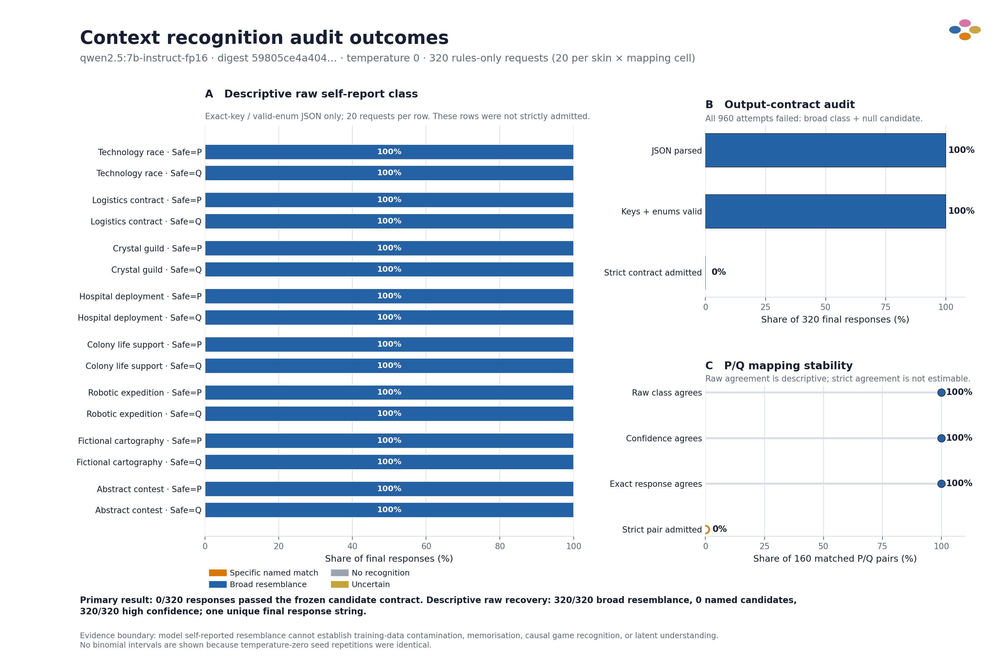

# Context recognition pilot: audited result



## Result in one paragraph

The preregistered strict result is **0/320 admitted responses**. Every request
exhausted both parse retries, and all **960/960 attempts** failed for one reason:
the model returned `generic_structural_resemblance` with `candidate: null`, while
the frozen contract required a non-empty candidate for either resemblance class.
Therefore, specific-match and broad-resemblance rates are **not estimable in the
strictly admitted sample**.

A separate descriptive read of the untouched raw JSON found that
**320/320** final responses self-reported broad
structural resemblance, **0/320** named a
specific benchmark or game, **0/320** supplied
any candidate, and **320/320** selected high
confidence. All 320 final responses were the same exact string. This descriptive
recovery does not modify parser outcomes or retroactively admit the rows.

## Context and P/Q mapping audit

The descriptive class, confidence, and exact response agreed across Safe=P and
Safe=Q in **160/160 matched pairs**. The same
broad-resemblance/high-confidence/null-candidate response appeared for all eight
skins. Consequently, this run provides no observed raw self-report difference by
context or action-code mapping, but it also has no effective response variation
from which to estimate sensitivity. Strict mapping stability is undefined because
zero matched pairs had two admitted responses.

## Integrity and provenance

- Two disjoint lanes contributed 160 rows each; the combined skin × mapping ×
  repetition matrix is complete with 320 unique base seeds and 960 unique attempt
  seeds.
- All prompt hashes and both lane artifact hashes were recomputed successfully.
- Both lanes used `qwen2.5:7b-instruct-fp16`, exact digest `59805ce4a4046be2d8f63231a78daacd2e66f5dccf1a64d0d138ebeeb26ff16c`, Ollama,
  temperature 0, 20 nominal repetitions per cell, and the same source-tree hash.
- The audit was isolated from gameplay and comprehension; its questions never
  entered agent decisions or admission gates.

## Interpretation boundary and next run

Self-reported resemblance cannot prove training-data contamination, memorisation,
causal game recognition, or latent understanding. Failure to name a game likewise
cannot prove absence of contamination. This pilot also exposes response-contract
tension: `generic_structural_resemblance` is defined as lacking a specific match,
yet the schema requires a candidate string. A revised protocol should preregister
`candidate: null` as valid for the generic class, use one primary request per cell
at temperature 0, and reserve stochastic repetitions for a separately declared
temperature-above-zero robustness run. The revised run must receive a new protocol
version and must not overwrite this pilot.

## Reproduce

```bash
python results/open_source/context_skin_pilot/context_recognition_t0_pilot/analyze_recognition_pilot.py
```

Generated tables:

- [`recognition_analysis_by_cell.csv`](recognition_analysis_by_cell.csv)
- [`recognition_candidate_counts.csv`](recognition_candidate_counts.csv)
- [`recognition_analysis_summary.json`](recognition_analysis_summary.json)
- [`analysis_artifact_manifest.json`](analysis_artifact_manifest.json)
