# AI Race Pilot Visualization & Results Insight Bundle

## Current evidence dashboard (2026-08-02)

This section is the canonical, current map of the expanded experiment suite. It
supersedes older snapshots further below where numbers differ. Every conclusion
is tied to an auditable run directory; temperature-0 and temperature-0.7 results
are displayed separately and are never pooled.

### Evidence ledger

| Module | Audited scale | Main result | Valid claim | Boundary |
|---|---:|---|---|---|
| Context live, T=0 | 768 races; 13,680 decisions | largest context effect +34.0 pp; all first-round effects 0 | payoff-preserving prompts produced different later trajectories | one Qwen digest; comprehension gate failed |
| Context live, T=.7 | 768 races; 13,680 decisions | overall +3.04 pp vs T=0; 88.2% action agreement | bounded decoding robustness comparison | only 62.6% complete trajectories identical; source archive SHA differs |
| Fixed-state replay, T=0 | 96 states x 8 skins x 2 mappings = 1,536 cells | largest direct context contrast +16.7 pp | direct prompt diagnostic at identical states | different estimand from live feedback; do not pool |
| Comprehension gate | 256 context probe rows | state update 12.5%; terminal scoring 17.2% | admission failed | behavior is not evidence of informed optimization |
| Recognition audit v2 | 16/16 strict-valid | all reported generic structural resemblance; 0 specific named-game matches | protocol can record self-reported recognition cleanly | self-report is not contamination or internal-recognition evidence |
| Heterogeneous dyads, T=0 | 384 races; 4,992 decisions | block-1 Unsafe: Qwen 75.2%, Mistral 93.3%; lane agreement 98.6% | disclosed identity/persona labels can shift enacted behavior in this grid | both checkpoints failed admission; block 2 is lane replication only |
| Exogenous position, T=0 | 96 frozen states x 2 checkpoints x 2 lanes | Qwen numeric-only N=3 last-minus-leader +41.7 pp; Mistral 0 pp; lane agreement 94.8%/100% | direct fixed-state response to an engine-scored payoff-relevant rank intervention | one history/risk; unadmitted; not a live-game feedback effect |
| Native FAST-SAE self-play | 18 races/300 decisions; 114 live reruns | strong held-out associations; 0/12 strongest-dose target-control CIs exclude zero | selected activations associate with action log odds | no feature-specific causal controller identified |
| Context FAST-SAE | two layers; 1,312 interventions/layer | L20 held-out AUC .985; 0 intervention flips | L20 is useful for capture/diagnostic association | steering claim rejected |
| EGT reconstruction | 36 seeded chains; 3 risks x 3 regimes x 4 chains | AU -> CAS -> CS strong-selection ordering recovered | faithful reconstruction of disclosed reduced model | not bitwise reproduction; private author code/seeds unavailable |

### Prepared validity-closing experiments (no model result claimed)

Three follow-ups are now executable under frozen, hash-checked protocols:

- **Context × opaque mapping:** 1,536 unique races, with all eight contexts on
  both GPU lanes and even/odd repetition sharding.
- **Positive payoff-scale stress test:** 384 unique races at scales
  `0.1/1/10/100`, backed by a real exhaustive engine contract covering 21,844
  joint-action sequences and 1,048,512 terminal comparisons; all mechanical
  cells passed with maximum normalized error `1.421e-14`.
- **Computation scaffold:** 768 factorial races plus 192 character-length
  placebo races. Round-1 effects are direct prompt contrasts; later symmetric
  self-play differences are game-level total intervention effects.

These three remain protocol and mechanical-contract artifacts, not GPU
behavioral findings. The separate heterogeneous-dyad and exogenous-position
studies below were completed through authenticated GreenNode notebook terminals;
their results must not be imputed to these still-unrun prepared grids.

### 1. Payoff-preserving context changes behavior after feedback

At temperature 0, all paired first-round context contrasts were exactly zero.
The largest live full-trajectory contrast was logistics at **+34.0 pp** (95%
race-cluster interval **+27.2 to +40.8**), while the largest matched fixed-state
contrast was fictional cartography at **+16.7 pp** (**+12.0 to +21.4**). Six of
seven non-control contexts aligned in sign across live and fixed protocols, but
these quantities answer different questions and are not pooled.

The opaque response mapping is a larger construct warning than any narrative
label: live Unsafe was **37.2% when P denoted Safe** and **0% when Q denoted
Safe**. This factor is shown explicitly rather than averaged away.

The comprehension gate failed, most sharply on state update and terminal
scoring. Context-conditioned action differences are therefore behavioral
diagnostics, not proof that the agent understood or optimized the game.

### 2. Temperature changes trajectories more than entry decisions

The paired T=.7 protocol raised overall full-trajectory Unsafe by **3.04 pp**
(**+2.19 to +3.97**) with no first-round change. Mean per-turn action agreement
was **88.2%**, yet only **62.6%** of complete player trajectories matched. Context
effect rank stability was substantial (Spearman **rho=.857**) and six of seven
non-control signs were retained, while individual context effect magnitudes
shifted by as much as 9.29 pp.

### 3. Disclosed model identity changes behavior, but does not reveal recognition

The lane-counterbalanced Qwen2.5-7B/Mistral-7B diagnostic completed 384 races
and 4,992 decisions with zero parse failures. In the frozen primary block,
Qwen emitted Unsafe on 75.2% of decisions and Mistral on 93.3%. The largest
aggregated opponent-label contrast was -41.7 pp for the Mistral/cross-family/
neutral/round-1 slice (24 decisions per disclosure arm). This is a descriptive
smoke-cell contrast, not a confirmatory population estimate.

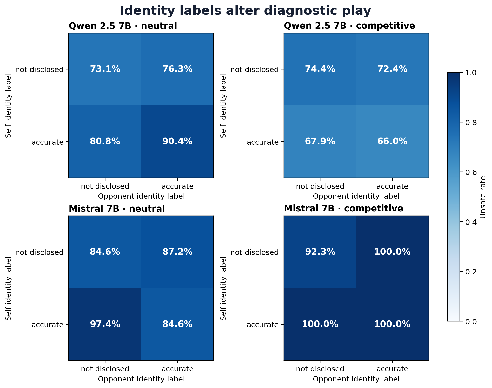

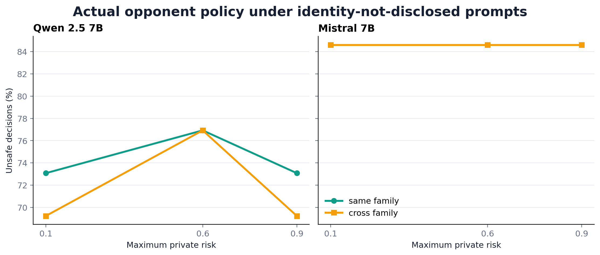

The prompts manipulate disclosed checkpoint labels and persona text. They do
not test hidden self-recognition, opponent identification without labels, or a
stable personality trait. Both checkpoints failed comprehension admission.
Block 2 only swaps GPU lanes: 98.6% action agreement is a reproducibility audit
and is not pooled as a second behavioral sample.

The live position panel remains observational because position is caused by
earlier actions and state feedback; it cannot identify a causal leader/laggard
effect.

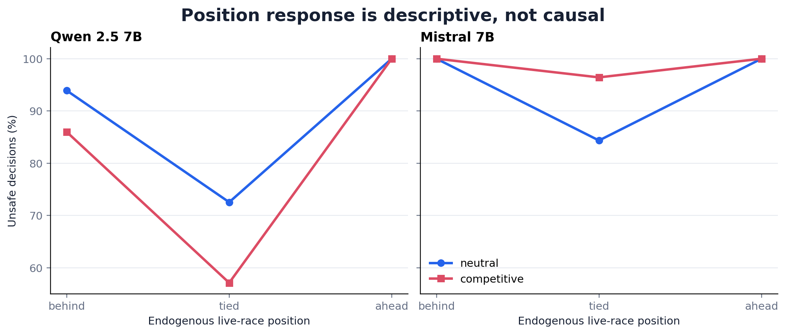

[Full heterogeneous-dyad report](open_source/heterogeneous_dyad_greennode_ba2906a/analysis/README.md)

### 4. Exogenous rank separates direct position response from live feedback

The position-endowment protocol holds the four-round engine-scored history,
stage payoff, risk, and decision round fixed, then changes only a public,
payoff-relevant progress endowment. It crosses N=2 behind/tied/ahead and N=3
leader/middle/last with both opaque P/Q mappings and numeric-only versus
verified-rank-label prompts.

In block 1's prespecified numeric-only arm, Qwen's N=3 Unsafe rate rose from
50.0% as leader to 91.7% as last: an exact +41.7 pp direct contrast in this
finite bank. Mistral chose Safe in every position cell. The two checkpoints
therefore show radically different response surfaces, not a common family-wide
strategy.

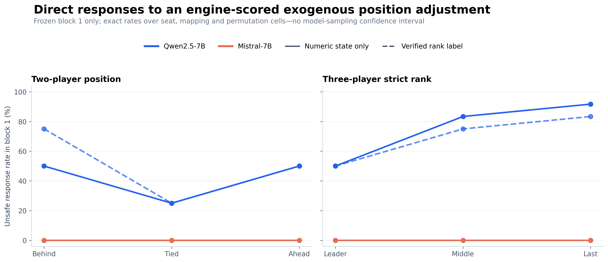

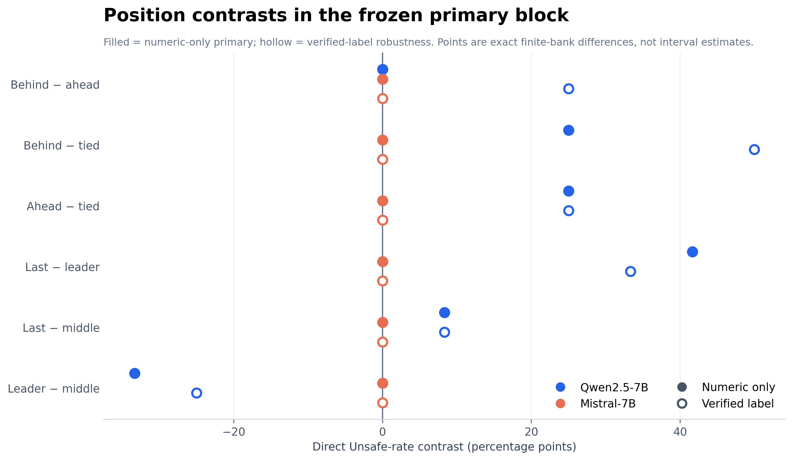

Across swapped GPU lanes, exact matched-probe agreement was 94.8% for Qwen and
100% for Mistral. Block 2 is retained only as a runtime audit.

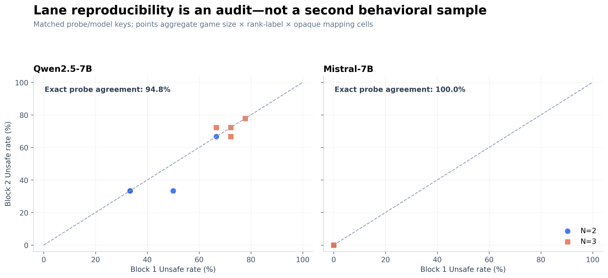

This intervention supports a causal **direct fixed-state prompt effect** inside
one modified state bank. It is not the total effect of falling behind in a live
game, where later opponent actions, stopping, risk, and prompts become
endogenous. Both checkpoints failed the separate 2-player comprehension gate,
which also does not admit N=3 understanding; no rational-adaptation claim is
warranted.

[Full exogenous-position report](open_source/position_endowment_greennode_e3cf825/analysis/README.md)

### 5. SAE association survived held-out evaluation; causal specificity did not

In native actual-self-play, three discovery-selected layer-12 FAST-SAE features
retained held-out absolute correlations of **.692--.700** with Unsafe-minus-Safe
log odds. At the strongest fixed-state doses, however, **0/12** target-minus-
matched-random or target-minus-unrelated-feature intervals excluded zero. SAE
reconstruction alone flipped **12.5%** of replay-exact decisions.

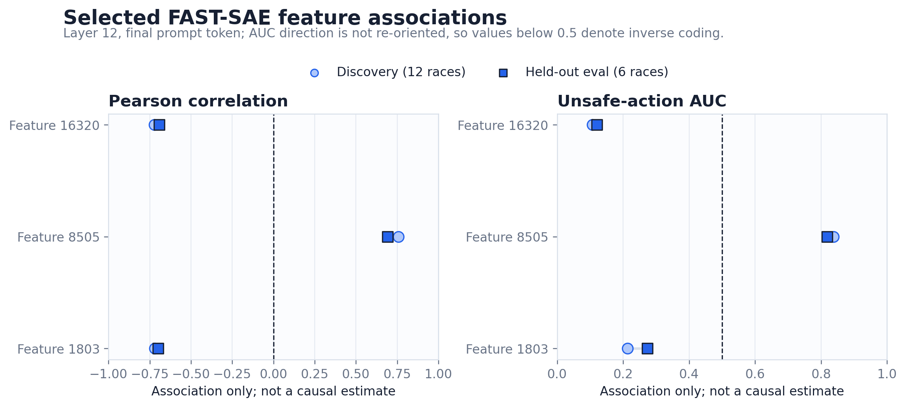

Across 114 live reruns, direct comparable target flips were only **1.1--3.9%**;
target/control action sequences were exactly equal in **68.1%** of comparisons,
and payoff shifts from controls were on the same or larger scale. The supported
claim is activation association plus non-specific perturbability, not an Unsafe
neuron or causal strategy switch.

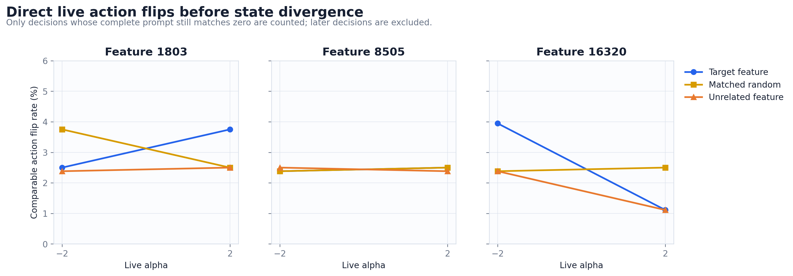

The separate context FAST-SAE screen selected layer 20 for diagnostic capture
(held-out AUC **.985**, accuracy **.929**) but observed **0 action flips in 1,312
interventions per layer**. Its steering hypothesis is rejected for this pilot.

### 6. Evolutionary theory is reproducible, but it does not describe the prompt policy

The independently reconstructed four-strategy model reproduces the strong-
selection qualitative phase ordering: **AU** dominates at risk .1, **CAS** at .6,
and **CS** at .9, implying Unsafe rates **99.2%, 98.0%, and 1.9%**. The reported
weak-selection/high-mutation fit instead gives **87.2%, 63.1%, and 37.0%**. An
official-source audit against unmodified EGTTools `StochDynamics` agrees to
`1.11e-16` in the transition matrix and `7.63e-15` in stationarity.

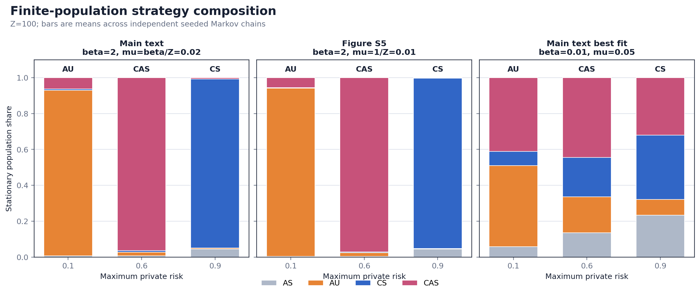

The T=0 technology framing produced 0% Unsafe at every risk, while equivalent
skins ranged up to **33.3%, 27.7%, and 33.0%**. This is a comparison of lenses,
not populations: repeated LLM self-play is not evolutionary sampling, and a
nearest-strategy label does not reveal a latent strategy.

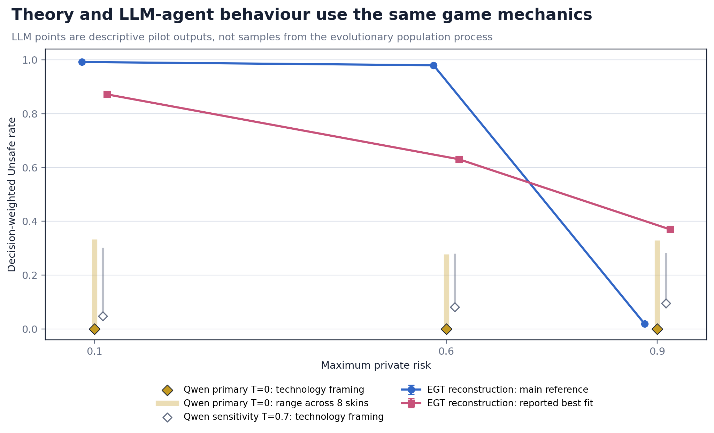

### 7. Recognition and provenance controls

The rejected v1 recognition pilot is retained because its prompt/parser contract
was contradictory; it yielded 0/320 strict-valid rows and is not rescored. Frozen
v2 corrected the contract before collection and produced 16/16 strict-valid
responses, all `generic_structural_resemblance` with high confidence and a null
specific-game candidate. These are self-reports only. See
[`context_recognition_v2_t0_confirm`](open_source/context_skin_pilot/context_recognition_v2_t0_confirm/README.md).

Primary artifact reports:

- [Temperature robustness report](open_source/context_skin_pilot/analysis_temperature_robustness/temperature_robustness_report.md)
- [Context T=0 report](open_source/context_skin_pilot/analysis_live_pilot_t0/context_skin_analysis.md)
- [Native FAST-SAE causal audit](open_source/activation_sae/causal_selfplay/fast-sae-pilot-L12-v1/analysis/analysis_report.md)
- [Context FAST-SAE audit](open_source/activation_sae/context_fast_sae_analysis/README.md)
- [EGT reconstruction report](open_source/egt_reproduction/README.md)
- [Heterogeneous-dyad diagnostic](open_source/heterogeneous_dyad_greennode_ba2906a/analysis/README.md)
- [Exogenous-position diagnostic](open_source/position_endowment_greennode_e3cf825/analysis/README.md)

### Integrated conclusion

The most defensible story is a validity boundary. The project can reproduce the
game arithmetic and reduced evolutionary phase pattern, locate activation
directions that predict actions, and identify a direct exogenous-position
response for one checkpoint. Yet the tested checkpoints fail key state/scoring
gates; behavior is sensitive to opaque mapping, payoff-preserving stories,
disclosed identities, and runtime lane even at temperature zero; and the SAE
does not yield feature-specific causal steering. The next confirmatory grid
must cross admitted model families, context, mapping, decoding, histories, and
live replay-to-fork position interventions before strategic claims.

Generated from artifact: `AI_Race_Experiment/results/reports/pilot_reports/pilot_insight_report/artifact.json`

The generated bundle below is a legacy pilot snapshot. Use the current evidence
dashboard above when numbers or evidence labels differ.

## 1) Validation checklist and repository cleanup outcome
- Artifact generation script and visualization pipeline were rebuilt and validated against current tracked files.
- Hard checks passed for row/denominator consistency, parse-failure controls, and protocol provenance mapping.
- Duplicate folder-content candidates in `results/open_source` were checked by filename+size signatures; no exact duplicate folders were found except expected structural differences across pilot/smoke/multimodule experiments.

### Folder signature scan

| Folder | File count | Status |
|---|---:|---|
| `game_understanding_pilot` | 5 | kept as distinct workload domain |
| `gpu_run_archive` | 13 | kept as distinct workload domain |
| `prompt_sensitivity_pilot` | 28 | kept as distinct workload domain |
| `surface_sensitivity_pilot` | 5 | kept as distinct workload domain |
| `surface_sensitivity_smoke` | 3 | kept as distinct workload domain |

No exact-duplicate candidate folder signatures found.

## 2) Evidence dataset map from artifact

| Dataset | Rows | Purpose |
|---|---:|---|
| `headlines` | 4 | one-row KPI cards |
| `surface` | 18 | surface variant audit rows |
| `surface_noncontrol` | 17 | surface variants excluding canonical |
| `surface_ranked` | 18 | surface rows ordered by magnitude |
| `persona` | 6 | persona-condition unsafe rates |
| `asymmetric_roles` | 2 | role split in asymmetric persona conditions |
| `probes` | 18 | probe semantic/strict accuracy by condition/domain |
| `behavior` | 2 | behavioral paired calculator ablation |
| `evidence` | 3 | pilot evidence ledger |

## 3) Manifest visuals

| Type | ID | Dataset | Title |
|---|---|---|---|
| chart | surface_delta_chart | surface | Unsafe-rate change across surface variants |
| chart | surface_scatter_chart | surface_noncontrol | Entry-decision flips and full-trajectory shifts |
| chart | persona_chart | persona | Unsafe rate across persona conditions |
| chart | asymmetric_role_chart | asymmetric_roles | Role-specific behavior in asymmetric games |
| chart | probe_chart | probes | Semantic game-understanding accuracy |
| chart | behavior_chart | behavior | Unsafe behavior with and without a calculator card |
| table | surface_table | surface_ranked | Surface-variant audit detail |
| table | behavior_table | behavior | Calculator behavior audit |
| table | evidence_table | evidence | Pilot evidence ledger |
| metric-strip | surface_span_card | headlines | Surface span |
| metric-strip | persona_span_card | headlines | Persona span |
| metric-strip | probe_card | headlines | Probe semantic accuracy |
| metric-strip | health_card | headlines | Parse-failure health |

## 4) Core pilot findings (human-readable)

- Surface sensitivity span: **80.8%** from baseline 52.2%; max effect at `+37.1%` on `Position Risk Near Response` and min `-43.7%` on `Order Actions Reversed`.
- Surface unsafe rates range: **8.4%** (`Order Actions Reversed`) to **89.2%** (`Position Risk Near Response`).
- No-persona unsafe benchmark: **56.3%**; persona span **45.7%**.
- Highest-risk role gap: risk-averse was the most conservative; adversarial-vs-adversarial was the least conservative.
- Probe semantics: unaided semantic accuracy **52.1%**, calculator uplift **23.5%**.
- Game-understanding behavior: calculator condition rose unsafe from **52.0%** to **60.8%** while mean payoff remained statistically flat; tie rate dropped.
- Protocol health: parse failures **0** / audited observations **15751**.

### Lowest direct semantic probe domains (pilot output)
| Condition | Domain | Semantic Accuracy |
|---|---|---:|
| Direct | Expected payoff | 0.0% |
| Direct | State transition | 0.0% |

## 5) Outputs and where to find them

- Artifact: `results/reports/pilot_reports/pilot_insight_report/artifact.json`
- Single canonical insights file (this one): `results/visualization_insight_full.md`
- Rebuild command: `python results/scripts/build_pilot_insight_report.py`

## 6) Next cleanup action suggested
- Keep generated report assets under `results/reports/pilot_reports/pilot_insight_report/` and move any new analysis markdown snapshots to a single tracker file under `results/` (this file).
- If you want, we can next split this into a short technical appendix and a slide-ready insight digest file while preserving a single source of truth.

## 7) XAI auto-vector attribution audit (prompt-sensitivity turn logs)

The new explainability pass added `results/scripts/explain_action_xai.py`, which builds
surrogate, auto-vectorized classifiers for SAFE/UNSAFE actions and writes decision-level
interpretability artifacts for every requested run.

### 7.1 Inputs used

- Prompt logs:
  - `tmp/pilot_rebuild/pilot_identified_t1_0`
  - `results/frontier`
- Feature construction:
  - Numeric game-state and action-history fields (e.g., `step_increment`, `round_payoff`,
    `prompt_chars`, `response_chars`, lag states),
  - Categorical context (`run_group`, `run_treatment`, `model`, `persona_condition`,
    `seat_persona_role`, etc.),
  - Prompt text TF-IDF (`prompt`),
  - Optional raw response TF-IDF variant (`raw_response`) for leakage-aware comparison.

### 7.2 Current output sets

| variant | directory | target leakage note | status |
|---|---|---|---|
| Text-free prompt-only vectorization | `results/open_source/prompt_sensitivity_pilot/xai_auto_vector_encoder_no_response` | does not include `raw_response` | preferred behavioral diagnostic; not a mechanism claim |
| Full prompt+response vectorization | `results/open_source/prompt_sensitivity_pilot/xai_auto_vector_encoder` | includes `raw_response`; high predictive performance can become proxy-to-leak driven | experimental/checking-only |

Both variants currently use the same **8,190 cleaned decision rows** and share an
unsafe rate of **56.45%**.

### 7.3 Key quantified findings

- **Performance (validation split):** AUC and accuracy are both near perfect (~1.0) in both variants.  
  This should be treated as an upper-bound *separability* signal, not a causal proof of a valid mechanism.
- **Dominant linear drivers (both variants):**
  - `step_increment` and `round_payoff` are the strongest positive unsafe-weighted features;
  - `prompt_chars` and `attempts` are substantial context/risk/format proxies;
  - `response_chars` appears strongly weighted when included.
- **Permutation robustness:** only a few low-order numeric fields produce non-zero
  permutation signal once the linear decision surface is estimated; text n-grams are mostly
  numerically near zero in this sample and should be read as unstable/unreliable feature ranking artifacts.
- **Surface protocol signal is confounded by hash/split granularity:** prompt-template groups are
  currently represented by short template hashes and split into many one-row groups; this collapses
  interpretable grouping, so protocol comparisons should be made on merged conditions first.

### 7.4 Files emitted

- `xai_model_metadata.json`
- `xai_global_importance.csv`
- `xai_permutation_importance.csv`
- `xai_local_explanations.csv`
- `xai_prompt_surface_summary.csv`
- `xai_input_snapshot.csv`
- `xai_target_distribution.json`
- `xai_markdown_summary.md`

### 7.5 Recommended next step

- Add a protocol-level aggregation pass before plotting (`run_treatment` +
  `persona_condition` + coarse text family), then regenerate top-attribution figures
  with fixed token settings to produce stable dashboard-grade visuals.
- Add an additional constrained-XAI variant that excludes post-decision fields
  (`round_payoff`, `step_increment`, `response_chars`, etc.) to test how much of the
  signal is mechanistic vs. pure policy understanding.
- Report model-strata separately (qwen2.5 + each Gemini variant) before aggregating
  to avoid cross-model mixing when attributing text-format effects.

### 7.6 Visual artifacts generated

- `results/open_source/prompt_sensitivity_pilot/xai_auto_vector_encoder_no_response/xai_top_global_coefficients.png`
- `results/open_source/prompt_sensitivity_pilot/xai_auto_vector_encoder_no_response/xai_top_permutation_importance.png`
- `results/open_source/prompt_sensitivity_pilot/xai_auto_vector_encoder/xai_top_global_coefficients.png`
- `results/open_source/prompt_sensitivity_pilot/xai_auto_vector_encoder/xai_top_permutation_importance.png`

### 7.7 Reference XAI libraries for design traceability

- `tmp/xai_ref_sources/RouteSAEs` (multi-layer routed SAE reference)
- `tmp/xai_ref_sources/SAELens` (pretrained SAE loading and intervention framework)
- `tmp/xai_ref_sources/sparsify` (Top-K SAE training reference)

These reference repos are intentionally left in `tmp/` and not tracked by Git.
The admitted neural run uses pinned SAELens/FAST artifacts described below; the
logged-feature results in this section remain behavioral surrogates.

## 8) Activation-level SAE audit (Qwen2.5-7B-Instruct)

This is the first result family in the repository that reads internal LLM
residual-stream activations. It uses pretrained FAST JumpReLU dictionaries at
layers 4, 12, 18, 20, and 25 (3,584 residual dimensions → 28,672 SAE features).
The base model, SAE repository, revisions, hook names, and environment versions
are pinned in each lane manifest.

### 8.1 Admission and leakage gates

| Gate | Result |
|---|---|
| Frozen source decisions | 600 sampled from 10,044 surface-pilot turns |
| Label balance | 360 Unsafe / 240 Safe |
| Split | 480 train / 120 eval |
| Dependency grouping | connected components of whole race + exact causal-prefix hash |
| Exact prefixes crossing split | **0** |
| Unique sampled races | 360 |
| Context truncation | **0 / 600** |
| Probe/control convergence warnings | **0 / 105 fits per token position** |
| Label-token leakage | SAFE/UNSAFE label excluded from both captures |

Two token positions were run on the identical sample set. The primary
`pre_action` capture includes the common `ACTION:` boilerplate but stops before
the action word. The stricter `prompt_last` capture stops at the assistant
generation marker, before any response text.

### 8.2 Held-out action information

| Layer | Pre-action AUC | Prompt-last AUC | Difference |
|---:|---:|---:|---:|
| 4 | 0.884 | 0.823 | 0.061 |
| 12 | 0.849 | 0.807 | 0.042 |
| 18 | 0.886 | 0.865 | 0.021 |
| 20 | 0.876 | 0.852 | 0.024 |
| 25 | 0.867 | 0.862 | 0.005 |
| **Mean** | **0.872** | **0.842** | **0.030** |

Each point is a ridge/LSQR linear probe over 4,096 features selected by variance
on train only. Across 20 shuffled-label controls per layer, mean AUC is 0.496 for
pre-action and 0.492 for prompt-last. The persistence before response boilerplate
shows that the signal is not created solely by the literal `ACTION:` prefix.

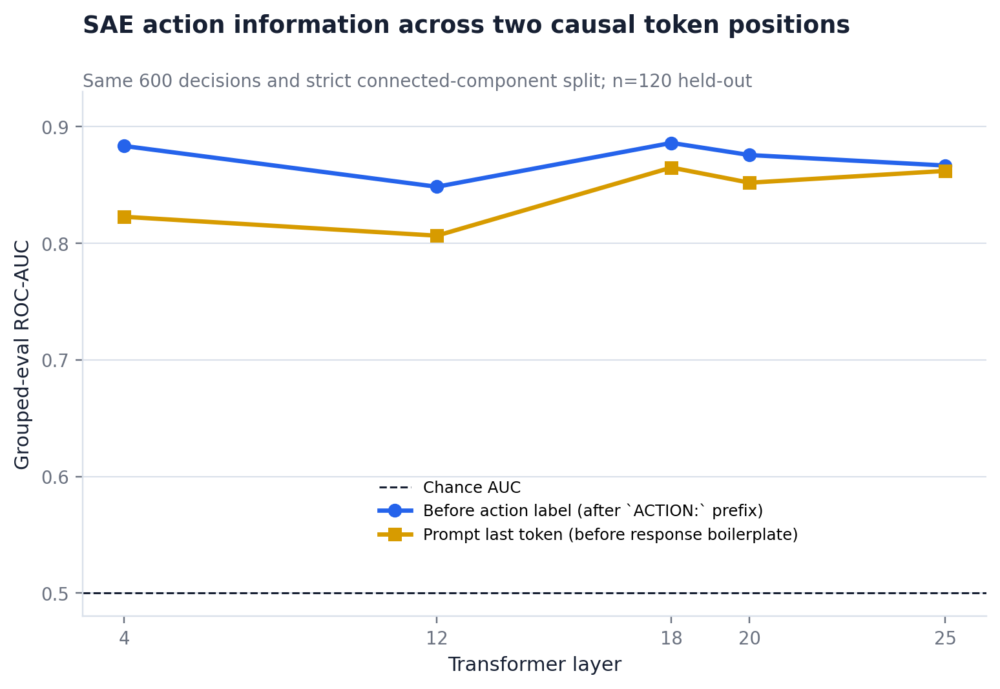

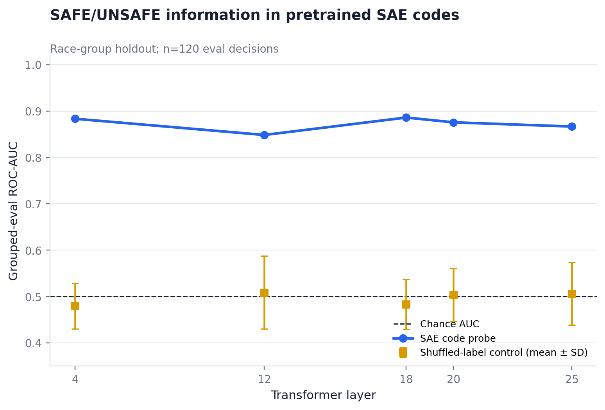

### 8.3 Fidelity, sparsity, and feature replication

Pre-action normalized reconstruction MSE ranges from 2.35e-5 to 8.71e-4, with
mean cosine similarity near one. This establishes very high reconstruction
fidelity at the captured token, not causal faithfulness. More importantly, mean
L0 ranges from 13,273 to 17,958 active features out of 28,672 (46%–63%). The FAST
codes are therefore unexpectedly dense on this decision-position distribution,
which weakens feature-level interpretability despite strong reconstruction.

For the visualization's top eight overlapping train features at each layer, all
40 keep the same Unsafe-minus-Safe sign in eval. This is a useful replication
check, but it is selection-conditioned and lacks cluster-bootstrap intervals and
FDR correction; individual feature IDs are candidates, not discoveries.

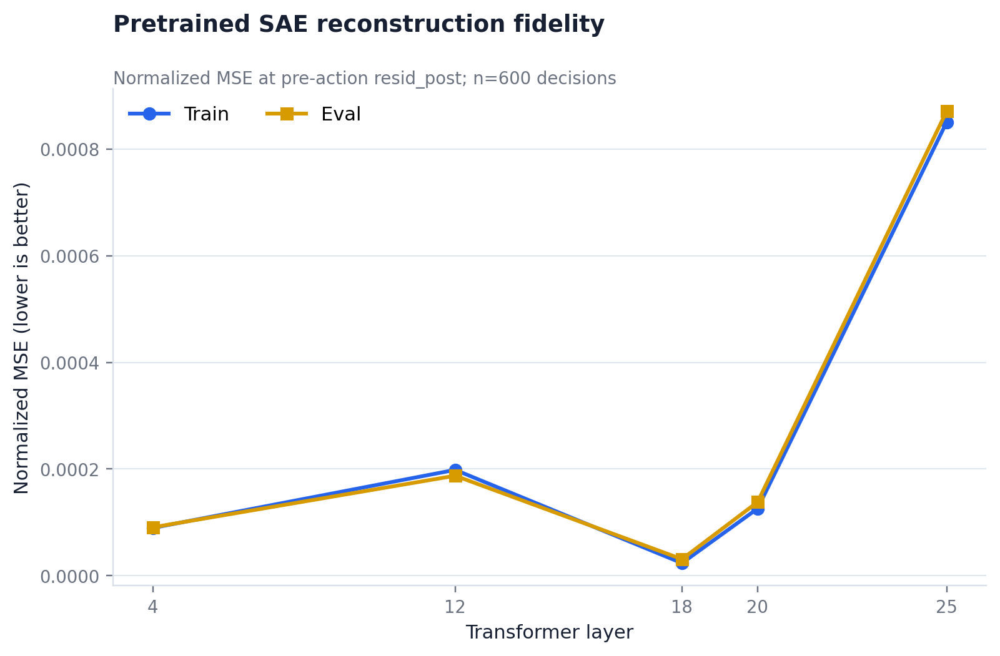

### 8.4 What this does and does not establish

The decisions came from Ollama GGUF F16 digest
`59805ce4a4046be2d8f63231a78daacd2e66f5dccf1a64d0d138ebeeb26ff16c`,
while activation attribution replays prompts through Hugging Face revision
`a09a35458c702b33eeacc393d103063234e8bc28`. Therefore the manifests correctly
scope the result as **cross-model exploratory association only**. The pilot shows
that the logged action is linearly recoverable from the replay model's SAE code;
it does not reveal a unique human-readable reason and does not establish that an
individual SAE feature caused the decision.

The next causal gate is same-runtime, temperature-0 generation plus
teacher-forced `ACTION: SAFE` versus `ACTION: UNSAFE` log-odds, followed by
decoder-direction steering with zero, reconstruction, matched-norm random,
unrelated-feature, and sign-reversal controls. Downstream KL/cross-entropy and
loss-recovered metrics are also still missing. Until those pass, RouteSAE/SAE
steering outputs belong in an exploratory appendix, not the paper's confirmatory
results.

All admitted artifacts, manifests, CSVs, PNGs, and PDFs are indexed in
`results/open_source/activation_sae/README.md`.
